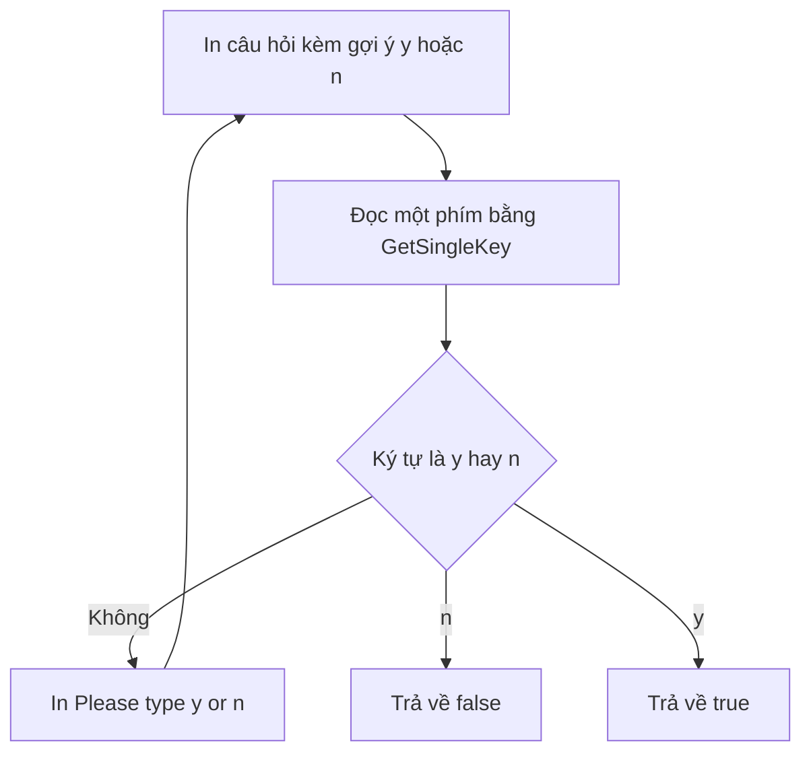

# ✅ Lời giải thử thách — hàm readBool và câu hỏi y/n

> Nguồn: `027-Solution-to-Challenge.txt` · [Udemy](https://ua.udemy.com/course/go-programming-language-crash-course/learn/lecture/26161922)

Chào các bạn, thử thách lần trước các bạn làm ra sao? Hy vọng không gặp quá nhiều khó khăn. Dù bạn đã hoàn thành hay chỉ mới thử được một phần, giờ chúng ta cùng đi qua cách mình đã giải quyết nhé.

Và nhớ một điều quan trọng trước khi bắt đầu: lời giải của mình **không phải là lời giải duy nhất** — cuối bài mình sẽ nói thêm về chuyện đó.

---

### 🔎 Bước 1: Tìm lại cách lắng nghe phím bấm

Nhìn vào code cần sửa, mình biết ngay mục tiêu: **lắng nghe một phím bấm đơn** để người dùng bấm `y` hoặc `n` khi được hỏi có nuôi chó hay không. Thế là mình quay lại dự án **hammer bitcoin**, tìm dòng import cho phép lắng nghe phím — chính là package `keyboard`. *Package này làm được nhiều thứ khác nữa, nhưng giờ mình chỉ cần đúng một việc: bắt trọn phím đơn.*

Mình copy địa chỉ package, quay lại project, mở terminal và dán lệnh `go get` với đúng URL. Lệnh chạy xong, package được thêm vào file `go.mod` — từ đây chương trình có thể dùng `keyboard`.

---

### 🧱 Bước 2: Viết hàm `readBool`

Xuống cuối file, mình tạo hàm mới tên `readBool`. Giống như `readInt` và `readFloat`, nó nhận tham số `s` kiểu `string` (câu hỏi cần hỏi) — nhưng lần này trả về một `bool`. Bên trong hàm:

* Mở bàn phím bằng `keyboard.Open()`, kiểm tra lỗi: nếu `err != nil` thì `log.Fatal(err)` và in lỗi ra.
* Đóng bàn phím bằng `defer` + hàm ẩn danh, chủ động bỏ qua error khi đóng (dùng dấu `_`).
* Mở vòng lặp vô hạn, in câu hỏi `s` bằng `fmt.Println`, rồi đọc phím bằng `keyboard.GetSingleKey()` — lưu ký tự vào `char`, bỏ qua giá trị thứ hai, và bắt lỗi bằng `log.Fatal`.

Đoạn kiểm tra phím mình làm "màu mè" một chút với package `strings`:

```go
if strings.ToLower(string(char)) != "y" &&
    strings.ToLower(string(char)) != "n" {
    fmt.Println("Please type y or n.")
} else if char == 'n' || char == 'N' {
    return false
} else if char == 'y' || char == 'Y' {
    return true
}
```

Cách hoạt động:

* `strings.ToLower` chuyển ký tự về chữ thường để so sánh cho dễ.
* Vì `char` là `rune`, mình ép sang string bằng `string(char)` trước khi so với `"y"` và `"n"`.
* Nếu bấm phím nào khác, chương trình nhắc `Please type y or n.` rồi lặp lại câu hỏi.
* Bấm `n`/`N` → trả về `false` (không nuôi chó). Bấm `y`/`Y` → trả về `true` (có nuôi).



---

### 🔌 Bước 3: Gọi hàm trong `main` và in kết quả

Quay lên `main`, mình gọi hàm mới để hỏi người dùng — truyền vào câu hỏi kèm gợi ý bấm `y/n` và dấu hỏi, rồi gán kết quả vào trường `owns a dog` của `user`.

Rồi sửa câu thông báo cuối cùng: thêm phần *owns a dog* cùng **placeholder cho kiểu `bool` là `%t`**, kèm dấu chấm ở cuối, và truyền thêm `user.ownsADog` vào danh sách các giá trị cần định dạng.

Chạy thử `go run main.go`... và mình gặp một **lỗi typo ở dòng 96**. Sửa xong mới nhớ ra: với hàm ẩn danh, bạn phải có đầy đủ **cặp ngoặc đơn mở–đóng** phía sau — mình quên mất tiêu. Sửa lại rồi chạy nào:

* Nhập tên `Trevor`, tuổi `44`, số yêu thích `77.3`, và bấm `y` cho câu hỏi về chú chó.
* Kết quả: `and yes I own a dog` — chính xác là thứ mình muốn.

---

### 🤝 Lời nhắn cuối: nhiều con đường đều tới đích

Bạn có thể đã làm ra một lời giải hơi khác mình — **điều đó hoàn toàn ổn**. Trong bất kỳ chương trình nào, luôn có rất nhiều cách để làm một việc. Go thường "dẫn đường" cho bạn theo một lối khá rõ ràng vì ngôn ngữ này đơn giản, nhưng riêng việc in thông tin ra màn hình thì có vô số cách tiếp cận — cách của bạn khác mình cũng chẳng sao cả.

Vậy là chương này sắp khép lại. Hẹn gặp các bạn ở bài tổng kết để cùng nhìn lại toàn bộ hành trình vừa qua nhé! 🚀

## Nguồn tham khảo

- [eiannone/keyboard — GitHub](https://github.com/eiannone/keyboard)
- [strings — pkg.go.dev](https://pkg.go.dev/strings)
- [log — pkg.go.dev](https://pkg.go.dev/log)
