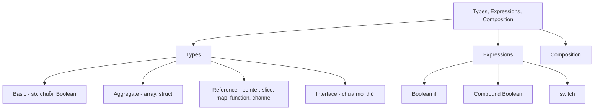

# 🧭 Mở màn chương Types, Expressions & Composition — tấm bản đồ để các bạn không bị lạc

> Nguồn: `029-Introduction.txt` · [Udemy](https://ua.udemy.com/course/go-programming-language-crash-course/learn/lecture/26161944)

Chúng ta đã biết rằng biến trong Go luôn phải có kiểu dữ liệu: các bạn đã gặp `string`, `int`, Boolean và thoáng qua cả `rune`. Trong chương này, mình muốn cùng các bạn đi sâu hơn — để khi ngồi viết code, các bạn biết **khi nào nên dùng kiểu nào** ở một vị trí cụ thể trong chương trình.

Đây cũng là chương chúng ta nói kỹ về **expressions**, về câu lệnh `if`, và làm quen với `switch`. Cuối chương, chúng ta sẽ chạm vào **composition** — thứ mà Go dùng thay cho kế thừa.

### 🎯 Chương này giải quyết điều gì?

Chúng ta đã dùng `if` với một hai điều kiện, nhưng mới ở mức "chạm ngõ". Lần này mình muốn đi qua đầy đủ:

* **Boolean if** — câu lệnh điều kiện cơ bản, đã gặp sơ qua.
* **Compound Boolean** — điều kiện phức hợp, có nhiều vế kết hợp lại, phức tạp hơn một chút nhưng rất đáng nắm.
* **`switch` statement** — thực chất chỉ là một cách viết `if` khác, **dễ đọc và dễ xử lý hơn khi có nhiều trường hợp cần chọn**.

Các bạn cứ yên tâm, chúng ta sẽ đi từng bước, không nhảy cóc.

---

### 📦 Bốn nhóm kiểu dữ liệu — bản đồ tổng quan

Trước khi gõ code, mình muốn các bạn thấy trước "địa hình". Go có **bốn nhóm kiểu** mà chúng ta sẽ lần lượt khám phá:

* **Basic types** — gồm số (numbers), chuỗi (strings) và Boolean. Các bạn đã thấy ví dụ của cả ba, nhưng còn vài điều đáng lưu ý.
* **Aggregate types** — gồm **array** (mà thật lòng là các bạn gần như sẽ **không bao giờ dùng**) và **struct** (thứ chúng ta sẽ dùng rất nhiều).
* **Reference types** — gồm **pointers** (có thể hoàn toàn mới với các bạn — đừng lo, mình sẽ đi khá kỹ), **slices** và **maps** (đã gặp), **functions** (đã gặp) và **channels** (mới toanh, là nét riêng của Go).
* **Interface type** — kiểu rất tổng quát, có thể chứa **đúng nghĩa mọi thứ** mà các bạn muốn.

---

### 🧠 Expressions, `if` phức hợp và `switch`

Phần expressions sẽ giúp các bạn hiểu bản chất những gì mình đã viết suốt thời gian qua: một đoạn code được "tính ra" thành một giá trị duy nhất tại thời điểm chạy.

Và khi có nhiều trường hợp cần rẽ nhánh, `switch` sẽ là người bạn thay thế `if` gọn gàng hơn nhiều. Mình sẽ giải thích kỹ khi chúng ta viết code thật.

---

### 🧩 Composition — "là" nhờ "có", không nhờ kế thừa

Go **không phải** ngôn ngữ lập trình hướng đối tượng (object-oriented) như Java hay C#. Thay vì kế thừa, Go dùng **composition (tổ hợp)**. Khái niệm này không khó, nhưng nếu các bạn từng làm với ngôn ngữ hướng đối tượng thì nó sẽ hơi lạ.

Hãy nhìn ví dụ cho dễ hình dung:

1. Trong thế giới hướng đối tượng, các bạn có `class Car`, rồi `class Ford` **kế thừa** (`extends`) từ `Car`. Chiếc Ford là ô tô **vì nó kế thừa từ ô tô**.
2. Trong thế giới composition, các bạn định nghĩa type `car` của riêng mình, và một chiếc xe thì **có** vô lăng, bánh xe, ghế ngồi và động cơ. Nếu các bạn tạo type `ford` mà nó cũng **có** vô lăng, bánh xe, ghế và động cơ — thì mặc nhiên, nó **là** một chiếc ô tô.

| Tiêu chí | Kế thừa (Java, C#) | Composition (Go) |
|---|---|---|
| Cách tạo quan hệ | `class Ford extends Car` | Định nghĩa type có đủ thành phần |
| Lý do "là" | Ford là Car **vì kế thừa** | Ford là Car **vì có** vô lăng, bánh, ghế, động cơ |
| Từ khóa | `extends`, `implements` | Không cần từ khóa nào |

Mình sẽ cùng các bạn đi qua phần này ở gần cuối chương.

---

### ✅ Tự kiểm tra nhanh

**1. Go dùng cơ chế nào thay cho kế thừa của lập trình hướng đối tượng?**

<b>Xem đáp án</b>

**Đáp án:** Composition (tổ hợp).
Giải thích: Go không phải ngôn ngữ hướng đối tượng; một type "là" type khác vì nó có đủ các thành phần cần thiết.
Tham chiếu: Mục "Composition — 'là' nhờ 'có', không nhờ kế thừa"

**2. Nhóm basic types gồm những gì?**

<b>Xem đáp án</b>

**Đáp án:** Số (numbers), chuỗi (strings) và Boolean.
Giải thích: Ba nhóm này đã xuất hiện sơ qua, chương này sẽ đào sâu thêm.
Tham chiếu: Mục "Bốn nhóm kiểu dữ liệu"

**3. Kiểu aggregate nào trong Go được dùng rất nhiều?**

<b>Xem đáp án</b>

**Đáp án:** Struct. Còn array thì gần như không bao giờ dùng.
Giải thích: Array có thể thay thế bằng slice linh hoạt hơn; struct là kiểu tổ hợp dùng hằng ngày.
Tham chiếu: Mục "Bốn nhóm kiểu dữ liệu"

**4. Reference types gồm những kiểu nào?**

<b>Xem đáp án</b>

**Đáp án:** Pointers, slices, maps, functions và channels.
Giải thích: Pointer và channel là hai thứ mới hoàn toàn ở chương này.
Tham chiếu: Mục "Bốn nhóm kiểu dữ liệu"

**5. `switch` thực chất là gì?**

<b>Xem đáp án</b>

**Đáp án:** Một cách viết `if` khác, dễ đọc và dễ xử lý hơn khi có nhiều trường hợp cần chọn.
Giải thích: Bản chất vẫn là rẽ nhánh điều kiện, chỉ khác về hình thức trình bày.
Tham chiếu: Mục "Expressions, if phức hợp và switch"

---

Chương này khá nặng về khái niệm, nhưng các bạn cứ đi chậm mà chắc — hiểu bản chất thì phần code phía sau sẽ nhẹ nhàng hơn rất nhiều. Ngay bài tiếp theo, chúng ta sẽ bắt đầu với **basic types** và kiểu `int`. Hẹn gặp lại các bạn! 🚀

## Nguồn tham khảo

- [The Go Programming Language Specification](https://go.dev/ref/spec)
- [Effective Go](https://go.dev/doc/effective_go)
- [Udemy — Introduction](https://ua.udemy.com/course/go-programming-language-crash-course/learn/lecture/26161944)
