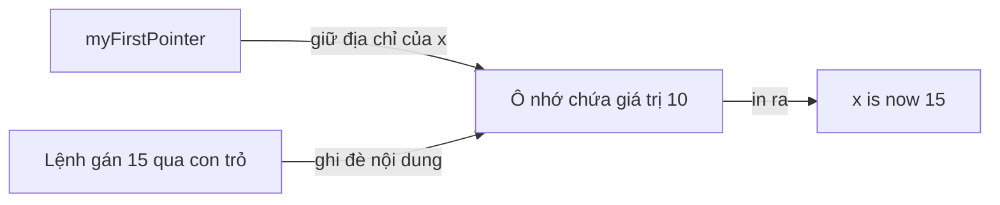

# 🎯 Pointers trong Go — "trỏ" tới ô nhớ, không hề đáng sợ như các bạn tưởng

> Nguồn: `032-Pointers.txt` · [Udemy](https://ua.udemy.com/course/go-programming-language-crash-course/learn/lecture/26161962)

Chúng ta đã xong basic types và aggregate types, giờ là lúc bước vào **reference types**: pointers, slices, maps, functions và channels. Slices, maps, functions thì các bạn đã gặp đôi chút; còn **pointers** và **channels** là hoàn toàn mới. Mình bắt đầu với pointers.

Nếu các bạn từng làm với PHP — hoặc chưa từng học ngôn ngữ lập trình nào — thì đây sẽ là khái niệm mới tinh. *Nhưng thật lòng, nó không khó đến vậy đâu. Mình hứa đấy.*

### 🧠 Pointer là gì?

**Pointer (con trỏ) không gì hơn là một thứ trỏ tới một vị trí cụ thể trong bộ nhớ.**

Khi các bạn khai báo `var myInt int` rồi gán `myInt = 10`, bạn đã bảo trình biên dịch (compiler): *"dành ra một chút bộ nhớ ở đâu đó trong máy, và cất số `10` vào đó"*. Sau này, các bạn chạm tới vùng nhớ đó chỉ bằng cách gọi tên biến.

Nhưng cũng có thể khai báo những biến **không giữ thông tin** (như số `10`), mà thay vào đó **trỏ tới vị trí bộ nhớ nơi thông tin nằm**.

```go
x := 10
myFirstPointer := &x

fmt.Println("x is", x)
fmt.Println("my first pointer is", myFirstPointer)
```

Chạy lên, dòng đầu in "x is 10" như các bạn đoán. Nhưng dòng thứ hai in ra thứ kiểu như `0xc000...` — một địa chỉ bộ nhớ. **Số cụ thể trên máy các bạn sẽ khác của mình**, vì máy mình cất dữ liệu ở một chỗ khác.

Điểm mấu chốt: `myFirstPointer` **không phải** `10`. Nó là **địa chỉ nơi số `10` được lưu**. Dấu `&` đặt trước `x` chính là thứ tạo ra sự khác biệt đó.

### 🔍 Thay đổi giá trị mà không cần chạm vào biến gốc

Giờ tới phần thú vị. Mình viết:

```go
*myFirstPointer = 15
fmt.Println("x is now", x)
```

Dấu `*` ở đây nói rằng: *"hãy đi tới địa chỉ mà `myFirstPointer` đang trỏ tới, và đổi nội dung ở đó thành giá trị sau dấu bằng"*. Chạy chương trình: ban đầu in "x is 10", sau đó in ra địa chỉ bộ nhớ, rồi — dù mình **chưa hề chạm vào biến `x`** — dòng cuối cho ra `x is now 15`.

Chúng ta vừa thay đổi giá trị nằm trong ô nhớ **mà không cần dùng tới tên biến `x`**. Nghe có vẻ lạ, nhưng đây chính là sức mạnh của pointer.



### 🛠️ Truyền pointer vào hàm

Ví dụ cụ thể hơn: mình viết một hàm đổi giá trị qua pointer.

```go
func changeValueOfPointer(num *int) {
    *num = 25
}
```

Tham số `num` có kiểu `*int` — dấu `*` nghĩa là "con trỏ tới `int`", chứ không phải một số nguyên thường. Hàm không trả về gì cả, chỉ đi tới địa chỉ nhận được và đổi nội dung thành `25`.

Ở `main`, nếu gọi `changeValueOfPointer(x)` thì lỗi ngay — `x` là `int`, không phải con trỏ. Phải truyền **tham chiếu** tới `x` bằng dấu `&`:

```go
changeValueOfPointer(&x)
fmt.Println("after function call, x is now", x)
```

Kết quả: `x` thành `25`. Để ý rằng hàm **không return gì hết**, mà vẫn đổi được giá trị. Đó là vì nó nhận một pointer tới `int` và sửa thẳng nội dung trong bộ nhớ.

| Ký hiệu | Ý nghĩa |
|---|---|
| `&x` | Lấy địa chỉ của `x` — tạo ra reference |
| `*pointer` | Đi tới địa chỉ pointer trỏ tới, để lấy hoặc **đổi** giá trị ở đó |
| `*int` | Kiểu "con trỏ tới `int`" khi khai báo tham số |

Điều này cho phép chúng ta **truyền pointer đi khắp nơi và thay đổi giá trị của một biến mà không cần biến đó xuất hiện trong scope của hàm**. Nếu pointer ở cấp package, các bạn có thể dùng nó ở mọi nơi trong package đó.

Quy tắc vàng chỉ có vậy: **muốn tham chiếu tới một biến thì thêm `&`, muốn lấy và đổi giá trị tại địa chỉ thì thêm `*`**. Pointers xuất hiện khá nhiều khi các bạn đọc code Go của người khác, và chúng cực kỳ hữu ích.

---

### ✅ Tự kiểm tra nhanh

**1. Pointer là gì?**
<details>
<summary><b>Xem đáp án</b></summary>

**Đáp án:** Là thứ trỏ tới một vị trí cụ thể trong bộ nhớ.
Giải thích: Pointer không giữ giá trị như `10`, mà giữ địa chỉ nơi giá trị đó được lưu.
Tham chiếu: Mục "Pointer là gì?"

</details>

**2. Dấu `&` trước biến `x` có tác dụng gì?**
<details>
<summary><b>Xem đáp án</b></summary>

**Đáp án:** Lấy địa chỉ của `x` — tạo ra một reference tới `x`.
Giải thích: `myFirstPointer := &x` khiến biến mới giữ địa chỉ bộ nhớ của `x`.
Tham chiếu: Mục "Pointer là gì?"

</details>

**3. Dấu `*` khi viết `*myFirstPointer = 15` nghĩa là gì?**
<details>
<summary><b>Xem đáp án</b></summary>

**Đáp án:** Đi tới địa chỉ mà con trỏ trỏ tới và đổi nội dung ở đó thành `15`.
Giải thích: Nhờ vậy biến `x` đổi giá trị dù không được gọi tên trực tiếp.
Tham chiếu: Mục "Thay đổi giá trị mà không cần chạm vào biến gốc"

</details>

**4. Vì sao gọi `changeValueOfPointer(x)` lại lỗi?**
<details>
<summary><b>Xem đáp án</b></summary>

**Đáp án:** Vì `x` là `int` thường, không phải `*int`; phải truyền `&x`.
Giải thích: Hàm yêu cầu con trỏ tới `int`, nên cần tham chiếu tới `x`.
Tham chiếu: Mục "Truyền pointer vào hàm"

</details>

**5. Lợi ích lớn nhất của pointer trong ví dụ hàm là gì?**
<details>
<summary><b>Xem đáp án</b></summary>

**Đáp án:** Có thể đổi giá trị của biến mà không cần biến đó nằm trong scope của hàm, cũng không cần return.
Giải thích: Hàm nhận pointer và sửa trực tiếp nội dung trong bộ nhớ.
Tham chiếu: Mục "Truyền pointer vào hàm"

</details>

---

*Đừng lo nếu các bạn thấy khái niệm này còn mới — pointers không khó như vẻ ngoài của chúng đâu, và chúng ta sẽ còn gặp lại chúng nhiều lần.* Sau pointers, chúng ta sẽ ôn lại và đào sâu **slices**. Hẹn gặp lại các bạn! 🚀

## Nguồn tham khảo

- [The Go Programming Language Specification](https://go.dev/ref/spec)
- [Udemy — Pointers](https://ua.udemy.com/course/go-programming-language-crash-course/learn/lecture/26161962)
