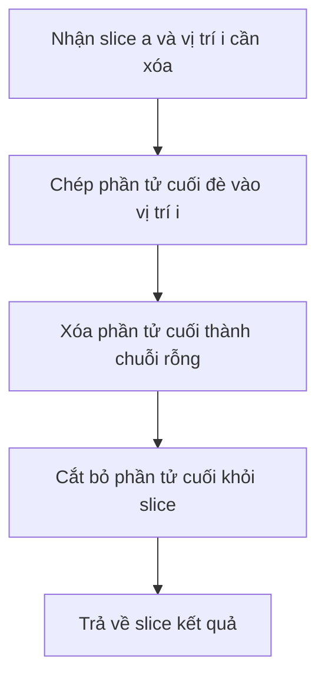

# 🍰 Slices trong Go — append, range, sort và tự tay xóa một phần tử

> Nguồn: `033-Slices.txt` · [Udemy](https://ua.udemy.com/course/go-programming-language-crash-course/learn/lecture/26161964)

Tiếp tục hành trình qua **reference types**, hôm nay là **slices**. Các bạn đã gặp slice vài lần và biết cách khởi tạo chúng rồi, nên bài này mình sẽ đi sâu hơn: duyệt, sắp xếp và cả tự viết hàm xóa một phần tử — việc mà mình phải nói trước là *không đơn giản như ở PHP, nhưng cũng không khó lắm*.

### 📦 Khởi tạo slice và thêm phần tử bằng `append`

Khởi tạo slice rất đơn giản: `var animals []string` — một slice chuỗi rỗng, ban đầu không chứa gì.

Muốn thêm phần tử, ta dùng hàm có sẵn `append`, tức là "nối vào cuối":

```go
var animals []string
animals = append(animals, "dog")
animals = append(animals, "fish")
animals = append(animals, "cat")
animals = append(animals, "horse")

fmt.Println(animals)
```

Ban đầu `animals` rỗng; sau bốn lần `append`, nó chứa `dog`, `fish`, `cat`, `horse`. Đúng như tên gọi, `append` **luôn thêm vào cuối** slice. Chạy chương trình, các bạn thấy thứ tự in ra đúng y như thứ tự đã thêm vào.

### 🔁 Duyệt slice và truy cập từng phần tử

Có một cách khác để đi qua các reference type như slice và map: vòng lặp `for` kết hợp `range`.

```go
for _, x := range animals {
    fmt.Println(x)
}
```

Mình truyền vào dấu gạch dưới `_` — đó là **index** mà mình không cần dùng — còn `x` là **phần tử hiện tại** đang được xét. Chạy lên, các phần tử in ra lần lượt theo đúng thứ tự.

Nếu đổi thành `for i, x := range animals` và in cả `i`, các bạn sẽ thấy nó **bắt đầu đếm từ `0`** giống array: phần tử đầu ở index `0` (giá trị `dog`), phần tử thứ tư ở index `3` (giá trị `horse`).

Vài thao tác nhỏ nữa với slice:

* In một phần tử: `animals[0]` → `dog`.
* In một dải phần tử: `animals[0:2]` → `dog`, `fish` (bắt đầu từ vị trí `0`, lấy hai phần tử).
* Đếm số phần tử: `len(animals)` → `4`.

### 🔤 Sắp xếp slice

Sắp xếp slice là việc các bạn sẽ làm rất thường xuyên — và đây là một trong những **lợi thế lớn của slice so với array**.

Trước tiên kiểm tra xem slice đã được sắp xếp chưa bằng `sort.StringsAreSorted(animals)` → kết quả `false`, vì các phần tử chưa theo thứ tự alphabet.

Rồi sắp xếp bằng `sort.Strings(animals)` — đơn giản đến mức khó tin với chuỗi, và với hầu hết các basic type khác cũng vậy. Kiểm tra lại thì `sort.StringsAreSorted` trả về `true`, và in ra thì thấy `cat`, `dog`, `fish`, `horse` — đúng thứ tự alphabet.

### 🗑️ Tự viết hàm xóa một phần tử

Xóa một phần tử khỏi slice **không dễ như ở PHP**, nhưng cũng chẳng khó. Mình viết một hàm như sau:

```go
func deleteFromSlice(a []string, i int) []string {
    a[i] = a[len(a)-1]
    a[len(a)-1] = ""
    a = a[:len(a)-1]
    return a
}
```

Ba bước diễn ra theo đúng thứ tự này:

1. **Chép phần tử cuối** của slice đè vào vị trí `i` cần xóa — trong ví dụ của mình, `horse` sẽ được chép tới vị trí đang xóa.
2. **Xóa phần tử cuối** bằng cách gán nó về giá trị rỗng mặc định — với `string` là chuỗi rỗng.
3. **Cắt ngắn slice** bằng cú pháp `a[:len(a)-1]` — lấy mọi thứ trừ phần tử cuối cùng — rồi trả về.



Thử xóa phần tử ở index `1` — trong danh sách đã sắp xếp `cat, dog, fish, horse` thì đó là `dog` — kết quả còn lại là `cat, horse, fish`.

À, và đây là một **hạn chế** các bạn cần nhớ: xóa kiểu này làm **vỡ thứ tự đã sắp xếp**. Nếu cần slice đúng thứ tự trở lại, chỉ việc gọi `sort.Strings(animals)` để sắp xếp lại lần nữa.

| Việc cần làm | Cú pháp |
|---|---|
| Thêm phần tử vào cuối | `append(animals, "dog")` |
| Đếm số phần tử | `len(animals)` |
| Truy cập một phần tử | `animals[0]` |
| Lấy một dải phần tử | `animals[0:2]` |
| Kiểm tra đã sắp xếp chưa | `sort.StringsAreSorted(animals)` |
| Sắp xếp | `sort.Strings(animals)` |

---

### ✅ Tự kiểm tra nhanh

**1. Hàm `append` thêm phần tử vào đâu trong slice?**
<details>
<summary><b>Xem đáp án</b></summary>

**Đáp án:** Luôn thêm vào cuối slice.
Giải thích: Đúng như tên gọi "append"; thứ tự các phần tử được giữ nguyên theo thứ tự thêm vào.
Tham chiếu: Mục "Khởi tạo slice và thêm phần tử bằng append"

</details>

**2. Trong `for _, x := range animals`, dấu `_` đại diện cho gì?**
<details>
<summary><b>Xem đáp án</b></summary>

**Đáp án:** Index của phần tử — mình bỏ qua vì không cần dùng.
Giải thích: Đổi thành `for i, x := range animals` là có thể dùng index, đếm từ `0`.
Tham chiếu: Mục "Duyệt slice và truy cập từng phần tử"

</details>

**3. `animals[0:2]` trả về những phần tử nào?**
<details>
<summary><b>Xem đáp án</b></summary>

**Đáp án:** Hai phần tử đầu tiên — `dog` và `fish`.
Giải thích: Bắt đầu từ vị trí `0` và lấy hai phần tử.
Tham chiếu: Mục "Duyệt slice và truy cập từng phần tử"

</details>

**4. Vì sao sắp xếp là lợi thế của slice so với array?**
<details>
<summary><b>Xem đáp án</b></summary>

**Đáp án:** Slice có thể sắp xếp rất dễ dàng với các hàm như `sort.Strings`.
Giải thích: Đây là một trong những lợi thế lớn mà Trevor nhấn mạnh của slice so với array.
Tham chiếu: Mục "Sắp xếp slice"

</details>

**5. Xóa một phần tử khỏi slice ảnh hưởng gì tới thứ tự đã sắp xếp?**
<details>
<summary><b>Xem đáp án</b></summary>

**Đáp án:** Làm vỡ thứ tự đã sắp xếp; muốn có thứ tự lại thì phải gọi `sort.Strings` lần nữa.
Giải thích: Cách xóa sao chép phần tử cuối vào vị trí bị xóa nên phá vỡ trật tự cũ.
Tham chiếu: Mục "Tự viết hàm xóa một phần tử"

</details>

---

Slices sẽ theo các bạn suốt khóa học, nên *nếu hàm xóa phần tử chưa thật sự thấm ngay, cũng đừng bận tâm — chúng ta sẽ còn luyện nhiều.* Bài tiếp theo là **maps**. Hẹn gặp lại các bạn! 🚀

## Nguồn tham khảo

- [Package sort](https://pkg.go.dev/sort)
- [Package builtin — append, len](https://pkg.go.dev/builtin)
- [Udemy — Slices](https://ua.udemy.com/course/go-programming-language-crash-course/learn/lecture/26161964)
