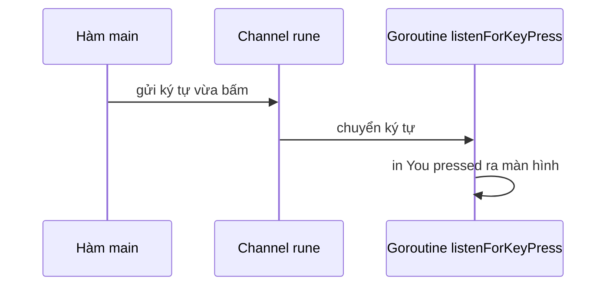

# 📡 Channels trong Go — khi các goroutine cần "nói chuyện" với nhau

> Nguồn: `036-Channels.txt` · [Udemy](https://ua.udemy.com/course/go-programming-language-crash-course/learn/lecture/26161988)

Hôm nay chúng ta nói về **channels** — một thứ khá đặc trưng của Go. Đây là reference type cuối cùng còn thiếu, và cũng là một trong những tính năng mạnh mẽ nhất của ngôn ngữ. Mình sẽ giải thích thật chậm, vì bài này có hai khái niệm mới đi kèm nhau: **goroutine** và **channel**.

Hiểu đơn giản: channel là cách để chương trình **gửi thông tin từ nơi này sang nơi khác** — hơi giống truyền tham số vào hàm. Nhưng khác ở chỗ: channel gần như chỉ dùng cho thứ gọi là **goroutine**, thứ chúng ta chưa gặp.

### ⚡ Goroutine — chạy nền, không chờ ai

Mình bắt đầu với một hàm đơn giản:

```go
func doSomething(s string) {
    for {
        fmt.Println("s is", s)
    }
}
```

Hàm này chạy mãi mãi, in ra tham số `s` không ngừng. Giờ mình gọi nó — nhưng có một chữ `go` phía trước:

```go
go doSomething("hello world")
for {
}
```

Từ khóa `go` biến lời gọi hàm thành một **goroutine**. Chương trình không dừng lại chờ hàm chạy xong; nó "bắn" hàm này đi chạy nền và tiếp tục công việc của mình. Vòng lặp `for {}` rỗng ở `main` giữ chương trình sống cho tới khi bạn nhấn `Ctrl+C`.

Chạy lên, các bạn thấy "hello world" được in ra liên tục — bằng chứng rằng `doSomething` đang chạy song song với hàm `main`.

### ⏱️ Chạy đồng thời trông như thế nào?

Mình sửa hàm để chỉ chạy **5 lần**: thêm biến đếm `until := 0`, tăng lên mỗi vòng, và `break` khi `until >= 5`. Đồng thời, trước vòng lặp giữ chương trình, mình in một dòng "This is another message".

Kết quả thật thú vị: dòng "This is another message" xuất hiện **trước** các dòng từ `doSomething` — dù trong code, lời gọi `doSomething` đứng trước. Lý do là hàm đó đang chạy **đồng thời (concurrently)**, không theo thứ tự tuần tự.

Trong thực tế, chương trình Go rất thường xuyên chạy đồng thời. Ví dụ một trang web: hiển thị trang thanh toán, rồi cần tạo hóa đơn, rồi cần gửi email cho khách — đủ thứ việc. Với ngôn ngữ tuần tự như PHP, bạn thường làm xong việc này mới sang việc khác. Còn với Go, chúng ta có thể **làm nhiều việc cùng lúc** nhờ các goroutine. Từ khóa `go` chính là thứ nói với chương trình: *"cứ bắn hàm này đi, nó tự chạy nền, và bạn tiếp tục công việc"*.

### 📮 Channel — đường dây liên lạc giữa các goroutine

Vậy vấn đề đặt ra: **làm sao nói chuyện với goroutine đó?** Ví dụ mình có một goroutine chỉ ngồi nghe tin nhắn email, hễ nhận được là gửi đi. Bạn tạo email ở đâu đó trong chương trình, gửi tới goroutine này — nhưng gửi **bằng cách nào**?

Câu trả lời là **channel**. Và cú pháp như sau:

```go
var keyPressChan chan rune
keyPressChan = make(chan rune)
go listenForKeyPress()
```

Vài điểm cần nhớ ngay:

* Channel chỉ nhận **một kiểu dữ liệu duy nhất** — ở đây là `rune`.
* Không thể khai báo channel rồi dùng luôn; phải tạo bằng `make`, giống như map.
* `rune` là một ký tự đơn — thứ được dùng để tạo nên chuỗi.

Trong chương trình demo, `main` cài đặt **keyboard package** mà chúng ta đã dùng ở các bài trước (qua `go get`, nó được thêm vào file `go mod`). Sau đó mở bàn phím, `defer` đóng bàn phím lại, rồi lặp vô hạn để chờ từng phím bấm. Việc đọc phím dùng hàm `keyboard.GetSingleKey()` — trả về ba giá trị, mình chỉ quan tâm ký tự đầu tiên. Khi người dùng bấm `q` hoặc `Q`, vòng lặp dừng. Còn lại, mỗi ký tự được **gửi vào channel** bằng cú pháp mũi tên:

```go
char, _, _ := keyboard.GetSingleKey()
if char == 'q' || char == 'Q' {
    break
}
keyPressChan <- char
```

Phía goroutine `listenForKeyPress`, ta **nhận từ channel** bằng cú pháp mũi tên ngược:

```go
for {
    key := <-keyPressChan
    fmt.Println("You pressed", string(key))
}
```

Chạy chương trình: bấm `a` → "You pressed a", bấm thêm `b c d e f` → in ra hết, bấm `q` → thoát. Một điều rất quan trọng: **channel mặc định sẽ "block"** — nó không đi tiếp cho tới khi có thứ gì đó được đẩy vào. Nghĩa là goroutine lắng nghe sẽ **đứng chờ** cho tới khi nhận được giá trị từ channel.



Channels chủ yếu được dùng để **giao tiếp giữa các goroutine** — chuyển dữ liệu từ phần này sang phần khác của chương trình đang chạy nền. Trong khóa này chúng ta sẽ không dùng channel thường xuyên, nhưng các bạn nên biết chúng, vì đây là một trong những tính năng mạnh nhất của Go.

---

### ✅ Tự kiểm tra nhanh

**1. Từ khóa `go` trước một lời gọi hàm có tác dụng gì?**
<details>
<summary><b>Xem đáp án</b></summary>

**Đáp án:** Chạy hàm đó như một goroutine — chạy nền song song, không chờ nó xong.
Giải thích: Chương trình tiếp tục công việc ngay, hàm được "bắn" đi chạy riêng.
Tham chiếu: Mục "Goroutine — chạy nền, không chờ ai"

</details>

**2. Vì sao dòng "This is another message" lại in ra trước các dòng của `doSomething`?**
<details>
<summary><b>Xem đáp án</b></summary>

**Đáp án:** Vì `doSomething` chạy đồng thời dưới dạng goroutine, nên thứ tự không theo code tuần tự.
Giải thích: Đây là minh chứng cho tính chạy đồng thời của Go.
Tham chiếu: Mục "Chạy đồng thời trông như thế nào?"

</details>

**3. Channel cần được tạo bằng cách nào?**
<details>
<summary><b>Xem đáp án</b></summary>

**Đáp án:** Dùng `make`, ví dụ `keyPressChan = make(chan rune)`; khai báo `var` không là chưa dùng được.
Giải thích: Giống như map; và mỗi channel chỉ nhận một kiểu dữ liệu.
Tham chiếu: Mục "Channel — đường dây liên lạc"

</details>

**4. Cú pháp gửi và nhận giá trị qua channel là gì?**
<details>
<summary><b>Xem đáp án</b></summary>

**Đáp án:** Gửi: `keyPressChan <- char`; nhận: `key := <-keyPressChan`.
Giải thích: Mũi tên chỉ chiều dữ liệu đi.
Tham chiếu: Mục "Channel — đường dây liên lạc"

</details>

**5. "Channel mặc định sẽ block" nghĩa là gì?**
<details>
<summary><b>Xem đáp án</b></summary>

**Đáp án:** Nó không đi tiếp cho tới khi có giá trị được đẩy vào channel; goroutine nhận sẽ đứng chờ.
Giải thích: Đây là cơ chế giúp đồng bộ việc gửi/nhận giữa các goroutine.
Tham chiếu: Mục "Channel — đường dây liên lạc"

</details>

---

Channels là chủ đề lớn, nên *nếu các bạn chưa thấy tự tin ngay cũng hoàn toàn bình thường — mình chỉ cần các bạn làm quen với khái niệm và cú pháp.* Bài tiếp theo chúng ta sẽ chạm đến **interfaces**, nơi sức mạnh thật sự của Go bắt đầu lộ diện. Hẹn gặp lại các bạn! 🚀

## Nguồn tham khảo

- [The Go Programming Language Specification](https://go.dev/ref/spec)
- [Udemy — Channels](https://ua.udemy.com/course/go-programming-language-crash-course/learn/lecture/26161988)
