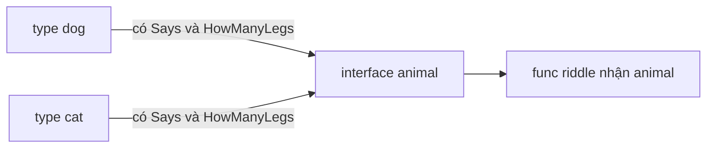

# 🧩 Interfaces trong Go — "có đủ hàm" là tự động trở thành animal

> Nguồn: `037-Interfaces.txt` · [Udemy](https://ua.udemy.com/course/go-programming-language-crash-course/learn/lecture/26161996)

Reference type cuối cùng cũng là thứ quan trọng bậc nhất khi dùng Go hiệu quả: **interface**. Nhiều người thấy interface khó theo dõi lúc đầu — *và điều đó hết sức bình thường* — nhưng khi đã hiểu bản chất rồi thì nó rất đơn giản. Hôm nay chúng ta đi qua ba câu hỏi: interface **là gì**, **dùng thế nào**, và **vì sao nên dùng**.

### 🐶 Bài toán: một câu đố chỉ nhận `dog`

Mình có một file `main.go` đơn giản với hai type gần giống nhau:

* `dog` — gồm ba thành viên: `Name`, `Sound`, `NumberOfLegs`.
* `cat` — gần như y hệt, chỉ thêm một thành viên `HasTail` kiểu `bool`.

Mục tiêu chương trình: tạo một câu đố đơn giản rồi in ra màn hình. Mình viết hàm `riddle` nhận tham số kiểu `dog`, dùng `fmt.Sprintf` với **dấu backtick** để dựng câu đố dạng "This animal says %s and has %d legs. What animal is it?", rồi in kết quả.

Tạo một `dog` với `Name: "dog"`, `Sound: "woof"`, `NumberOfLegs: 4` và gọi `riddle(dog)` — chạy ngon lành: "This animal says woof and has 4 legs, what animal is it?". *Một câu đố không hay lắm, nhưng nó chứng minh chương trình làm đúng việc cần làm.*

Nhưng đây mới là vấn đề: mình muốn một câu đố nữa, lần này truyền vào `cat`. Mình tạo `var cat cat` với đầy đủ `Name`, `Sound`, `NumberOfLegs`, `HasTail`... nhưng **không thể** gọi `riddle(cat)`. Dù `cat` có đủ mọi thông tin cần thiết, hàm `riddle` chỉ chấp nhận `dog`. Và đây chính là lúc interface tỏa sáng.

### 📜 Định nghĩa interface `animal`

Mình tạo một interface gần giống cách tạo type thường — chỉ khác chữ `struct` được thay bằng `interface`:

```go
type animal interface {
    Says() string
    HowManyLegs() int
}
```

Khi định nghĩa interface, các bạn **chỉ liệt kê các hàm** mà interface đó yêu cầu. Muốn "thỏa mãn" (satisfy) yêu cầu của một interface, các type chỉ cần có những hàm cùng tên, đúng kiểu trả về.

Ở đây, `animal` yêu cầu hai hàm: `Says()` trả về `string`, và `HowManyLegs()` trả về `int`.

### 🐱 Dog và Cat cùng thỏa mãn interface

Giờ mình chỉ cần định nghĩa hàm cho `dog` với **receiver** — mình đã học ở bài trước:

```go
func (d *dog) Says() string {
    return d.Sound
}

func (d *dog) HowManyLegs() int {
    return d.NumberOfLegs
}
```

Tên hàm phải **khớp chính xác** với interface, và kiểu trả về cũng phải đúng: `Says` trả `string`, `HowManyLegs` trả `int`. Vì `dog` đã có đủ hai hàm này, **mặc nhiên nó cũng là một `animal`**.

Mình sửa hàm `riddle` để nhận `animal` (đặt tên tham số là `a`), và thay vì truy cập thành viên trực tiếp, gọi `a.Says()` và `a.HowManyLegs()`. Vì các hàm receiver dùng con trỏ, mình truyền `&dog` vào. Rồi mình chép hai hàm y như vậy cho `cat`, và truyền `&cat`. Chạy `go run main.go`:

* "This animal says woof and has 4 legs. What animal is it?"
* "This animal says meow and has 4 legs. What animal is it?"



### 💡 Vì sao interface mạnh — và khác Java/PHP ở đâu?

Interface giúp mình **tránh việc phải viết hai hàm gần như y hệt nhau** — một hàm nhận `dog`, một hàm nhận `cat` — trong khi cả hai làm đúng cùng một việc. Cách này hiệu quả hơn, **tốn ít dòng code hơn**, và không hề khó triển khai.

Điểm mấu chốt cần nhớ: khi định nghĩa interface, bạn liệt kê **tất cả các hàm mà interface đó phải có** để được coi là interface đó. Ví dụ nếu `dog` chỉ có `Says` mà thiếu `HowManyLegs`, nó **không** thỏa mãn yêu cầu của `animal`. Nhưng vì nó có đủ cả hai — `Says` trả `string`, `HowManyLegs` trả `int` — nó mặc nhiên thỏa mãn, và có thể dùng ở những chỗ yêu cầu `dog` hoặc yêu cầu `animal`.

Điều này hơi khác các ngôn ngữ khác. Ở Java hay PHP, nếu một hàm hiện thực một interface, bạn phải **nói rõ** bằng từ khóa kiểu `implements`. Còn Go thì không: **chỉ cần hiện thực đầy đủ các hàm mà interface quy định, thế là xong**.

---

### ✅ Tự kiểm tra nhanh

**1. Khi định nghĩa interface, bạn cần viết những gì?**
<details>
<summary><b>Xem đáp án</b></summary>

**Đáp án:** Chỉ liệt kê các hàm mà interface đó yêu cầu, kèm kiểu trả về.
Giải thích: `animal` yêu cầu `Says() string` và `HowManyLegs() int`.
Tham chiếu: Mục "Định nghĩa interface animal"

</details>

**2. Vì sao không thể gọi `riddle(cat)` lúc đầu?**
<details>
<summary><b>Xem đáp án</b></summary>

**Đáp án:** Vì hàm `riddle` được khai báo chỉ nhận kiểu `dog`.
Giải thích: Dù `cat` có đủ thông tin, nó không phải `dog`; interface là cách giải quyết.
Tham chiếu: Mục "Bài toán: một câu đố chỉ nhận dog"

</details>

**3. Type `dog` trở thành `animal` khi nào?**
<details>
<summary><b>Xem đáp án</b></summary>

**Đáp án:** Khi nó có đủ hai hàm `Says` và `HowManyLegs` với đúng kiểu trả về — tự động, không cần từ khóa nào.
Giải thích: Go thỏa mãn interface một cách ngầm định.
Tham chiếu: Mục "Dog và Cat cùng thỏa mãn interface"

</details>

**4. Nếu `dog` thiếu hàm `HowManyLegs` thì sao?**
<details>
<summary><b>Xem đáp án</b></summary>

**Đáp án:** Nó không thỏa mãn interface `animal`.
Giải thích: Phải có đủ tất cả các hàm interface quy định mới được coi là interface đó.
Tham chiếu: Mục "Vì sao interface mạnh"

</details>

**5. Go khác Java/PHP ở điểm nào khi hiện thực interface?**
<details>
<summary><b>Xem đáp án</b></summary>

**Đáp án:** Go không cần từ khóa `implements`; chỉ cần hiện thực đủ các hàm là mặc nhiên thỏa mãn.
Giải thích: Java/PHP yêu cầu khai báo rõ ràng; Go thì ngầm định theo cấu trúc hàm.
Tham chiếu: Mục "Vì sao interface mạnh"

</details>

---

Interface là chìa khóa để viết Go "đúng chất" — *các bạn cứ đọc lại ví dụ dog/cat thêm một lần, mọi thứ sẽ sáng tỏ.* Còn một mảng nữa trong chương này: **expressions** — thứ chúng ta dùng hằng ngày mà ít khi gọi tên. Hẹn gặp lại các bạn ở bài tiếp theo! 🚀

## Nguồn tham khảo

- [The Go Programming Language Specification](https://go.dev/ref/spec)
- [Effective Go](https://go.dev/doc/effective_go)
- [Udemy — Interfaces](https://ua.udemy.com/course/go-programming-language-crash-course/learn/lecture/26161996)
