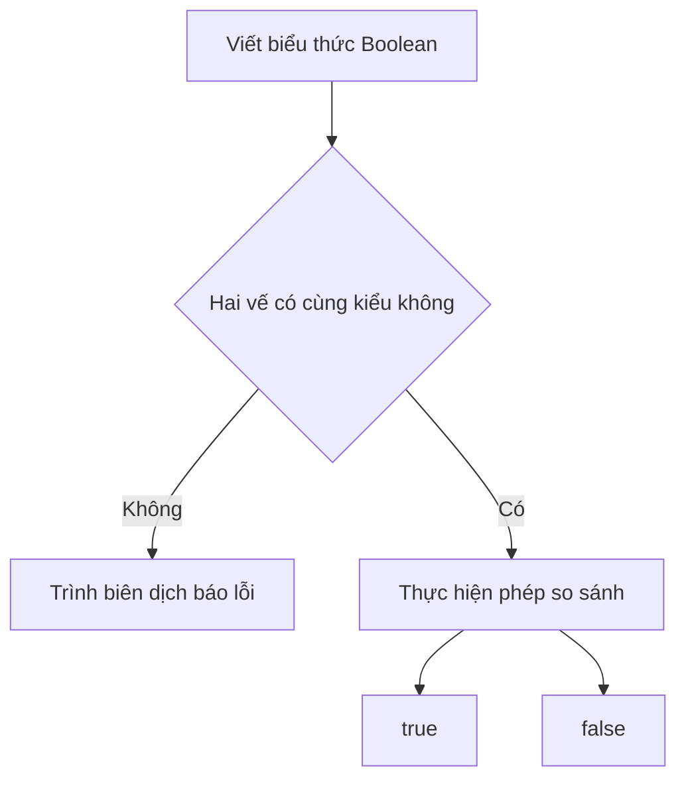

# 🧠 Booleans trong Go — Nền tảng của mọi quyết định trong chương trình

> Nguồn: `039-Booleans.txt` · [Udemy](https://ua.udemy.com/course/go-programming-language-crash-course/learn/lecture/26162012)

Mình đã cùng các bạn dùng câu lệnh `if` vài lần trong các bài trước, nhưng hôm nay mình muốn đi chậm lại và nhìn Boolean logic cho thật kỹ. Suy cho cùng, viết chương trình phần lớn là **đưa ra quyết định**: xác định xem một điều gì đó đúng hay sai, rồi làm một việc nếu đúng và một việc khác nếu sai. Chúng ta hãy cùng điểm qua tất cả những phép kiểm tra mà các bạn có thể làm trong một chương trình.

### 🍎 Bắt đầu với hai biến quen thuộc

Mình mở một chương trình rỗng — chỉ một file `main.go` gồm khai báo `package` và một hàm `main` để trống. Từ đó mình khai báo hai biến:

* `apples` — gán giá trị `18`.
* `oranges` — gán giá trị `9`.

Và mình viết một **biểu thức Boolean (Boolean expression)** — một phép kiểm tra:

```go
fmt.Println(apples == oranges)
```

Xin nhấn mạnh một chi tiết nhỏ nhưng cực kỳ quan trọng: đây **không phải** phép gán giá trị của `oranges` cho `apples`. Chúng ta dùng **dấu bằng đôi** `==` — đó mới là phép kiểm tra logic, và người ta thường gọi nó là một **điều kiện (condition)**.

Chạy `go run main.go`, chương trình in ra `false`. Lý do rất dễ hiểu: `apples` là 18, `oranges` là 9, hai giá trị này không bằng nhau.

---

### ⚖️ "Khác nhau" và những phép so sánh còn lại

Tiếp theo, mình thử phép "khác":

```go
fmt.Println(apples != oranges)
```

Lần này chương trình in ra `false` cho dòng đầu và `true` cho dòng thứ hai — vì 18 đúng là khác 9.

Rồi mình lần lượt thử các phép so sánh khác bằng `fmt.Printf`, dùng `%t` để in kết quả Boolean. Đây là bộ sáu phép toán so sánh của Go:

| Phép toán | Ý nghĩa |
|---|---|
| `==` | bằng nhau |
| `!=` | khác nhau |
| `>` | lớn hơn |
| `<` | nhỏ hơn |
| `>=` | lớn hơn hoặc bằng |
| `<=` | nhỏ hơn hoặc bằng |

Với `apples` là 18 và `oranges` là 9, chương trình in ra:

* 18 lớn hơn 9 → `true`
* 18 nhỏ hơn 9 → `false`
* 18 lớn hơn hoặc bằng 9 → `true`
* 18 nhỏ hơn hoặc bằng 9 → `false`

---

### ⚠️ Quy tắc bắt buộc: hai vế phải cùng kiểu

Có một điều các bạn cần ghi nhớ. Nếu mình thử so sánh `apples` với giá trị chuỗi `"10"`, trình biên dịch lập tức báo lỗi:

> Khi viết biểu thức Boolean, **kiểu dữ liệu của hai vế phải khớp nhau**. Chúng ta không thể so sánh một `int` với một `string` — điều đó không được phép.

Nói cách khác, các bạn chỉ có thể kiểm tra những giá trị **cùng kiểu** với nhau mà thôi.



---

### 🎯 Tự kiểm tra nhanh

**1. Dấu `==` khác gì dấu `=` trong Go?**
<details>
<summary><b>Xem đáp án</b></summary>

**Đáp án:** `==` là phép so sánh (kiểm tra hai giá trị có bằng nhau), còn `=` là phép gán giá trị.
Giải thích: `apples == oranges` không hề gán giá trị của `oranges` cho `apples`.
Tham chiếu: Mục "Bắt đầu với hai biến quen thuộc"

</details>

**2. Điều kiện bắt buộc khi so sánh hai giá trị trong biểu thức Boolean là gì?**
<details>
<summary><b>Xem đáp án</b></summary>

**Đáp án:** Hai giá trị phải cùng kiểu dữ liệu.
Giải thích: So sánh một `int` với một `string` sẽ khiến trình biên dịch báo lỗi.
Tham chiếu: Mục "Quy tắc bắt buộc: hai vế phải cùng kiểu"

</details>

**3. `fmt.Println(apples != oranges)` in ra gì khi `apples` là 18 và `oranges` là 9?**
<details>
<summary><b>Xem đáp án</b></summary>

**Đáp án:** `true`.
Giải thích: 18 khác 9, nên phép kiểm tra "khác nhau" trả về đúng.
Tham chiếu: Mục "Khác nhau và những phép so sánh còn lại"

</details>

**4. `%t` trong `fmt.Printf` dùng để làm gì?**
<details>
<summary><b>Xem đáp án</b></summary>

**Đáp án:** In ra giá trị Boolean (`true` hoặc `false`).
Giải thích: Mình dùng `%t` khi muốn in kết quả của phép kiểm tra trong câu lệnh `fmt.Printf`.
Tham chiếu: Mục "Khác nhau và những phép so sánh còn lại"

</details>

**5. Kết quả của phép kiểm tra 18 nhỏ hơn hoặc bằng 9 là gì?**
<details>
<summary><b>Xem đáp án</b></summary>

**Đáp án:** `false`.
Giải thích: 18 không nhỏ hơn và cũng không bằng 9, nên điều kiện sai.
Tham chiếu: Mục "Khác nhau và những phép so sánh còn lại"

</details>

---

Đó là những biểu thức Boolean đơn giản nhất, và các bạn sẽ dùng chúng liên tục trong mọi chương trình Go sau này. Còn khi cần kiểm tra nhiều điều kiện cùng lúc thì sao? Bài tiếp theo chúng ta sẽ học **compound Booleans** — cách ghép điều kiện bằng `&&` và `||`. Hẹn gặp lại các bạn! 🚀

## Nguồn tham khảo

- [The Go Programming Language Specification — Comparison operators](https://go.dev/ref/spec#Comparison_operators)
- [Udemy — Booleans](https://ua.udemy.com/course/go-programming-language-crash-course/learn/lecture/26162012)
