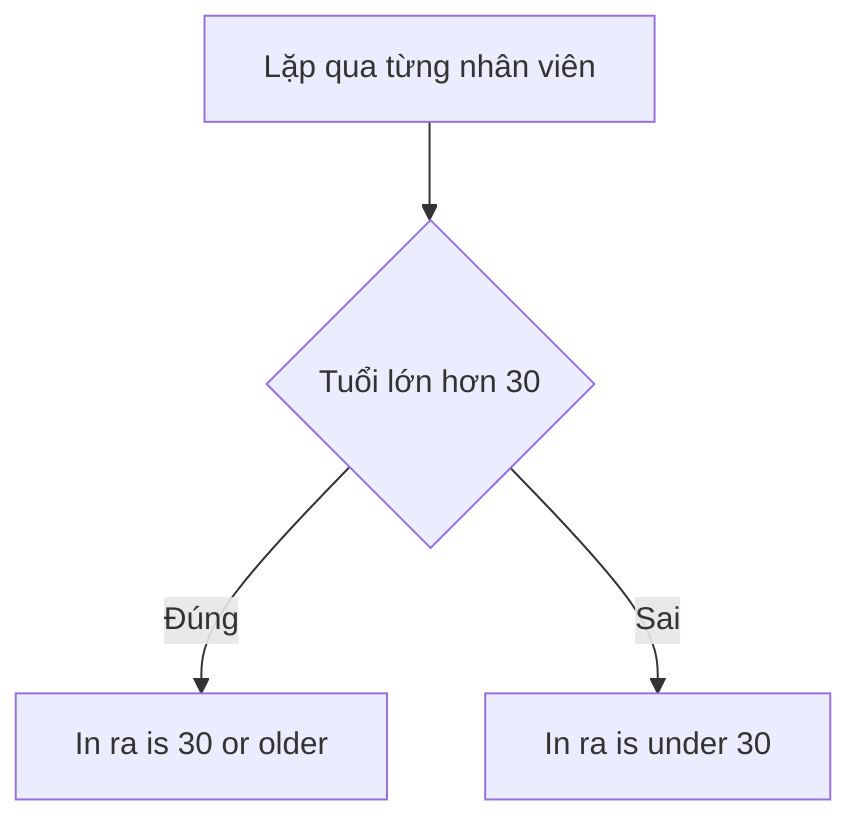

# 🧩 Compound Booleans — Ghép điều kiện bằng `&&` và `||` trong Go

> Nguồn: `040-Compound-Booleans.txt` · [Udemy](https://ua.udemy.com/course/go-programming-language-crash-course/learn/lecture/26162026)

Ở bài trước chúng ta đã làm quen với những phép kiểm tra đơn giản. Hôm nay mình muốn nâng lên một mức: ghép nhiều điều kiện lại với nhau — đúng kiểu các bạn sẽ dùng hằng ngày khi viết code thật. Vẫn là project cũ, mình chỉ xóa hết nội dung trong hàm `main` và bắt đầu lại từ đầu.

### 🧱 Định nghĩa type `employee` và hai nhân viên

Trước hàm `main`, mình định nghĩa một type mới tên là `employee` — một `struct` với bốn field:

```go
type employee struct {
    name     string
    age      int
    salary   int
    fullTime bool
}
```

Field cuối cùng `fullTime` là một `bool`, trả lời câu hỏi: nhân viên này **full-time hay part-time**? Nếu `true` thì là full-time; nếu không thì là part-time, casual, hoặc kiểu gì đó khác.

Trong hàm `main`, mình tạo hai nhân viên:

* **Jack** — Jack Smith, 27 tuổi, lương 40.000, `fullTime` là `false` (Jack không phải nhân viên full-time).
* **Jill** — Jill Jones, 33 tuổi, lương 60.000, `fullTime` là `true`.

Sau đó mình tạo biến `employees` là một **slice of employee** (`[]employee`), rồi `append` lần lượt Jack và Jill vào đó.

---

### 🔍 Phép thử đơn giản đầu tiên

Mình dùng `range` để lặp qua slice: bỏ qua giá trị trả về thứ nhất (index — một số nguyên) bằng dấu `_`, và gọi phần tử của vòng lặp hiện tại là `x`:

```go
for _, x := range employees {
    if x.age > 30 {
        fmt.Println(x.name, "is 30 or older")
    } else {
        fmt.Println(x.name, "is under 30")
    }
}
```

Chạy `go run main.go`, kết quả đúng như các bạn đoán: **Jack Smith is under 30** (vì Jack 27 tuổi) và **Jill Jones is 30 or older** (vì Jill 33 tuổi). Đây vẫn là kiểu kiểm tra quen thuộc của bài trước.



---

### 🔗 `&&` là "và", `||` là "hoặc"

Giờ mình làm phức tạp hơn một chút. Mình kiểm tra đồng thời tuổi **và** lương:

```go
if x.age > 30 && x.salary > 50000 {
    fmt.Println(x.name, "makes more than 50,000 and is over 30")
} else {
    fmt.Println(x.name, "makes less than 50,000 or is under 30")
}
```

Hai dấu `&&` chính là **logical and (và logic)**. Đoạn code trong nhánh `if` **chỉ được thực thi khi cả hai điều kiện đều đúng**: tuổi của nhân viên hiện tại từ 31 trở lên **và** lương từ 50.001 trở lên. Nếu không, nhánh `else` sẽ chạy.

Tiếp đó, mình copy khối lệnh và đổi `&&` thành **dấu hai sọc dọc** `||` — **logical or (hoặc logic)**. Lần này nhánh `if` chạy khi **một trong hai** điều kiện đúng; còn nhánh `else` chỉ chạy khi **cả hai** điều kiện đều sai, nghĩa là tuổi từ 30 trở xuống **hoặc** lương từ 50.000 trở xuống.

| Toán tử | Tên | Khi nào đúng |
|---|---|---|
| `&&` | logical and | Cả hai vế đều phải đúng |
| `\|\|` | logical or | Chỉ cần một trong hai vế đúng |

Kết quả sau khi chạy: Jill khớp cả hai điều kiện, còn Jack rơi vào cả hai nhánh `else` — đúng như mong đợi.

Chú ý nhỏ khi viết chuỗi trong `fmt.Println`: chuỗi phải đặt trong dấu ngoặc kép và phân tách với biến bằng dấu phẩy.

---

### 🧐 Khi điều kiện trở nên khó đọc — hãy dùng ngoặc

Có những điều kiện viết ra rất tối nghĩa. Mình thử một ví dụ: tuổi lớn hơn 30 **hoặc** lương dưới 50.000 **và** là nhân viên full-time, rồi in ra dòng "matches our unclear criteria". Đọc lên thì thật sự không rõ chương trình sẽ làm gì.

Chạy thử: chỉ **Jill Jones** khớp điều kiện, Jack không in ra gì cả — vì không có `else` nên không có gì được in.

Cách sửa rất đơn giản: đặt các điều kiện cần kiểm tra chung vào **dấu ngoặc**:

```go
if (x.age > 30 || x.salary < 50000) && x.fullTime {
    fmt.Println(x.name, "matches our unclear criteria")
}
```

Bây giờ mọi thứ đã rõ ràng: cụm trong ngoặc phải đúng, **và** nhân viên phải full-time. Chạy lại, kết quả không đổi nhưng code dễ đọc hơn hẳn — đó chính là mục tiêu.

Một lưu ý thú vị: những ngôn ngữ như JavaScript **bắt buộc** phải có ngoặc trong trường hợp này, còn Go thì không. Đa số IDE (trừ Visual Studio Code) sẽ cảnh báo "redundant parentheses" — ngoặc thừa — nếu các bạn thêm ngoặc không cần thiết. Vậy nên trong Go, chỉ dùng ngoặc khi các bạn thật sự muốn làm rõ mình đang kiểm tra điều gì.

---

### ⚠️ Lỗi đánh máy ai cũng từng mắc

Có một lỗi mà **mọi người** đều mắc khi mới học lập trình: viết `if x.age = 10` thay vì `if x.age == 10`. Ý các bạn là "nếu người này 10 tuổi", nhưng dấu `=` đơn lại là phép gán. May mắn là trình biên dịch Go rất thông minh và sẽ báo lỗi ngay — nhưng hãy cẩn thận, vì đây là lỗi đánh máy cực kỳ dễ xảy ra.

### 🎯 Tự kiểm tra nhanh

**1. Toán tử `&&` cho kết quả đúng khi nào?**
<details>
<summary><b>Xem đáp án</b></summary>

**Đáp án:** Khi cả hai điều kiện đều đúng.
Giải thích: Nhánh `if` chỉ chạy nếu tuổi trên 30 **và** lương trên 50.000.
Tham chiếu: Mục "`&&` là và, `||` là hoặc"

</details>

**2. Nhánh `else` của điều kiện dùng `||` chỉ chạy khi nào?**
<details>
<summary><b>Xem đáp án</b></summary>

**Đáp án:** Khi cả hai điều kiện đều sai.
Giải thích: Với `||`, chỉ cần một vế đúng là nhánh `if` chạy; `else` chỉ còn lại khi cả hai đều sai.
Tham chiếu: Mục "`&&` là và, `||` là hoặc"

</details>

**3. Vì sao điều kiện "tuổi trên 30 hoặc lương dưới 50.000 và full-time" bị coi là khó đọc?**
<details>
<summary><b>Xem đáp án</b></summary>

**Đáp án:** Vì không rõ thứ tự kết hợp các điều kiện, người đọc không biết chương trình thật sự kiểm tra gì.
Giải thích: Trevor phải thêm ngoặc để làm rõ: cụm "tuổi trên 30 hoặc lương dưới 50.000" phải đúng, và nhân viên phải full-time.
Tham chiếu: Mục "Khi điều kiện trở nên khó đọc — hãy dùng ngoặc"

</details>

**4. Trong Go, khi nào nên dùng ngoặc trong câu lệnh `if`?**
<details>
<summary><b>Xem đáp án</b></summary>

**Đáp án:** Chỉ khi muốn làm cho điều kiện đang kiểm tra trở nên rõ ràng hơn.
Giải thích: Go không bắt buộc ngoặc; nhiều IDE còn cảnh báo ngoặc thừa (trừ Visual Studio Code).
Tham chiếu: Mục "Khi điều kiện trở nên khó đọc — hãy dùng ngoặc"

</details>

**5. Lỗi đánh máy nào rất dễ gặp khi so sánh trong `if`?**
<details>
<summary><b>Xem đáp án</b></summary>

**Đáp án:** Dùng dấu `=` (gán) thay vì `==` (so sánh), ví dụ `if x.age = 10`.
Giải thích: Trình biên dịch Go sẽ báo lỗi, nhưng đây là lỗi ai cũng từng mắc khi mới học.
Tham chiếu: Mục "Lỗi đánh máy ai cũng từng mắc"

</details>

---

Boolean ghép là công cụ các bạn sẽ dùng suốt ngày trong code Go, nên hãy cứ thoải mái thử nghiệm — sai cũng không sao, trình biên dịch sẽ nhắc các bạn. Ngay bài sau, chúng ta sẽ mang những gì đã học áp vào dự án Hammer Bitcoin: các bạn sẽ có một **thử thách đếm biểu thức Boolean** thú vị đấy. Hẹn gặp lại! 🚀

## Nguồn tham khảo

- [The Go Programming Language Specification — Operators and punctuation](https://go.dev/ref/spec#Operators_and_punctuation)
- [Udemy — Compound Booleans](https://ua.udemy.com/course/go-programming-language-crash-course/learn/lecture/26162026)
