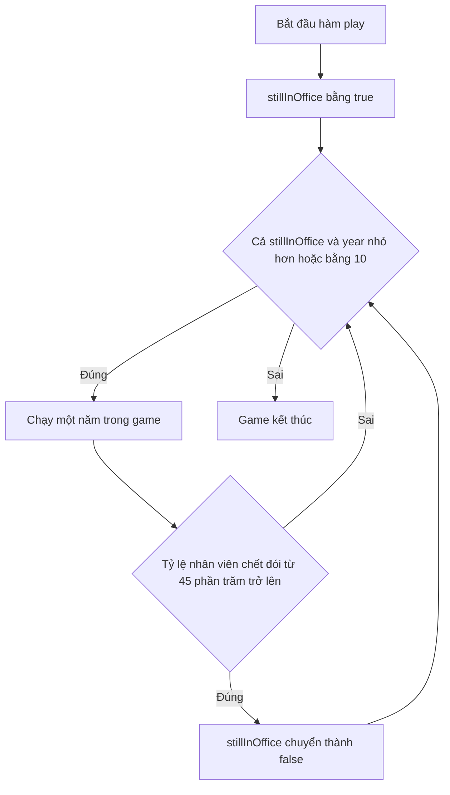

# 🎮 Thử thách Hammer Bitcoin — Đếm mọi biểu thức Boolean trong game

> Nguồn: `041-Hammer-Bitcoin-Challenge.txt` · [Udemy](https://ua.udemy.com/course/go-programming-language-crash-course/learn/lecture/26162038)

Mình đã cùng các bạn đi qua Boolean khá kỹ: nào là **gán Boolean** (đặt một biến thành `true` hoặc `false`), nào là **biểu thức Boolean** (xác định xem một hay nhiều điều kiện đúng hay sai). Giờ là lúc mang kiến thức đó áp vào **Hammer Bitcoin** — dự án xuyên suốt khóa học mà các bạn đã gặp từ trước. Các bạn hãy mở project đó ra cùng mình nhé.

### 🧠 Ôn nhanh hai khái niệm

* **Boolean assignment (gán Boolean):** gán một biến bằng `true` hoặc `false`, ví dụ `stillInOffice` được đặt thành `true`.
* **Boolean expression (biểu thức Boolean):** một phép kiểm tra trả về `true` hoặc `false`, ví dụ `year <= 10`.

Cả hai loại này đều xuất hiện đầy trong file `bitcoinminer.go` mà chúng ta sắp xem.

---

### 🎮 Mở `bitcoinminer.go` và tìm đến hàm `play`

Mình mở file `bitcoinminer.go` và cuộn xuống hàm `play` — trong code của mình, hàm này bắt đầu ở **dòng 38**.

Bên trong `play`, từ **dòng 48**, có một vòng lặp `for` **chỉ chạy khi hai điều kiện cùng đúng**:

1. `stillInOffice` — nghĩa là các bạn vẫn chưa bị đuổi khỏi ghế.
2. Biến `year` phải **nhỏ hơn hoặc bằng 10**.

Điều kiện thứ nhất khá dễ hiểu. Lần đầu hàm này chạy, ở **dòng 45**, `stillInOffice` được gán `true` và giữ nguyên như vậy cho đến khi điều kiện ở **dòng 59** xảy ra: nếu hàm `countStarvedEmployees` trả về **từ 45 trở lên** — tức 45% nhân viên trở lên đã chết đói — thì `stillInOffice` chuyển thành `false`.

---

### ⌨️ Chạy thử một ván "thảm họa"

Mình mở terminal và gõ `go run main.go`. Màn hình chào mừng hiện ra, và trò chơi lần lượt hỏi:

1. Sẽ mua bao nhiêu máy tính? → mình nhập `0`.
2. Sẽ bán bao nhiêu máy tính? → `0`.
3. Phân phối bao nhiêu bitcoin cho nhân viên? → `0`. Mình thừa nhận mình chơi "keo kiệt" — không ai được trả lương năm nay, và tất nhiên rất nhiều người sẽ chết đói.
4. Dành bao nhiêu bitcoin cho việc bảo trì? → `0`.

Kết quả hiện ra:

> 100 of your team starved during the last year of your incompetent reign. The few who remain hacked your bank account and changed your password effectively evicting you. Your final rating: terrible.

(Mình có thấy một lỗi đánh máy trong phần chào mừng, chắc sẽ sửa lúc nào đó, nhưng bây giờ cứ để nguyên vậy.)

Rõ ràng ván này mình chơi không được tốt lắm, nên mình chọn không chơi lại và đóng chương trình.

---

### 🔍 Chuyện gì đã xảy ra trong code?

Trong hàm `countStarvedEmployees`, giá trị trả về là **100** — lớn hơn hoặc bằng 45 — nên `stillInOffice` bị đặt thành `false`. Vòng lặp chạy thêm vài lệnh nữa, rồi khi nó muốn lặp lại ở dòng 48 thì `stillInOffice` đã là `false`. Lúc này giá trị `year` không còn quan trọng nữa, bởi **cả hai điều kiện đều phải đúng** thì vòng lặp mới tiếp tục — và thế là game kết thúc.

Nhìn kỹ, các bạn sẽ thấy rất nhiều phép toán Boolean trong file này:

* Ngay đầu hàm có `year` được đặt bằng 1 — đây **không phải** gán Boolean, nhưng nó tham gia biểu thức Boolean ở dòng 48: vì `year` bắt đầu từ 1 nên phép kiểm tra `year <= 10` trả về `true`.
* Ở dòng 45 là một **gán Boolean**: `stillInOffice` nhận giá trị `true`.
* Ở dòng 59 là một **gán Boolean** khác: `stillInOffice` nhận giá trị `false`.

---

### 🎯 Thử thách của các bạn

Nhiệm vụ của các bạn là: **đi hết phần còn lại của file `bitcoinminer.go` và đếm từng biểu thức Boolean một.**

Để các bạn khỏi bỡ ngỡ, mình ôn lại cách đếm mà mình đang dùng:

* Dòng 45 — từ khóa `true` tự thân cũng được xem là một biểu thức Boolean, nên đây là **một**.
* Dòng 48 — một số lập trình viên sẽ đếm cụm điều kiện của vòng lặp `for` thành hai, nhưng phần lớn (trong đó có mình) xem cả cụm `stillInOffice` **và** `year <= 10` là **một biểu thức Boolean**.
* Dòng 59 — từ khóa `false` gán cho `stillInOffice` là một biểu thức nữa.

Như vậy trong hàm `play` mình đếm được **ba** biểu thức. Còn phần còn lại của file thì mình để các bạn tự khám phá — mình sẽ đếm cùng các bạn ở bài sau, và nếu mình đếm sai thì các bạn cứ thoải mái "cà khịa" mình trong phần bình luận nhé.

*Đừng lo nếu có đoạn code trông vẫn còn khó hiểu — ở bài này các bạn chỉ cần tìm biểu thức Boolean thôi. Hãy để ý rằng sẽ có nhiều thứ "sáng" hơn hẳn so với lần đầu các bạn nhìn vào file này, và đến cuối khóa, toàn bộ file sẽ trở nên rõ ràng với các bạn.*

### 🎯 Tự kiểm tra nhanh

**1. Vòng lặp trong hàm `play` chỉ chạy khi nào?**

<b>Xem đáp án</b>

**Đáp án:** Khi `stillInOffice` là `true` **và** `year` nhỏ hơn hoặc bằng 10.
Giải thích: Cả hai điều kiện phải cùng đúng thì vòng lặp mới tiếp tục.
Tham chiếu: Mục "Mở bitcoinminer.go và tìm đến hàm play"

**2. `stillInOffice` chuyển thành `false` khi nào?**

<b>Xem đáp án</b>

**Đáp án:** Khi `countStarvedEmployees` trả về từ 45 trở lên — tức 45% nhân viên trở lên đã chết đói.
Giải thích: Điều kiện này nằm ở dòng 59 của file.
Tham chiếu: Mục "Mở bitcoinminer.go và tìm đến hàm play"

**3. Trong ván chơi thử, vì sao game kết thúc ngay?**

<b>Xem đáp án</b>

**Đáp án:** Vì không trả lương cho nhân viên (nhập 0 bitcoin), 100 nhân viên chết đói nên `stillInOffice` thành `false`.
Giải thích: Khi `stillInOffice` sai thì `year` không còn quan trọng, vòng lặp dừng và game kết thúc.
Tham chiếu: Mục "Chuyện gì đã xảy ra trong code"

**4. `year` được đặt bằng 1 có phải là gán Boolean không?**

<b>Xem đáp án</b>

**Đáp án:** Không.
Giải thích: Đó là gán một số nguyên, nhưng `year` tham gia biểu thức Boolean `year <= 10` ở dòng 48.
Tham chiếu: Mục "Chuyện gì đã xảy ra trong code"

**5. Từ khóa `true` hoặc `false` đứng một mình có được tính là biểu thức Boolean không?**

<b>Xem đáp án</b>

**Đáp án:** Có.
Giải thích: `true` ở dòng 45 và `false` ở dòng 59 đều được mình đếm là biểu thức Boolean.
Tham chiếu: Mục "Thử thách của các bạn"

---

Thử thách này nghe có vẻ đơn giản nhưng sẽ giúp các bạn đọc code game quen tay hơn rất nhiều đấy. Cứ thử hết sức mình, bài sau mình sẽ đếm cùng các bạn và tiết lộ đáp án cuối cùng. Hẹn gặp lại! 🚀

## Nguồn tham khảo

- [Udemy — Hammer Bitcoin Challenge](https://ua.udemy.com/course/go-programming-language-crash-course/learn/lecture/26162038)
