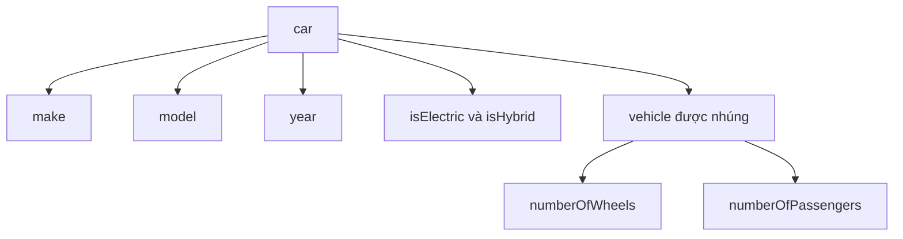

# 🚗 Composition trong Go — Vì sao Go không cần kế thừa?

> Nguồn: `043-Composition.txt` · [Udemy](https://ua.udemy.com/course/go-programming-language-crash-course/learn/lecture/26162052)

Mình đã nhắc đến khái niệm **composition (tổ hợp)** từ khá lâu nhưng chưa đi sâu, và hôm nay là lúc quay lại với nó. Đây là một trong những chủ đề mình thích nhất, vì nó cho thấy Go khác biệt thế nào so với Java, C# hay PHP. Để so sánh cho công bằng, mình sẽ bắt đầu bằng một chương trình PHP viết theo hướng đối tượng — các bạn không hiểu hết cũng không sao, mình chỉ đi qua những điểm quan trọng.

### 🐘 Nhìn sang PHP: kế thừa trông như thế nào?

Trong file PHP này, từ **dòng 3 đến dòng 27**, có một **class (lớp)** tên là `vehicle`. Class mô tả một loại đối tượng tồn tại trong chương trình:

* `vehicle` có hai **public member**: `numberOfWheels` (số bánh xe) và `numberOfPassengers` (số hành khách). Các bạn sẽ để ý PHP đặt dấu `$` trước tên biến — hơi lạ một chút, nhưng đó là cách của PHP.
* Hàm đầu tiên tên là `showDetails`, chỉ in ra màn hình số hành khách rồi số bánh xe, thông qua `$this`.
* Bốn hàm tiếp theo (dòng 12–26) có tên kỹ thuật là **accessors và mutators**, hay thường được gọi là **getters và setters**. Chúng cho phép đọc hoặc ghi giá trị của một member. Cứ mỗi biến cần truy cập và thay đổi thì phải tạo một cặp getter/setter — class `vehicle` có hai biến nên có tổng cộng **bốn hàm**.

Bên dưới là class `car`, kéo dài từ **dòng 29 đến dòng 125**, và nó **extends `vehicle`** — nghĩa là kế thừa toàn bộ những gì `vehicle` có. `car` thêm các biến `make`, `model`, `year`, `isElectric`, `isHybrid` cùng getters/setters, thêm hàm `show` in ra make, model, year, electric, hybrid... rồi gọi `showDetails` của class cha. Phần chương trình chính bắt đầu ở **dòng 127**: tạo một chiếc car, dùng setters để gán giá trị, gọi `show`, rồi làm y hệt cho một chiếc xe nữa.

Tổng cộng: **149 dòng code.**

---

### 🚙 Cùng bài toán đó, viết bằng composition trong Go

Mình tạo một project rỗng mới với file `main.go`, và bắt đầu bằng hai type:

```go
type vehicle struct {
    numberOfWheels     int
    numberOfPassengers int
}

type car struct {
    make       string
    model      string
    year       int
    isElectric bool
    isHybrid   bool
    vehicle
}
```

Chi tiết đáng chú ý nhất là dòng cuối cùng: mình **nhúng (embed) type `vehicle` ngay trong type `car`**. Vậy là `car` có quyền truy cập mọi thứ thuộc về `vehicle` — nhưng còn hơn thế nữa, mình sẽ cho các bạn thấy ngay sau đây.



---

### 🔧 Gắn hàm vào từng type

Mình viết hàm `showDetails` với **receiver** là `vehicle` (đặt tên biến là `v`), bên trong in ra số hành khách và `v.numberOfPassengers`, rồi dòng tiếp theo in số bánh xe và `v.numberOfWheels`. Chính vì dùng receiver `vehicle` nên hàm này gắn chặt với type `vehicle`.

Dưới đó, mình tạo hàm `show` gắn với type `car`: in lần lượt `c.make`, `c.model`, `c.year`, giá trị Boolean `isElectric` và `isHybrid`. Và ở cuối hàm, mình gọi:

```go
c.vehicle.showDetails()
```

Đây là điểm "ăn tiền": vì `vehicle` được nhúng trong `car`, chiếc xe của các bạn gọi được cả hàm của `vehicle` — thứ mà nó thừa hưởng chứ không cần viết lại.

---

### ▶️ Chạy thử: Volvo, Tesla và thay đổi dữ liệu trực tiếp

Trong `main`, mình định nghĩa một `vehicle` tên `suv` với **4 bánh** và **6 hành khách**. Rồi mình định nghĩa một chiếc `car` tên `volvoXc90`: make volvo, model xc90, bản T8 (hybrid), năm 2021, `isElectric` là `false` (mình ghi ra cho rõ chứ mặc định cũng là `false`), `isHybrid` là `true`, và trường `vehicle` chính là biến `suv` vừa tạo.

Gọi `volvoXc90.show()` rồi chạy `go run main.go` — chiếc xe có đủ dữ liệu của `car` **lẫn** `vehicle`, và gọi được cả hàm dựng sẵn trong `vehicle`.

Điểm tuyệt vời nhất: nếu mình định nghĩa thêm một type khác — ví dụ `interiorDetails` cho phần nội thất — mình chỉ cần **nhúng nó vào `car`**. Đó chính là tinh thần của composition.

Rồi mình làm y hệt chương trình PHP: in một dòng trống bằng `fmt.Println`, tạo `teslaModelX`: make tesla, model model x, năm 2021, `isElectric` là `true`, `isHybrid` là `false`, và nhúng `vehicle` kiểu `suv`. Gọi `show` — mọi thứ đúng như mong đợi.

Và đây là điều dễ chịu nhất: **không cần getters và setters**. Muốn đổi xe từ 6 chỗ thành 7 chỗ, mình chỉ viết:

```go
teslaModelX.vehicle.numberOfPassengers = 7
```

Chạy lại chương trình — 7 hành khách. Không phải viết thêm hàm nào cả.

---

### 📉 149 dòng PHP so với 63–64 dòng Go

| Tiêu chí | PHP (inheritance) | Go (composition) |
|---|---|---|
| Số dòng code | 149 | 63–64 |
| Getters/setters | Bắt buộc, mỗi biến một cặp | Không cần |
| Truy cập member | Qua hàm | Trực tiếp |

Ít code hơn nghĩa là **ít phải bảo trì hơn và ít cơ hội phát sinh lỗi hơn**. Và đó là composition trong một "vỏ hạt dẻ" — đơn giản, gọn gàng, nhưng cực kỳ mạnh mẽ.

### 🎯 Tự kiểm tra nhanh

**1. Go dùng cơ chế nào thay cho kế thừa?**
<details>
<summary><b>Xem đáp án</b></summary>

**Đáp án:** Composition — nhúng type này vào type khác.
Giải thích: `car` nhúng `vehicle`, nhờ đó dùng được cả member lẫn hàm của `vehicle`.
Tham chiếu: Mục "Cùng bài toán đó, viết bằng composition trong Go"

</details>

**2. Vì sao class `vehicle` trong PHP cần tới bốn hàm cho hai biến?**
<details>
<summary><b>Xem đáp án</b></summary>

**Đáp án:** Vì mỗi biến cần một cặp getter và setter.
Giải thích: Accessors và mutators cho phép đọc/ghi giá trị của member; hai biến nên cần bốn hàm.
Tham chiếu: Mục "Nhìn sang PHP: kế thừa trông như thế nào?"

</details>

**3. Làm sao `car` gọi được hàm `showDetails` của `vehicle`?**
<details>
<summary><b>Xem đáp án</b></summary>

**Đáp án:** Vì `vehicle` được nhúng bên trong `car`, nên gọi được qua `c.vehicle.showDetails()`.
Giải thích: Hàm `showDetails` có receiver là `vehicle`, nên gắn với type đó.
Tham chiếu: Mục "Gắn hàm vào từng type"

</details>

**4. Để thay đổi số hành khách của Tesla trong bài, mình làm gì?**
<details>
<summary><b>Xem đáp án</b></summary>

**Đáp án:** Gán trực tiếp giá trị mới, ví dụ `teslaModelX.vehicle.numberOfPassengers = 7`.
Giải thích: Với composition không cần setter, ta truy cập member trực tiếp.
Tham chiếu: Mục "Chạy thử: Volvo, Tesla và thay đổi dữ liệu trực tiếp"

</details>

**5. So với PHP, việc viết bằng composition mang lại lợi ích gì?**
<details>
<summary><b>Xem đáp án</b></summary>

**Đáp án:** Ít hơn khoảng một nửa số dòng code, ít bảo trì và ít lỗi hơn.
Giải thích: PHP mất 149 dòng, còn Go chỉ khoảng 63–64 dòng cho cùng chức năng.
Tham chiếu: Mục "149 dòng PHP so với 63–64 dòng Go"

</details>

---

Composition là một trong những "vũ khí" đẹp nhất của Go, và các bạn sẽ gặp lại nó rất nhiều khi làm việc với interface. Nhưng trước đó, bài tiếp theo chúng ta sẽ nói về **exported và unexported** — quy tắc chữ HOA chữ thường quyết định điều gì được nhìn thấy bên ngoài package. Một chủ đề nhỏ mà vô cùng quan trọng. Hẹn gặp lại các bạn! 🚀

## Nguồn tham khảo

- [The Go Programming Language Specification — Struct types](https://go.dev/ref/spec#Struct_types)
- [Udemy — Composition](https://ua.udemy.com/course/go-programming-language-crash-course/learn/lecture/26162052)
