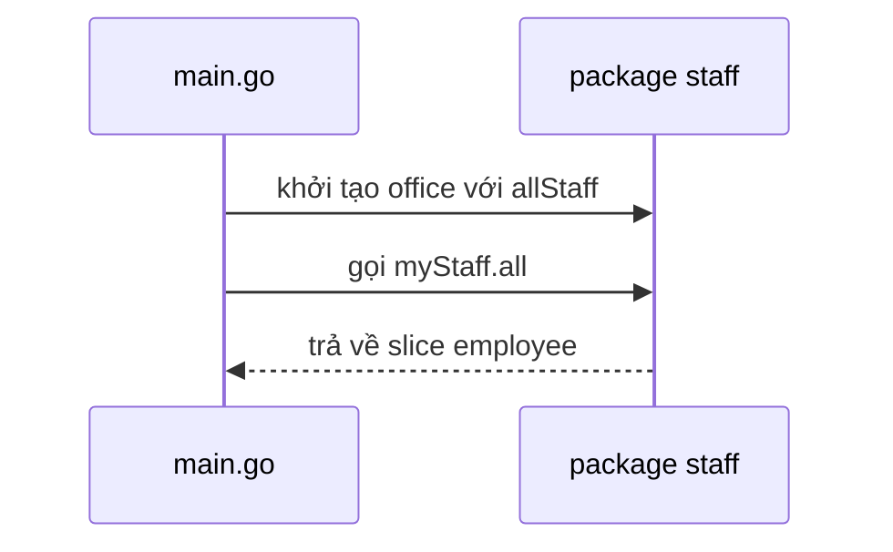

# 🔠 Exported và Unexported trong Go — Chữ HOA quyết định tất cả

> Nguồn: `044-Exported-vs-Unexported.txt` · [Udemy](https://ua.udemy.com/course/go-programming-language-crash-course/learn/lecture/26162070)

Chúng ta đã chạm vào chủ đề này một lần trước đó, nhưng mình thấy cần đi kỹ hơn. **Exported (công khai)** và **unexported (nội bộ)** là chìa khóa để hiểu cách các package "nói chuyện" với nhau — và cũng là nguồn gốc của không ít lỗi khó hiểu với người mới. Các bạn hãy mở Visual Studio Code ra, mình sẽ đi từng bước thật chậm.

### 🏗️ Dựng project, package `staff` và chữ HOA exported

Trong VS Code, mình tạo một folder mới trong thư mục project, đặt tên là `exported` và mở nó ra. Sau đó mình mở terminal và — như các bạn luôn nên làm — gõ `go mod init` để đặt tên cho ứng dụng, mình đặt là `myapp`. Lệnh này tạo ra file `go.mod`.

Tiếp theo:

1. Tạo file `main.go` ở ngay gốc project, khai báo `package main` và hàm `main` để trống.
2. Tạo một folder mới tên `staff` — folder này sẽ là **một package riêng**.
3. Trong folder đó, tạo file `staff.go` với khai báo `package staff`.

Trong `staff.go`, mình định nghĩa type `employee`:

```go
type employee struct {
    firstName string
    lastName  string
    salary    int
    fullTime  bool
}
```

Rồi thêm type `office`, cũng là một struct, chỉ có một member `allStaff` — một slice of employee.

Quay lại `main.go`, mình tạo một biến ở **package level** tên `employees`, kiểu `[]staff.employee`, và nạp vào đó năm người:

1. **John Smith** — lương 30.000 — full-time.
2. **Sally Jones** — lương 50.000 — full-time.
3. **Mark Smithers** — lương 60.000 — full-time.
4. **Alan Anderson** — lương 15.000 — không full-time.
5. **Margaret Carter** — lương 100.000.

Điểm mấu chốt: mình **import được type `employee` từ package `staff`** là nhờ tên nó bắt đầu bằng **chữ HOA**. Đây là quy tắc vàng:

> Chỉ những **type, biến và hàm bắt đầu bằng chữ HOA** mới nhìn thấy được từ bên ngoài package. Những gì bắt đầu bằng chữ thường là **unexported** — chỉ dùng được bên trong package chứa nó.

Mình nhấn mạnh lại điều này vì rất dễ đặt tên bằng chữ thường rồi quên mất rằng nó chưa được export.

---

### 🧩 Khởi tạo package từ bên ngoài

Mình khai báo biến `myStaff` kiểu `staff.office` và truyền `allStaff: employees`. Nhưng lúc này biến chỉ "nằm im" — chưa làm gì được. Thế nên mình quay lại `staff.go`, viết một hàm có **receiver** `e` kiểu `office`, trả về `[]employee`, và bên trong chỉ `return e.allStaff`.



Vậy `allStaff` được nạp dữ liệu khi nào? Chính là ở `main.go`: mình khởi tạo type `office` của package `staff` với field `allStaff` chứa danh sách nhân viên. **Đây là cách rất phổ biến để khởi tạo giá trị mặc định hoặc giá trị ban đầu cho một package mà các bạn import** — một pattern mà các bạn nên làm quen.

Giờ `myStaff` đã có kiểu `staff.office`, mình gọi được hàm `all`:

```go
log.Println(myStaff.all())
```

Mình xóa dòng cũ và chạy `go run main.go` — chạy đúng như mong đợi.

---

### 💰 `overpaid`, `underpaid` và biến package-level

Mình viết hàm `overpaid` (receiver `office`, trả về `[]employee`): tạo biến `overpaid` kiểu slice of employee, `range` qua `e.allStaff` (bỏ index, phần tử hiện tại gọi là `x`), nếu `x.salary > 75000` thì `append` vào, cuối cùng trả về. Trong `main.go`, mình in `myStaff.overpaid()` ra và comment dòng cũ đi. (Mình có một lỗi nhỏ trong file staff, sửa lại là chạy được ngon lành.) Kết quả: **Margaret Carter** có lương trên 75.000 — đúng, cô ấy "overpaid".

Vì giá trị 75.000 có thể dùng ở nhiều nơi, mình biến nó thành **biến ở package level**: `var overpaidLimit = 75000`. Nhưng nếu để vậy, mình không thể ghi đè từ `main.go`. Thử `staff.overpaidLimit = 60000` — lỗi ngay:

> `overpaidLimit` is not exported by package `staff`.

Chỉ cần đổi thành **chữ HOA** — `OverpaidLimit` — ở cả hai file, lỗi biến mất. Chạy `go run main.go`, vẫn một người. Đổi giá trị trong `main` từ 60.000 xuống 10.000, chạy lại: **mọi người** đều lọt vào danh sách vì ai cũng có lương trên 10.000.

Rồi mình tạo hàm `underpaid` tương tự (đổi điều kiện thành nhỏ hơn, dùng `underpaidLimit`) và **cố tình** để `underpaidLimit` bắt đầu bằng **chữ thường**. Mọi thứ vẫn compile và chạy bình thường, nhưng biến này **không thể truy cập từ ngoài package**. Đó chính là điều mình muốn minh họa. Cuối cùng, mình để `main.go` dùng giá trị mặc định: overpaid là 75.000, underpaid là 20.000 — chạy lên, ta có đúng một người overpaid và một người underpaid.

**Ghi nhớ:** giống như hàm bắt đầu bằng chữ HOA là exported, **biến ở package level** bắt đầu bằng chữ HOA cũng exported; chữ thường thì không.

---

### 🚫 Hàm không exported và hàm không receiver

Trong `staff.go`, mình tạo hàm `notVisible` (receiver `office`) chỉ in ra "hello world". Quay lại `main.go` gọi `myStaff.notVisible` → lỗi ngay: hàm không tồn tại hoặc không được export. Đổi tên thành chữ HOA là chạy được.

Một điều cuối cùng: các bạn **không bắt buộc** phải tạo hàm có receiver trong package `staff`. Mình tạo hàm `myFunction` không có receiver, chỉ log ra "I am a function" — hoàn toàn hợp lệ, và gọi được từ `main.go`. Nhưng hàm này **không truy cập được** các giá trị nằm trong biến receiver `e`, đơn giản vì nó không có receiver.

---

### ✅ Tổng kết: quy tắc chữ HOA

| Loại | Bắt đầu bằng chữ HOA | Bắt đầu bằng chữ thường |
|---|---|---|
| Type | Exported | Unexported |
| Biến package-level | Exported | Unexported |
| Hằng (constant) | Exported | Unexported |
| Hàm | Exported | Unexported |

Nói ngắn gọn: **type, biến, hằng và hàm bắt đầu bằng chữ HOA thì nhìn thấy được bên ngoài package; bắt đầu bằng chữ thường thì không.**

### 🎯 Tự kiểm tra nhanh

**1. Vì sao `main.go` import được type `employee` từ package `staff`?**
<details>
<summary><b>Xem đáp án</b></summary>

**Đáp án:** Vì tên `employee` bắt đầu bằng chữ HOA — nó được export.
Giải thích: Chỉ type, biến, hàm bắt đầu bằng chữ HOA mới nhìn thấy từ ngoài package.
Tham chiếu: Mục "Dựng project, package staff và chữ HOA exported"

</details>

**2. Vì sao `staff.overpaidLimit = 60000` trong `main.go` báo lỗi?**
<details>
<summary><b>Xem đáp án</b></summary>

**Đáp án:** Vì `overpaidLimit` bắt đầu bằng chữ thường nên không được export khỏi package `staff`.
Giải thích: Đổi thành `OverpaidLimit` (chữ HOA) ở cả hai file thì lỗi biến mất.
Tham chiếu: Mục "overpaid, underpaid và biến package-level"

</details>

**3. Biến `underpaidLimit` viết chữ thường có làm chương trình lỗi khi build không?**
<details>
<summary><b>Xem đáp án</b></summary>

**Đáp án:** Không — chương trình vẫn compile và chạy bình thường.
Giải thích: Nó chỉ không truy cập được từ bên ngoài package; Trevor cố tình để vậy để minh họa.
Tham chiếu: Mục "overpaid, underpaid và biến package-level"

</details>

**4. Hàm không có receiver khác gì hàm có receiver?**
<details>
<summary><b>Xem đáp án</b></summary>

**Đáp án:** Hàm không receiver không truy cập được dữ liệu nằm trong receiver.
Giải thích: `myFunction` vẫn gọi được từ `main.go` nhưng không thấy các giá trị của biến `e`.
Tham chiếu: Mục "Hàm không exported và hàm không receiver"

</details>

**5. Cách khởi tạo package bằng việc truyền dữ liệu vào field exported từ `main.go` được gọi là gì?**
<details>
<summary><b>Xem đáp án</b></summary>

**Đáp án:** Một pattern rất phổ biến để khởi tạo giá trị mặc định hoặc giá trị ban đầu cho package được import.
Giải thích: `office` với field `allStaff` được nạp từ `main.go`, sau đó package dùng lại dữ liệu này.
Tham chiếu: Mục "Khởi tạo package từ bên ngoài"

</details>

---

Quy tắc chữ HOA tuy nhỏ nhưng theo các bạn suốt cả sự nghiệp viết Go — nhất là khi làm việc với package do người khác viết. Nếu hôm nay các bạn thấy hơi rối, hoàn toàn không sao: cứ quay lại bài này khi cần nhé. Bài tiếp theo, chúng ta sẽ cùng **tổng kết chương Types, Expression and Composition** trước khi bước sang chương mới về vòng lặp `for`. Hẹn gặp lại! 🚀

## Nguồn tham khảo

- [The Go Programming Language Specification — Exported identifiers](https://go.dev/ref/spec#Exported_identifiers)
- [Udemy — Exported vs. Unexported](https://ua.udemy.com/course/go-programming-language-crash-course/learn/lecture/26162070)
