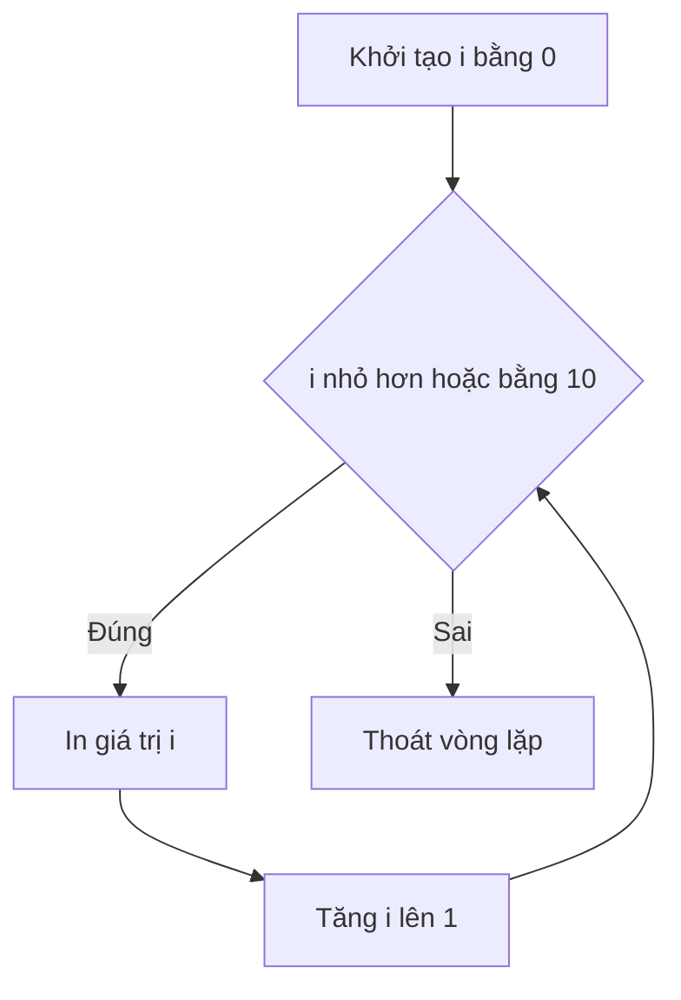

# 🎯 Vòng lặp for ba phần — Chạy đúng số lần bạn muốn

> Nguồn: `047-Three-Part-Loop.txt` · [Udemy](https://ua.udemy.com/course/go-programming-language-crash-course/learn/lecture/26162110)

Chào các bạn! Hôm nay chúng ta bắt đầu "chơi" với vòng lặp một cách nghiêm túc. Trước giờ các bạn đã thấy vài kiểu `for` rồi, nhưng lần này mình giới thiệu **three-part loop (vòng lặp ba phần)** — công cụ để chạy một đoạn code đúng số lần mà bạn muốn. Mình vừa tạo một project trống: `main.go` chỉ có package `main` và hàm `main` rỗng, kèm file `go.mod` tạo bằng `go mod init myapp`. *Các bạn nhớ tạo `go.mod` cho mọi project mới nhé — đó là thói quen tốt.*

### 🧵 Ôn lại những vòng lặp đã gặp

Chúng ta đã gặp hai kiểu `for` quen thuộc:

* **Infinite loop** — `for` không có gì sau nó, mọi thứ trong cặp `{}` chạy mãi mãi, cho đến khi bạn tự thoát bằng `Ctrl+C`.
* **Range** — kiểu như `for _, x := range someMap`, dùng để duyệt qua slice hoặc map; dấu `_` là chỗ bỏ qua index.

Ngoài hai kiểu đó, `for` còn có thêm mấy biến thể nữa, và hôm nay là **three-part loop**.

---

### ⚙️ Ba phần của vòng lặp for

Cú pháp trông như thế này:

```go
for i := 0; i <= 10; i++ {
    fmt.Println("i is", i)
}
```

Đọc kỹ một chút nhé:

1. **Phần 1 — khởi tạo:** `i := 0`, index của chúng ta bắt đầu từ 0.
2. **Phần 2 — điều kiện:** `i <= 10` — biểu thức Boolean quyết định còn tiếp tục hay không.
3. **Phần 3 — cập nhật:** `i++` — mỗi vòng lặp, giá trị của `i` được thay đổi.

Ba phần này ngăn nhau bởi **hai dấu chấm phẩy** trong đầu vòng lặp. Chạy `go run main.go`, các bạn sẽ thấy `i` được in ra lần lượt. Lần đầu tiên, `i` bằng 0 và được in ra **trước khi** phép `++` được thực hiện; sau đó `i` tăng lên 1, điều kiện được kiểm tra lại... Cứ thế cho đến 10, vì `10 <= 10` vẫn đúng. Lần kế tiếp `i` được tăng thành 11, điều kiện sai, và vòng lặp thoát — số 11 **không bao giờ** được in ra.



Và đây là bảng tóm tắt ba phần cho các bạn dễ nhớ:

| Phần | Vị trí | Ví dụ | Vai trò |
|---|---|---|---|
| Khởi tạo | Trước dấu `;` đầu tiên | `i := 0` | Nơi index bắt đầu |
| Điều kiện | Giữa hai dấu `;` | `i <= 10` | Biểu thức Boolean cho phép tiếp tục |
| Cập nhật | Sau dấu `;` thứ hai | `i++` | Thay đổi index mỗi vòng |

---

### 🔄 Đếm ngược và những bước nhảy linh hoạt

Không nhất thiết phải cộng thêm 1 mỗi lần. Ví dụ muốn đếm ngược từ 10 về 0, mình chỉnh lại ba phần:

```go
for i := 10; i >= 0; i-- {
    fmt.Println("i is", i)
}
```

Ở đây phần cập nhật là `i--`, cách viết ngắn gọn của `i = i - 1` — đúng như `i++` là cách viết ngắn của `i = i + 1`. Chạy lên, chương trình đếm ngược từ 10 xuống 0.

Các bạn cũng có thể nhảy hai bước một lần bằng `i = i + 2` nếu muốn lặp cách quãng. Phần thứ ba chỉ đơn giản là **nơi bạn sửa giá trị của index theo cách bạn muốn**.

---

### 📝 Ghi nhớ ba phần

* Nhớ rằng bạn có **ba phần ngăn bởi dấu chấm phẩy**: nơi index bắt đầu, điều kiện để tiếp tục, và cách sửa index.
* Trường hợp phổ biến nhất là `i++` (tăng 1) hoặc `i--` (giảm 1), nhưng bạn hoàn toàn tự do.
* Đây là construct **rất rất phổ biến** — khi muốn làm gì đó đúng 100 lần chẳng hạn, đây chính là cú pháp bạn cần.

*Cứ gõ theo, sai cũng không sao* — three-part loop sẽ xuất hiện lại rất nhiều lần trong khóa, nên các bạn sẽ sớm thấy nó tự nhiên như đánh răng vậy.

---

Three-part loop là viên gạch đầu tiên và cũng là viên gạch dùng nhiều nhất trong xây dựng vòng lặp Go. Nắm chắc nó, các bài sau sẽ nhẹ nhàng hơn hẳn.

Bài tiếp theo, chúng ta sẽ dùng `for` để làm việc mà các ngôn ngữ khác gọi là `while` — vòng lặp chạy chừng nào điều kiện còn đúng. Hẹn gặp lại! 🚀

## Nguồn tham khảo

- [A Tour of Go — For](https://go.dev/tour/flowcontrol/1)
- [The Go Programming Language Specification — For statements](https://go.dev/ref/spec#For_statements)
