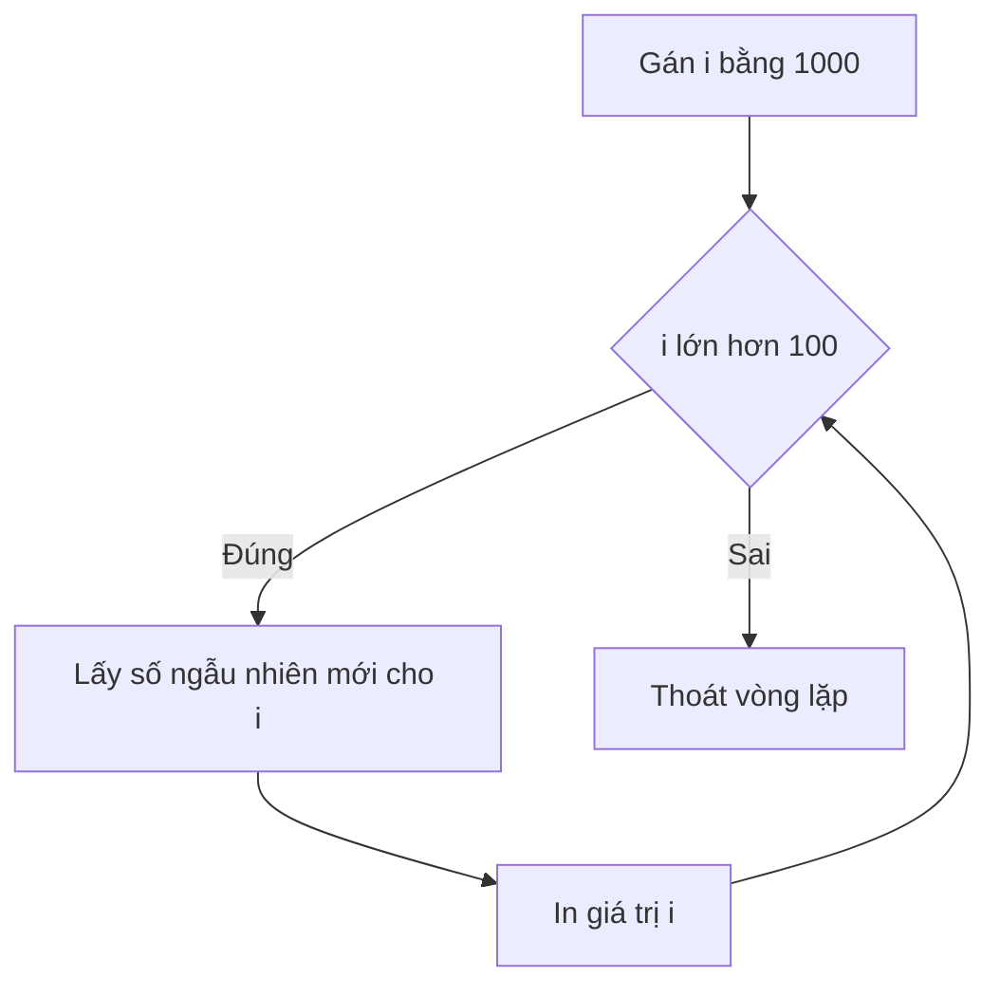

# 🌊 Kiểu while trong Go — Vòng lặp chạy khi điều kiện còn đúng

> Nguồn: `048-The-While-Loop-in-Go.txt` · [Udemy](https://ua.udemy.com/course/go-programming-language-crash-course/learn/lecture/26162122)

Chào các bạn! Lần trước chúng ta chạy một đoạn code đúng số lần định trước; lần này mình muốn làm điều thú vị hơn: một vòng lặp **chạy chừng nào một biểu thức Boolean còn đúng**. Đây chính là kiểu `while` quen thuộc ở ngôn ngữ khác, và tất nhiên, Go vẫn làm nó bằng `for`. Mình có sẵn `main.go` rỗng cùng `go.mod` tạo bằng `go mod init myapp` — *các bạn nhớ tạo `go.mod` mỗi khi bắt đầu project mới nhé.*

### 🎯 Ý tưởng: `for` cộng một biểu thức Boolean

Mục tiêu của mình rất đơn giản: **execute a loop while some condition is true**. Trước hết, mình cần một biến để kiểm tra:

* Khai báo `i` và gán giá trị **1000** — lớn hơn 100, nên điều kiện ban đầu đúng.
* Viết vòng lặp bắt đầu bằng keyword `for`, nhưng thay vì để trống như infinite loop, mình đặt ngay một biểu thức Boolean: `for i > 100`.

Nếu bên trong vòng lặp không có gì thay đổi giá trị của `i` thì chương trình sẽ chạy mãi mãi, vì `i` luôn là 1000 và luôn lớn hơn 100 — phải `Ctrl+C` mới dừng được. Vậy nên điều quan trọng là **bên trong thân vòng lặp phải có logic làm thay đổi giá trị của `i`**.

---

### 🎲 Lấy số ngẫu nhiên và gieo seed

Để `i` thay đổi, mình sẽ cho nó nhận một **số ngẫu nhiên**. Chúng ta đã biết cách làm việc này, nhưng nhắc lại một chút cho chắc:

1. Trước tiên phải **seed** bộ sinh số ngẫu nhiên: gọi `rand.Seed(time.Now().UnixNano())`.
2. Trong mỗi vòng lặp, gán `i` bằng `rand.Intn(1000) + 1` — như vậy khoảng giá trị nằm trong vùng mình mong muốn.

Về lý do phải seed: nếu không, mỗi lần chạy chương trình, các bạn sẽ nhận được **đúng cùng một dãy số ngẫu nhiên** — nghe ngược đời nhưng đúng là vậy!

---

### 🧭 Chạy thử và đọc kết quả từng bước

Đây là toàn bộ đoạn code mình viết:

```go
rand.Seed(time.Now().UnixNano())
i := 1000
for i > 100 {
    i = rand.Intn(1000) + 1
    fmt.Println("i is", i)
    if i > 100 {
        fmt.Println("so loop keeps going")
    } else {
        fmt.Println("got", i, "and broke out of loop")
    }
}
```

Mình còn in thêm thông báo trong câu `if` để các bạn thấy rõ chuyện gì đang diễn ra. Luồng chạy như sau:

1. Seed bộ sinh số ngẫu nhiên.
2. Khai báo `i` bằng 1000 — chắc chắn lớn hơn 100, nên vòng lặp sẽ chạy ít nhất một lần.
3. Kiểm tra điều kiện `i > 100`. Đúng thì vào thân vòng lặp: lấy số ngẫu nhiên, gán cho `i`, in ra.
4. Nếu `i` vẫn lớn hơn 100, in "so loop keeps going" và lặp lại. Nếu `i` nhỏ hơn hoặc bằng 100, in thông báo đã thoát vòng lặp.



Khi mình chạy `go run main.go`, chương trình in ra một loạt số cho đến khi gặp **29** — và ngay khi gặp 29, nó thoát khỏi vòng lặp và đi tiếp.

---

### 🧠 Chốt lại cách hoạt động

* Với kiểu `while` này, bạn chỉ cần đặt **một biểu thức Boolean bất kỳ** ngay sau `for`.
* Chừng nào biểu thức còn **đúng**, vòng lặp còn chạy; vừa **sai**, chương trình thoát ra và đi tiếp từ điểm đó.
* Nhớ seed nếu dùng số ngẫu nhiên, và nhớ thay đổi giá trị biến trong điều kiện, nếu không sẽ lặp vô tận.

---

*Đừng lo nếu các bạn chưa quen ngay với việc đặt điều kiện* — cứ nghĩ đơn giản: còn đúng thì còn chạy. Đó là toàn bộ bí quyết của kiểu `while` trong Go.

Bài tiếp theo, chúng ta sẽ ôn kỹ hơn về **infinite loop** và một use case cực kỳ thực tế của nó. Hẹn gặp lại! 🚀

## Nguồn tham khảo

- [Go Packages — math/rand](https://pkg.go.dev/math/rand)
