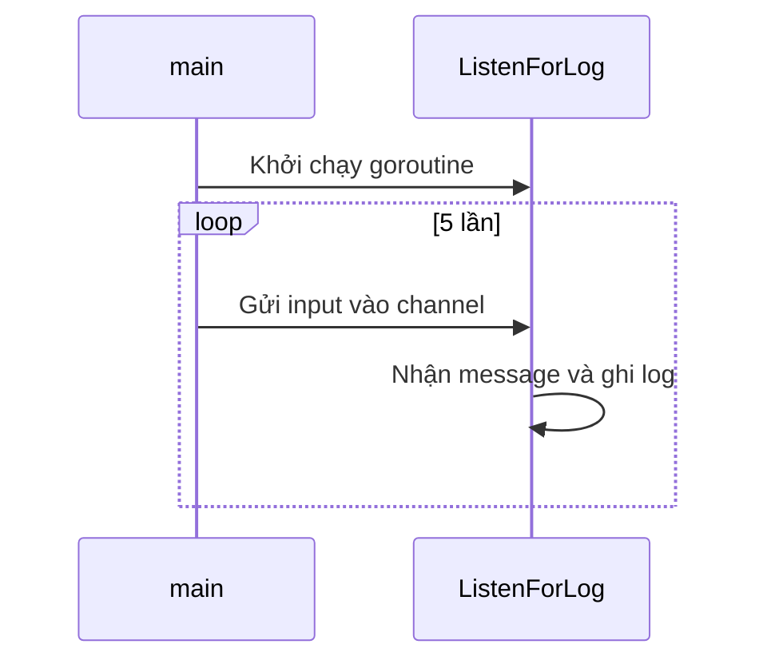

# ♾️ Infinite Loop trong Go — Khi vòng lặp chạy mãi là điều mình cần

> Nguồn: `049-The-Infinite-Loop-in-Go.txt` · [Udemy](https://ua.udemy.com/course/go-programming-language-crash-course/learn/lecture/26162132)

Chào các bạn! Hôm nay mình muốn dành thời gian nói kỹ hơn về **infinite loop (vòng lặp vô hạn)**. Chúng ta từng gặp nó rồi, nhưng có những tình huống mà một vòng lặp **không bao giờ thoát** lại là điều hoàn toàn hợp lý — và cũng có những chỗ nó không phù hợp. Cùng xem một ví dụ thật để thấy rõ nhé.

### 🧰 Dựng project: package `myLogger`

Mình có một project mới, chưa có file nào. Đầu tiên tạo `main.go` với `package main` và hàm `func main()` rỗng. Sau đó mình tạo thêm một **package** mới:

1. Tạo một thư mục tên `myLogger` để chứa package.
2. Trong đó, tạo file `myLogger.go` và khai báo `package myLogger`.
3. Mở terminal, chạy `go mod init myapp`.
4. Viết một function duy nhất tên `ListenForLog(ch chan string)` — nhận một tham số `ch` kiểu **channel of string**, không trả về gì cả.

Bên trong `ListenForLog`, mình đặt một vòng lặp `for` chạy mãi mãi — tạm thời để trống, chút nữa sẽ quay lại lấp phần thân.

Ở `main.go`, mình ghi chú mục tiêu: **đọc input từ người dùng 5 lần và ghi vào log**.

---

### 🎤 Đọc input 5 lần và gửi vào channel

Để làm được điều đó, mình cần:

* Một biến reader đọc từ bàn phím: `reader := bufio.NewReader(os.Stdin)`.
* Một channel để gửi dữ liệu sang `ListenForLog`: `ch := make(chan string)`.
* Một dòng hướng dẫn in ra màn hình, và một vòng lặp ba phần để đọc đúng 5 lần — `for i := 0; i < 5; i++` sẽ chạy với `i` từ 0, 1, 2, 3, 4.

Mỗi vòng, mình đọc một dòng người dùng nhập (delimiter là rune của phím Enter) rồi gửi vào channel:

```go
for i := 0; i < 5; i++ {
    input, _ := reader.ReadString('\n')
    ch <- input
    time.Sleep(time.Second)
}
```

Lưu ý dòng `time.Sleep(time.Second)` ở cuối — chút nữa mình sẽ giải thích vì sao nó xuất hiện.

---

### 🚀 Chạy `ListenForLog` như một goroutine

Có một chi tiết quan trọng: function `ListenForLog` bên package `myLogger` **chưa hề chạy**. Mình phải gọi nó, và gọi theo cách đặc biệt — chạy như một **goroutine** để nó sống nền suốt chương trình:

* Gọi `go myLogger.ListenForLog(ch)`.
* Import package vừa tạo theo đường dẫn `myapp/myLogger`.

Trong `ListenForLog`, phần thân giờ được viết đầy đủ: lấy message từ channel và ghi log bằng package `log` có sẵn của Go:

```go
func ListenForLog(ch chan string) {
    for {
        message := <-ch
        log.Println(message)
    }
}
```

Vòng lặp vô hạn này **không bao giờ thoát** — và đó chính là điều mình muốn, vì logger phải luôn túc trực để nhận message bất cứ lúc nào.

---

### 🐛 Lệch nhịp và cú sửa bằng `time.Sleep`

Lần chạy đầu tiên, mọi thứ chưa đẹp như mong đợi: mình nhập `1` và nhấn Enter, nhưng dòng log lại in ra trước khi thấy ký tự mình vừa gõ. Thứ tự bị lộn xộn vì goroutine chạy song song với vòng lặp nhập liệu.

Cách sửa rất đơn giản: sau khi thông tin được gửi vào channel, mình cho chương trình **đợi một giây** bằng `time.Sleep`:

* Package `time` chúng ta đã dùng với `time.Now`; lần này là `time.Sleep`.
* Đối số là hằng số có sẵn `time.Second`.

Chạy lại: nhập `1`, log hiện ra, đợi một giây, rồi mình nhập tiếp 2, 3, 4 và 5 — chương trình kết thúc **đúng như mong đợi**.



---

### ✅ Khi nào nên dùng vòng lặp vô hạn?

Ví dụ vừa rồi là **use case rất phổ biến** của infinite loop: một goroutine chạy nền mà bạn cần nó tồn tại suốt thời gian chương trình sống, không bao giờ thoát cho đến khi chương trình chính kết thúc.

Còn nếu vòng lặp vô hạn không có mục đích rõ ràng như vậy, nó thường là dấu hiệu của lỗi logic. *Đừng lo, chuyện nhầm lẫn này ai cũng từng trải qua* — và giờ các bạn đã có thêm một công cụ để nhìn ra nó.

---

Vậy là chúng ta đã biết cả ba "khuôn mặt" quen thuộc của `for`: đếm đủ số lần, chạy theo điều kiện, và chạy mãi không ngừng. Bài tiếp theo, mình sẽ kết hợp chúng vào **vòng lặp lồng nhau** và bắt đầu làm quen với debugger. Hẹn gặp lại! 🚀

## Nguồn tham khảo

- [Go Packages — log](https://pkg.go.dev/log)
- [Go Packages — bufio](https://pkg.go.dev/bufio)
