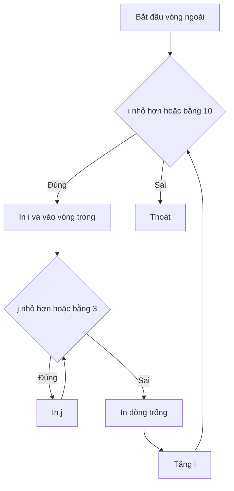

# 🪆 Vòng lặp lồng nhau và Debugger — Lần đầu gặp Delve

> Nguồn: `050-Nested-Loops-and-the-Debugger.txt` · [Udemy](https://ua.udemy.com/course/go-programming-language-crash-course/learn/lecture/26162140)

Chào các bạn! Chúng ta đã đi qua kha khá biến thể của `for`: vòng lặp vô hạn, kiểu `while`, và cả `range`. Lần này mình muốn giới thiệu **nested loop (vòng lặp lồng nhau)** — vòng lặp nằm trong vòng lặp. Và nhân dịp này, chúng ta sẽ bắt đầu nghịch thử **debugger của Go**, tên là **delve**. *Đừng lo, mọi thứ đều nhẹ nhàng thôi* — chỉ cần một chút chuẩn bị.

### 🪆 Vòng lặp trong vòng lặp

Mình có một project trống với `main.go` (package `main`, hàm `main` rỗng) và file `go.mod` tạo bằng `go mod init myapp`. *Lưu ý nhỏ nhưng quan trọng:* nếu bạn chưa có `go.mod`, phần debugger phía sau sẽ **không chạy được** — nên hãy tạo trước nhé.

Trong `main`, mình viết vòng lặp ngoài đếm từ 1 đến 10:

```go
for i := 1; i <= 10; i++ {
    fmt.Print("i is ", i, " ")
    for j := 1; j <= 3; j++ {
        fmt.Print("   j:", j)
    }
    fmt.Println()
}
```

Vài điều đáng chú ý:

* Ở vòng lặp trong, mình **không thể dùng lại biến `i`** vì `i` đã được khai báo và dùng ở vòng ngoài — nên mình dùng `j`.
* Mình chuyển từ `fmt.Println` sang `fmt.Print` (không xuống dòng) để giá trị `i` và `j` nằm trên cùng một dòng; thêm một dấu cách sau `"i is "` để chữ không dính vào nhau.
* Sau vòng lặp trong, mình in thêm một dòng trống bằng `fmt.Println()` cho dễ đọc.

Chạy `go run main.go`, các bạn sẽ thấy kết quả gọn gàng. Điều đáng chú ý nằm ở số lần chạy:

* Vòng ngoài chạy **10 lần**.
* Vòng trong chạy **3 lần mỗi khi vòng ngoài chạy một lần** → tổng cộng **30 lần**, vì 3 × 10 = 30.



---

### 🐞 Làm quen với debugger của Go

Đây là lúc thử debugger. Trong VS Code, lần đầu bấm chạy debug, bạn sẽ thấy một thông báo nhỏ ở góc dưới bên phải đề nghị cài **"missing components"** — đó chính là `dlv`, debugger của Go. Cài xong, mọi thứ sẵn sàng.

Các bước mình làm:

1. **Đặt breakpoint:** di chuột sang lề trái cạnh số dòng 8, click vào chấm đỏ — nó sáng lên, đó là breakpoint.
2. **Run → Start Debugging.** Chương trình chạy bình thường cho đến khi gặp breakpoint thì dừng lại.
3. Nhìn panel bên trái, mình thấy ngay giá trị của biến `i`.
4. Bấm **Continue** (hoặc `F5`) để chạy tiếp; bấm `Shift+F5` (hoặc nút vuông đỏ) để dừng.

Một chi tiết nhỏ: output trong **Debug Console** có thể khác nhau tùy hệ điều hành — nếu của bạn không giống của mình thì *cũng đừng bận tâm*, phần bên trái màn hình (biến, call stack) sẽ hoạt động đúng như mong đợi.

---

### 🧭 Step từng dòng, xem `i` và `j` nhảy múa

Mình đổi breakpoint sang dòng 9 — dòng có vòng lặp trong. Lần này, debugger hiển thị **cả hai biến `i` và `j`**. Bấm step liên tục, các bạn sẽ thấy:

* `i` đứng yên ở 1, còn `j` lần lượt tăng 1 → 2 → 3.
* `j = 3` là giá trị khiến điều kiện của vòng trong không còn đúng, nên vòng trong kết thúc.
* Bấm tiếp: `i` chuyển thành 2, còn `j` quay về 1 — và cứ thế.

Các bạn có thể thử sửa giá trị khởi tạo hoặc điều kiện trong hai câu `for` rồi chạy debugger lại — đây là cách luyện tập rất tốt.

---

### 💡 Debugger là người bạn của bạn

Rất nhiều người quen dùng `fmt.Print`, `fmt.Println` hay `log.Print` để đoán xem chương trình đang làm gì. Debugger như `dlv` giúp việc đó **dễ hơn rất nhiều**: bạn thấy giá trị biến theo thời gian thực, không cần chèn thêm dòng lệnh nào.

Nested loop là thứ các bạn sẽ gặp hoài trong lập trình — ở hầu như mọi ngôn ngữ — và mình cũng sẽ quay lại với chúng khi xem lại vài project cũ của khóa học. *Cứ nghịch debugger thoải mái, sai cũng không sao.*

---

Nested loop cộng với debugger là bộ đôi cực kỳ mạnh: một bên tạo ra cấu trúc phức tạp, một bên giúp bạn nhìn thấu cấu trúc đó. *Các bạn cứ thử phá, thử sửa — debugger không mắng ai bao giờ.*

Trong các bài tới, chúng ta sẽ mang debugger vào những project thật: **Hammer Bitcoin** và **Eliza**. Hẹn gặp lại! 🚀

## Nguồn tham khảo

- [Delve — Debugger for the Go programming language](https://github.com/go-delve/delve)
- [Visual Studio Code — Debug code](https://code.visualstudio.com/docs/editor/debugging)
