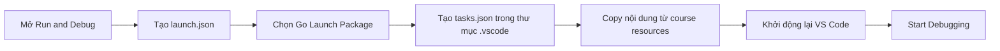

# 🛠️ Debug app đọc bàn phím — Cấu hình launch.json và tasks.json

> Nguồn: `051-Debugging-Console-Applications.txt` · [Udemy](https://ua.udemy.com/course/go-programming-language-crash-course/learn/lecture/26162152)

Chào các bạn! Lần này mình muốn đưa debugger vào project **Hammer Bitcoin**. Nhưng trước khi debug được, chúng ta cần một chút **setup** — lý do là ứng dụng này (và rất nhiều ứng dụng khác trong khóa) **đọc input từ bàn phím**. Mình sẽ chỉ các bạn thấy vấn đề trước, rồi cùng sửa.

### 🐛 Vấn đề: debugger "đứng hình" khi chờ bàn phím

Mình mở project Hammer Bitcoin, đặt breakpoint ở **dòng 13** của `main.go`, vào menu Run và chọn **Start Debugging**. Debugger hiện lên cùng Debug Console.

Chuyện gì xảy ra tiếp theo:

* Game chạy bình thường và in câu hỏi: "how many computers will you buy?".
* Con trỏ nháy chuột... lại **không nằm cạnh dòng nhập liệu**, mà ở chỗ khác.
* Mình gõ `1` rồi nhấn Enter — số 1 **hiện lên** ở dòng nhập, nhưng game không đi tiếp bước nào nữa.

Chương trình bị kẹt vì debug console không xử lý đúng việc đọc input từ bàn phím. Rõ ràng cách này không ổn, nên mình dừng debugger lại và bắt tay vào cấu hình.

---

### 📄 Tạo `launch.json` và `tasks.json`

Đây là các bước mình làm, các bạn cứ theo tuần tự:

1. Đóng debug terminal và xóa breakpoint cũ.
2. Nhìn panel bên trái, click vào **Run and Debug**. Một khung thoại nhỏ hiện ra.
3. Tìm dòng chữ **"to customize Run and Debug create a launch.json file"** và click vào đó.
4. Chọn **Go: Launch Package** — thao tác này mở ra file `launch.json`.
5. Nhìn sang **Explorer**, bạn sẽ thấy thư mục mới tên `.vscode`. Click chuột phải vào đó, chọn **New File**, đặt tên là `tasks.json`.
6. Trong **course resources** của bài học này, mình có để sẵn hai file để tải về: `launch.json` và `tasks.json`. Hãy tải chúng, mở bằng trình soạn thảo yêu thích (Notepad trên Windows, TextEdit trên Mac đều được).
7. **Select all → Copy** nội dung từng file đã tải, rồi dán đè vào `launch.json` và `tasks.json` trong project.
8. Lưu tất cả, **thoát VS Code và mở lại**.

---

### 🔄 Khởi động lại và debug lần hai

Sau khi restart, mình mở sẵn một cửa sổ terminal — *vì đôi khi debugger không tự mở nó*. Rồi vào menu Run, chọn **Start Debugging**:

* Debug Console lần này **trống trơn**, vì output được đưa ra **terminal** thay vì debug console.
* Ứng dụng chạy ngay trong terminal; không có breakpoint nên không dừng ở đâu cả — nhưng giờ mình **debug được** nó.
* Nếu có breakpoint, chương trình sẽ dừng đúng chỗ và hiển thị giá trị biến ở panel bên trái. Mình thậm chí có thể chơi game ngay tại đây.

---

### 🧠 Ghi nhớ cho lần sau

Các bước này sẽ lặp lại mỗi khi bạn muốn debug một **console application** (ứng dụng đọc input từ bàn phím / `stdin`):

* Tạo `launch.json` mới trong cửa sổ debug.
* Tạo tay file `tasks.json` trong thư mục `.vscode`.
* Dán nội dung hai file tải từ course resources vào đúng chỗ.
* Lưu, thoát VS Code, mở lại — và bạn đã sẵn sàng.
* Nhớ kỹ: **output đi ra terminal, không phải debug console.**

*Đừng lo vì phải setup hơi lằng nhằng* — chỉ cần làm **một lần** cho mỗi project, sau đó bạn dùng debugger thoải mái cho tới hết dự án.

---

Phần chuẩn bị đã xong, và phần thú vị nhất ở ngay trước mắt: bài tiếp theo chúng ta sẽ **debug Hammer Bitcoin thật sự** — dừng ở từng breakpoint và xem các biến thay đổi ra sao. Hẹn gặp lại! 🚀

## Nguồn tham khảo

- [Visual Studio Code — Debug code](https://code.visualstudio.com/docs/editor/debugging)
- [Delve — Debugger for the Go programming language](https://github.com/go-delve/delve)
