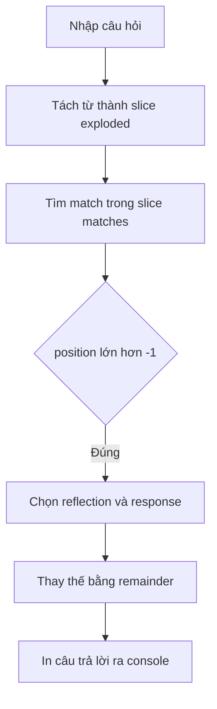

# 🤖 Vòng lặp trong Eliza — Debug ba tầng for để hiểu "AI" giả lập

> Nguồn: `053-for-loops-in-Eliza.txt` · [Udemy](https://ua.udemy.com/course/go-programming-language-crash-course/learn/lecture/26162186)

Chào các bạn! Hôm nay chúng ta mang những gì đã học về debugger áp dụng vào **Eliza** — chương trình "trò chuyện như nhà trị liệu" mà chúng ta đã viết. Mình sẽ dùng debugger để mổ xẻ các vòng lặp `for` bên trong Eliza, và các bạn sẽ thấy chương trình giả lập trí tuệ nhân tạo theo cách rất thủ công nhưng thú vị.

### 🧰 Chuẩn bị debugger cho Eliza

Nếu bạn đã xem bài trước, việc setup `launch.json` và `tasks.json` ở Eliza cũng y hệt. Có một mẹo nhanh: tạo thư mục `.vscode` mới rồi **copy hai file `launch.json` và `tasks.json` từ project trước sang**. Trevor có nói vui một câu mình rất thích: *lập trình viên hay "lười" — và đó chính là lý do chúng ta viết những chương trình hiệu quả, để không phải làm việc vất vả!* Cách nào cũng được, miễn là bạn debug được.

---

### 🎯 Breakpoint ở `main.go` và trong `doctor.go`

Mình mở `main.go` và đặt breakpoint ở **dòng 36**, căn dòng cuối của hàm `main`:

```go
fmt.Println(response(userInput))
```

Sau đó bấm **Start Debugging**. Chương trình chạy, terminal mở ra, và ta đứng chờ ở breakpoint — lúc này Eliza đang **chờ người dùng nhập**. Mình gõ thử: `I need advice` rồi Enter.

Tiếp theo, mình mở file `doctor.go` — nơi chứa hàm `response` — và đặt thêm hai breakpoint:

* **Dòng 148:** vòng lặp ngoài dạng ba phần — `for i := 0; i < len(matches); i++`.
* **Dòng 162:** vòng lặp lồng bên trong, dùng `range` duyệt qua biến `exploded` — một slice of strings.

---

### 🔬 Theo dõi biến đi qua ba tầng vòng lặp

Sau khi nhập `I need advice` và bấm Continue, chương trình dừng trong `response`. Nhìn panel biến, chúng ta có:

* `userInput` = `I need advice` — dấu chấm cuối câu đã bị **loại bỏ trước đó ở dòng 144**, nơi chương trình dùng regular expression thay mọi dấu câu bằng khoảng trắng.
* `remainder` và `output` chưa có giá trị gì; biến `r1` là thứ của compiler, cứ bỏ qua.

Bấm Continue tiếp, ta dừng ở dòng 162 của vòng lặp lồng nhau:

* Chương trình đang **tìm từ khóa khớp** trong slice `matches`; phần tử thứ hai trong đó chính là `I need`.
* Nó tìm thấy match ở vị trí 0, sinh ra biến tạm `advice`.
* Mình bấm step: `word` nhận giá trị `advice`, `value` là `your` — đến từ danh sách **reflections**, nơi đại từ được chuyển đổi.
* Nhìn vào reflections, ta thấy `I` sẽ được đổi thành `you` khi Eliza xây câu trả lời.

Rồi mình đặt thêm breakpoint ở **dòng 180** — ngay trước khi `output` nhận giá trị. Bấm step, `output` hiện ra: **"are you sure you need %1"** — trong đó `%1` (percent one) sẽ được thay bằng `remainder`, tức từ `advice`. Continue một nhịp, console in ra câu trả lời hoàn chỉnh: **"are you sure you need advice"**, và chương trình quay về breakpoint chờ câu hỏi tiếp theo.



---

### 💡 Debugger để hiểu code, không chỉ để tìm lỗi

Điều mình muốn các bạn nhớ từ bài này: debugger **không chỉ để săn bug**. Nó còn là cách tuyệt vời để **hiểu một chương trình đang chạy như thế nào** — nhất là khi trong Eliza có tới **ba vòng lặp `for`** lồng nhau và rất nhiều biến trung gian.

Đọc code bằng mắt rồi tự nhớ "biến này đang bằng gì" khó hơn nhiều so với việc để debugger chỉ cho bạn từng bước. *Cứ kiên nhẫn step qua vài lần* — bạn sẽ thấy mọi thứ sáng dần ra.

---

Vậy là Eliza không còn là "hộp đen" nữa: các bạn đã thấy cách nó tách câu, tìm từ khóa, và ghép câu trả lời. Bài tiếp theo, chúng ta sẽ **sửa lại cách Eliza kết thúc chương trình** khi người dùng gõ `quit` — một chỗ rất đáng cải thiện. Hẹn gặp lại! 🚀

## Nguồn tham khảo

- [Delve — Debugger for the Go programming language](https://github.com/go-delve/delve)
- [Visual Studio Code — Debug code](https://code.visualstudio.com/docs/editor/debugging)
