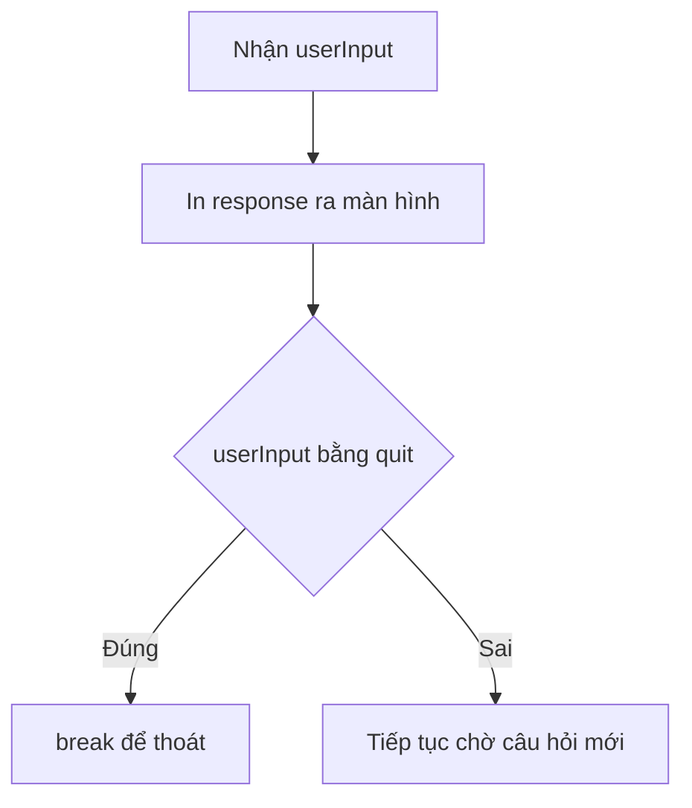

# 🧠 Hiểu sâu hơn về Eliza — Sửa nút "quit" cho ra dáng

> Nguồn: `054-Understanding-more-about-Eliza.txt` · [Udemy](https://ua.udemy.com/course/go-programming-language-crash-course/learn/lecture/26162200)

Chào các bạn! Hôm nay chúng ta quay lại với **Eliza** để sửa một chỗ mà mình thấy chưa ổn: cách chương trình phản hồi khi người dùng gõ `quit`. Đây cũng là dịp rất tốt để quan sát ba tầng vòng lặp của Eliza hoạt động ra sao — lần này bằng con mắt "đi săn" của debugger.

### 🎯 Thêm breakpoint ở dòng 152

Debugger của mình đang không chạy, nhưng các breakpoint cũ vẫn còn: một cái trong hàm `main`, và vài cái trong `doctor.go` ở các dòng 148, 162 và 180.

Lần này mình thêm một breakpoint mới ở **dòng 152**, dòng có câu điều kiện:

```go
if position > -1 {
```

Lý do mình đặt breakpoint đúng ở đây là để chút nữa thấy rõ mình **sửa chương trình** như thế nào.

---

### 🐛 Phát hiện vấn đề: gõ `quit` mà không thấy gì

Mình chạy debug, nhập `I need advice`. Chương trình dừng ở breakpoint đầu tiên trong `main` — đây là chỗ mình muốn các bạn chú ý, vì nó quyết định: *nếu người dùng gõ `quit` thì kết thúc chương trình, ngược lại thì xử lý bình thường*.

Bấm Continue, ta sang breakpoint dòng 148 trong `doctor.go`, các biến `userInput`, `remainder`, `output` lần lượt được cập nhật. Continue tiếp, ta dừng ở dòng 152:

* Chương trình đang tách câu người dùng nhập thành các phần và **tìm match**.
* Nó tìm `life` — không thấy, vì `life` không có trong câu của mình.
* Nó tìm `I need` — **thấy ngay**, nhờ dữ liệu đã được chuyển hết về chữ thường.
* Step vào trong, ta thấy nó xử lý tiếp bên trong nhánh `if`.

Mình dừng debugger, rồi thử một thí nghiệm nhỏ: **comment khối thoát chương trình** trong `main.go` để chương trình không bao giờ tự kết thúc khi gõ `quit`. Sau đó chạy `go run main.go` như bình thường (trên Mac mình gõ `go run *.go`, còn trên Windows bạn dùng `go run .`).

Kết quả thú vị: gõ `quit` — chương trình **có phản hồi** nhưng mình không bao giờ nhìn thấy nó, vì chương trình thoát ngay lập tức. Gõ lại lần nữa, lần này là `goodbye`, thì nhận được câu: **"thank you, that will be 150 dollars"** — nghe hơi đắt cho một phiên trò chuyện dài 18 giây, nhưng thôi kệ!

Rõ ràng `doctor.go` đã tạo phản hồi cho `quit`, chỉ là `main.go` không cho nó cơ hội xuất hiện.

---

### 🛠️ Cách sửa: in response trước, rồi mới `break`

Sau khi thử vài biến thể, cách hợp lý nhất là thế này:

```go
fmt.Println(response(userInput))

if userInput == "quit" {
    break
}
```

Nghĩa là: **luôn in câu trả lời** trước đã, rồi mới kiểm tra — nếu `userInput` là `quit` thì `break`. Và `break` chính là keyword đưa chúng ta ra khỏi vòng lặp.



---

### 🔄 Chạy lại và quan sát toàn bộ luồng

Mình chạy debug lại từ đầu với `I need advice`:

* Breakpoint ở `main` → Continue.
* Tìm `life` không thấy → Continue vài lần.
* Đến khi tìm thấy match `I need` → dừng ở dòng 162, nơi vòng lặp `range` duyệt qua `exploded`. `exploded` chính là câu người dùng **tách thành một slice các từ**.
* Sang dòng 180, `output` trở thành **"why do you need %1"** — `%1` sẽ được thay bằng `remainder`, tức từ `advice`.
* Console in ra: **"why do you need advice"**, rồi Eliza chờ câu tiếp theo.

Lần này mình gõ `quit`. Vì `quit` là **mục cuối cùng** trong slice `matches`, mình phải bấm step/continue khá nhiều lần mới đi hết. Và cuối cùng, điều mong đợi cũng đến: **"thank you for talking with me, exiting"** — chương trình tự dừng, đúng như mong muốn.

---

### 💡 Chốt lại

Chỉ một thay đổi nhỏ về thứ tự in và `break`, Eliza đã có một **lời tạm biệt đàng hoàng** thay vì im lặng biến mất. *Eliza đôi lúc vẫn đòi bạn 150 đô — điều đó thì mình chịu*, nhưng ít ra chương trình giờ chạy hợp lý hơn hẳn.

Bài tiếp theo, chúng ta tạm rời Eliza để quay lại **menu app** và thử chuyển vòng lặp vô hạn của nó sang kiểu `while`. Hẹn gặp lại! 🚀

## Nguồn tham khảo

- [Delve — Debugger for the Go programming language](https://github.com/go-delve/delve)
- [Visual Studio Code — Debug code](https://code.visualstudio.com/docs/editor/debugging)
