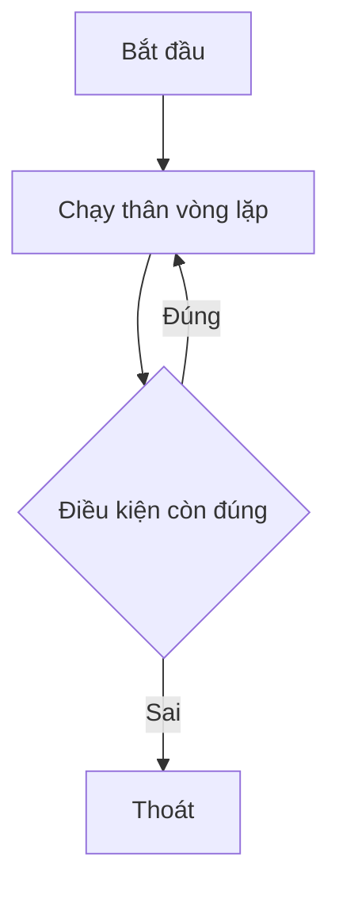

# 🔄 Do-While trong Go — Không có cú pháp riêng, nhưng vẫn làm được

> Nguồn: `058-The-do-while-loop-in-go.txt` · [Udemy](https://ua.udemy.com/course/go-programming-language-crash-course/learn/lecture/26162234)

Chào các bạn! Để cho đầy đủ, chúng ta còn đúng **một dạng vòng lặp nữa** chưa nói tới: **do-while**. Go không có cú pháp riêng cho nó, nhưng đừng lo — bằng `for`, chúng ta vẫn làm được y hệt. Tin hay không thì tùy, *chúng ta đã làm nó một lần rồi mà không gọi tên đấy*.

### 🧾 Do-while ở các ngôn ngữ khác trông thế nào?

Ở những ngôn ngữ khác, do-while trông kiểu như: `do` — làm gì đó — rồi kết thúc bằng `while` kèm một điều kiện. Điểm khác biệt cốt lõi của nó là: **thân vòng lặp chạy ít nhất một lần**, rồi mới kiểm tra điều kiện để quyết định có chạy tiếp không.

Go **không hỗ trợ cú pháp này chút nào**, nhưng hỗ trợ đúng chức năng đó — một lần nữa, bằng keyword `for`.



---

### 1️⃣ Cách thứ nhất: vòng lặp vô hạn + `break`

Cách này chính là thứ chúng ta đã dùng ở bài menu app:

* Vòng lặp vô hạn để thân vòng chắc chắn chạy ít nhất một lần.
* Sau khi nhận input và kiểm tra lỗi, ta kiểm tra điều kiện rồi thoát bằng `break`.

```go
if char == 'q' || char == 'Q' {
    break
}
```

Đơn giản vậy thôi. Đó là **một phiên bản** của do-while trong Go.

---

### 2️⃣ Cách thứ hai: `for ok`

Cách thứ hai cũng dùng `for`, nhưng với một biến Boolean làm điều kiện:

* Khởi tạo `ok := true` — đảm bảo lần đầu tiên luôn vào vòng lặp.
* Viết `for ok` — phần điều kiện chỉ đơn giản là chính biến `ok`.
* Ở **cuối thân vòng lặp**, thực hiện phép kiểm tra logic: gán `ok = char != 'q' && char != 'Q'`.

Nghĩa là logic vẫn chạy trước, rồi **điều kiện mới được test ở cuối mỗi vòng** — đúng tinh thần "do trước, while sau". Mình comment cách thứ nhất lại, chạy thử cách hai: nhập 1, 2, rồi `q` — chương trình thoát chính xác như mong đợi.

| | Cách 1: vô hạn + `break` | Cách 2: `for ok` |
|---|---|---|
| Điều kiện nằm ở đâu | Trong thân vòng lặp, kiểm tra rồi `break` | Ở cuối vòng, gán lại biến `ok` |
| Cách thoát | Gặp `q` hoặc `Q` thì `break` | `ok` chuyển thành `false` |
| Độ trực quan | Rõ ràng, dễ thấy ngay | Khá "dày đặc", không hiển nhiên ngay |

---

### ⚖️ Vậy cách nào dễ đọc hơn?

Mình trả lời thẳng: mình thấy **cách thứ nhất** — vòng lặp vô hạn với câu kiểm tra `break` — **rõ ràng hơn nhiều**. Còn dòng `for ok` kèm phép gán `ok = ...` ở cuối thì hơi khó nhìn ra ý đồ ngay lập tức, phải đọc kỹ mới hiểu.

Cách hai vẫn chạy đúng, tất nhiên. Và đây là câu hỏi mình để các bạn tự tính như một bài tập nhỏ: **mỗi cách thực hiện bao nhiêu phép kiểm tra trong mỗi vòng lặp?** Cứ để ý và tự đếm, các bạn sẽ thấy nhiều điều thú vị.

---

### 💡 Chốt lại

Go có **tương đương của do-while**, nhưng nó được làm bằng đúng một keyword duy nhất — `for` — giống như mọi vòng lặp khác. Sau bài này, các bạn đã biết đủ bộ: đếm theo số lần, chạy theo điều kiện, chạy mãi mãi, và chạy ít nhất một lần rồi mới kiểm tra.

---

*Đừng lo nếu `for ok` nhìn hơi lạ mắt* — bạn không thấy nó nhiều bằng hai cách kia, và hoàn toàn có thể chọn cách mình thấy dễ đọc hơn. Miễn chương trình chạy đúng, bạn đang làm tốt.

Chúng ta đã đi hết các biến thể vòng lặp rồi. Bài tiếp theo là bài **tổng kết section Flow Control** — cùng ôn lại toàn bộ hành trình và nhìn về section kế tiếp. Hẹn gặp lại! 🚀

## Nguồn tham khảo

- [The Go Programming Language Specification — For statements](https://go.dev/ref/spec#For_statements)
