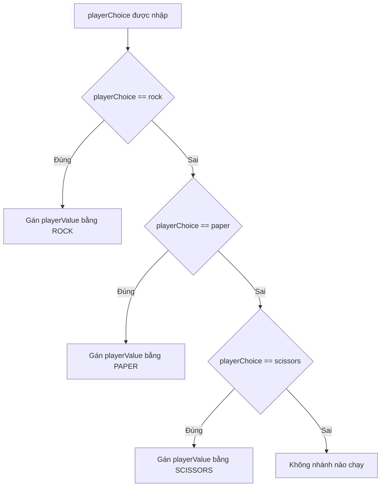

# 🔍 else và else if — Chỉ cần kiểm tra đúng một lần

> Nguồn: `062-else-statement.txt` · [Udemy](https://ua.udemy.com/course/go-programming-language-crash-course/learn/lecture/26162250)

Lần trước chúng ta dừng lại ở ba câu `if` nằm từ dòng 35 đến dòng 45 của game rock paper scissors. Mình có nói rằng cách viết này **không thật hiệu quả** — và hôm nay mình sẽ chứng minh điều đó bằng chính công cụ debugger, rồi cùng các bạn sửa lại cho gọn gàng. *Đừng lo nếu các bạn từng viết code kiểu "kiểm tra hết mọi điều kiện" — ai học lập trình cũng đi qua đoạn này.*

---

### 🐞 Nhìn bằng debugger: ba lần kiểm tra cho một quyết định

Để dùng debugger với cửa sổ terminal, mình cần cấu hình dự án một chút:

1. Trong thư mục **rock paper scissors**, tạo một thư mục con tên `.vscode` (viết thường đúng như vậy).
2. Tạo hai file `launch.json` và `tasks.json`, rồi copy nội dung từ một dự án trước đó của khóa học dán vào là xong.

Quay lại `main.go`, mình đặt một **breakpoint** ở dòng 35 rồi bấm **Start Debugging**. Bảng debug hiện ra, mình bấm sang tab terminal để thấy chỗ nhập liệu và gõ `rock`.

Chương trình dừng đúng tại dòng 35. Mình nhấn từng bước (step) để chạy:

* Bước qua dòng 35: điều kiện đúng, `playerValue` được gán giá trị của `ROCK`.
* Nhưng chương trình **vẫn tiếp tục** chạy sang dòng 39 — dù đã có kết quả rồi.
* Rồi tiếp tục sang dòng 43.

Vậy là **ba lần kiểm tra** được thực hiện trong khi chỉ cần **một**. Các bạn chắc cũng đoán ra cách sửa rồi đấy.

---

### ⚙️ Sửa lại bằng else if và else

Cách sửa rất đơn giản: câu `if` thứ hai đổi thành `else if`, câu thứ ba đổi thành `else`.

Mình đặt lại breakpoint và chạy debugger lần nữa, vẫn gõ `rock`. Lần này sau khi gán giá trị, chương trình **nhảy thẳng qua** toàn bộ các nhánh còn lại. Đúng như mong đợi: nó chọn **một và chỉ một** nhánh trong danh sách.

---

### 🧠 Quy tắc quan trọng: chỉ nhánh khớp đầu tiên được chọn

Để kiểm chứng, mình thử thêm một `else if` kiểm tra lại điều kiện `playerChoice == "rock"` — và nó **không bao giờ chạy**. Vì sao? Vì **biểu thức Boolean khớp đầu tiên** trong toàn bộ câu lệnh `if` (từ dòng 35 tới dòng 43) sẽ được chọn, và ngay khi tìm được một điều kiện đúng, chương trình bỏ qua mọi thứ còn lại.

Các bạn có thể thêm bao nhiêu `else` cũng được, nhưng thường thì ba nhánh là ổn. Nếu bắt đầu có bốn, năm hay bảy lựa chọn thì sẽ có cách viết tốt hơn — và chúng ta sẽ gặp cách đó rất sớm.

Điều cần ghi nhớ: **chỉ một** biểu thức Boolean được chọn. Nếu **không** điều kiện nào đúng, thì **không** nhánh nào chạy cả — chương trình chỉ kiểm tra, kiểm tra, kiểm tra rồi nhảy ra ngoài.

---

### 🧪 Chuyện gì xảy ra khi nhập "fish"?

Mình chạy lại chương trình bằng `go run main.go` và nhập `fish` thay vì rock, paper hay scissors. Chương trình vẫn chạy đủ cả ba lần kiểm tra để xác nhận không khớp điều kiện nào — nhưng không dòng lệnh nào bên trong `if` được thực thi.

Kết quả in ra: *player chose fish và value là -1*. Đúng vậy, vì ở dòng 23 mình đã khởi tạo `playerValue` bằng `-1`, và nó chẳng bao giờ được đổi giá trị.

---

### 🎯 Tự kiểm tra nhanh

**1. Vì sao ba câu `if` rời rạc lại kém hiệu quả?**

<b>Xem đáp án</b>

**Đáp án:** Vì chương trình phải chạy đủ cả ba lần kiểm tra, dù đã có kết quả ngay từ lần đầu.
Giải thích: Debugger cho thấy sau khi gán `playerValue` ở dòng 35, chương trình vẫn tiếp tục kiểm tra dòng 39 và dòng 43.
Tham chiếu: Mục "Nhìn bằng debugger".

**2. Khi dùng `else if` và `else`, điều gì thay đổi khi một nhánh khớp?**

<b>Xem đáp án</b>

**Đáp án:** Chương trình nhảy qua toàn bộ các nhánh còn lại, chỉ chọn một nhánh duy nhất.
Giải thích: Đây là điểm khác biệt chính so với ba câu `if` rời rạc.
Tham chiếu: Mục "Sửa lại bằng else if và else".

**3. Nếu thêm một `else if` kiểm tra lại điều kiện "rock", nó có chạy không?**

<b>Xem đáp án</b>

**Đáp án:** Không. Nó không bao giờ chạy vì điều kiện đầu tiên đã khớp trước đó.
Giải thích: Chỉ biểu thức Boolean khớp đầu tiên trong cả câu lệnh `if` được chọn.
Tham chiếu: Mục "Quy tắc quan trọng".

**4. Nhập "fish" thì chuyện gì xảy ra?**

<b>Xem đáp án</b>

**Đáp án:** Cả ba điều kiện đều sai, không nhánh nào chạy, `playerValue` giữ nguyên giá trị `-1`.
Giải thích: Chương trình vẫn chạy đủ ba lần kiểm tra rồi nhảy ra ngoài, không dòng lệnh nào trong `if` được thực thi.
Tham chiếu: Mục 'Chuyện gì xảy ra khi nhập "fish"'.

**5. Khi nào nên cân nhắc một cách viết khác thay cho chuỗi `else` dài?**

<b>Xem đáp án</b>

**Đáp án:** Khi có nhiều hơn ba lựa chọn — ví dụ bốn, năm hay bảy nhánh.
Giải thích: Lúc đó sẽ có một cách làm tốt hơn, và mình giới thiệu nó ngay ở bài tiếp theo.
Tham chiếu: Mục "Quy tắc quan trọng".

---

Tóm lại, `else if` và `else` giúp chương trình **chọn đúng một nhánh** và thoát ra ngay, thay vì kiểm tra thừa. Ở bài sau, mình sẽ giới thiệu **`switch`** — người anh em giúp code dễ đọc hơn hẳn khi có nhiều lựa chọn. Hẹn gặp lại các bạn! 🚀
