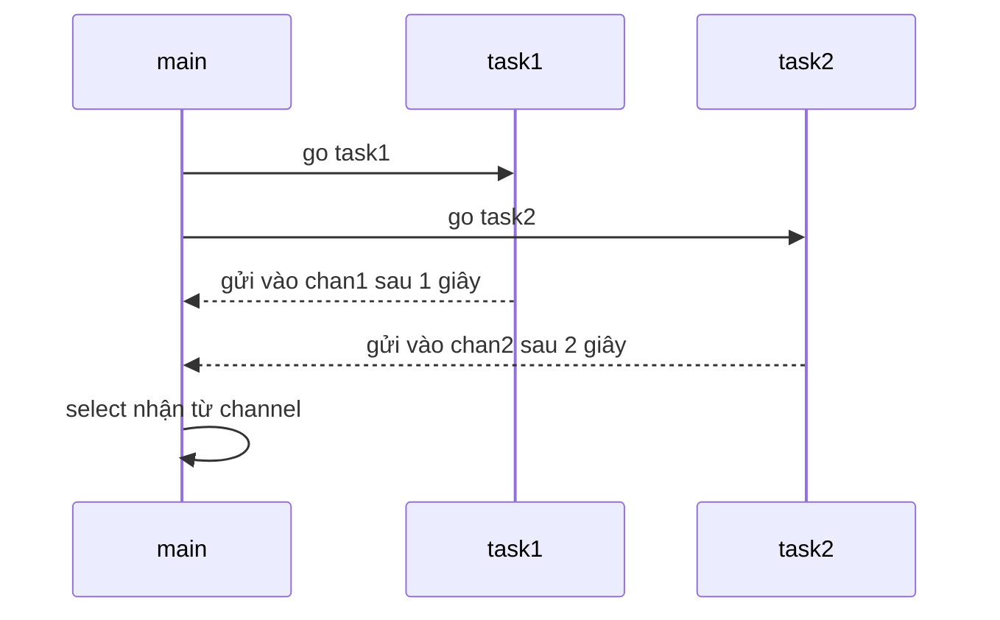

# 📡 Làm quen select — Câu lệnh ra quyết định dành riêng cho channel

> Nguồn: `065-Introducing-select.txt` · [Udemy](https://ua.udemy.com/course/go-programming-language-crash-course/learn/lecture/26162264)

Đã đến lúc nhìn vào câu lệnh **`select`**. Về bản chất, `select` rất giống câu lệnh `switch` hay `if`, vì nó cũng cho chương trình **ra quyết định**. Điểm khác biệt duy nhất — và cũng là điểm thú vị nhất — là `select` **chỉ làm việc với channel**.

Chúng ta chưa làm nhiều với channel, nên hôm nay sẽ vừa ôn lại vừa tạo một ví dụ thật đơn giản để thấy `select` hoạt động thế nào. Những bài sau, chúng ta sẽ áp dụng nó vào game rock paper scissors.

---

### 🔍 select là gì, và khác switch ở đâu?

Các bạn cứ nhớ gọn như thế này: `switch` duyệt qua các `case` để so sánh giá trị, còn `select` **chờ** xem channel nào nhận được thông tin. `select` chỉ hữu ích khi chương trình có nhiều channel cùng hoạt động.

Ví dụ hôm nay sẽ là một chương trình rất nhỏ: hai channel, hai hàm chạy nền, và một `select` trong hàm `main`. Mình tạo một dự án trống chỉ có `main.go` và file `go.mod` như thường lệ.

---

### 📦 Ví dụ nhỏ: hai channel, hai task

Vì sẽ làm việc với channel, mình tạo **hai channel ở cấp package**, cả hai đều chứa dữ liệu kiểu `string`:

```go
var chan1 = make(chan string)
var chan2 = make(chan string)
```

Tiếp theo là hai hàm, mình gọi là `task1` và `task2`. Chúng không làm gì to tát — chỉ **dừng lại một chút rồi gửi thông tin vào channel**:

* `task1` chờ **1 giây** bằng `time.Sleep` (hàm có sẵn trong thư viện chuẩn, dùng package `time`) rồi gửi một đoạn text vào channel thứ nhất.
* `task2` chờ **2 giây** rồi gửi text `"2"` vào channel thứ hai.

Các bạn nhớ lại cú pháp gửi dữ liệu vào channel bằng dấu mũi tên, và vì đây là channel kiểu `string` nên chỉ gửi được chuỗi mà thôi.

Đến đây chương trình vẫn chưa làm gì cả — mình có hai hàm và hai biến nhưng chưa dùng tới.

---

### ⚙️ Đặt select vào main

Trong hàm `main`, việc đầu tiên là **kích hoạt hai hàm dưới dạng goroutine** bằng từ khóa `go`, để chúng chạy nền:

```go
go task1()
go task2()
```

Mỗi hàm như vậy chạy **đúng một lần**: `task1` chờ một giây, gửi thông tin vào channel rồi kết thúc; `task2` chờ hai giây rồi cũng vậy.

Sau đó mình viết một vòng lặp `for` chạy **đúng hai lần** — `i` từ `0`, điều kiện `i < 2`, mỗi vòng tăng `i` lên một. Bên trong vòng lặp chính là `select`:

```go
select {
case msg1 := <-chan1:
	fmt.Println("received", msg1)
case message2 := <-chan2:
	fmt.Println("received", message2)
}
```

Cách viết rất giống `switch`: từ khóa `select`, cặp ngoặc nhọn, rồi các `case`. Mỗi `case` ở đây **nhận dữ liệu từ một channel** và gán vào một biến — `msg1` cho channel một, `message2` cho channel hai — sau đó in ra màn hình.



---

### 🧪 Chạy thử và lý do mình chọn ví dụ này

Mình chạy `go run main.go` và nhận được kết quả: *received 1*, rồi *received 2*. Chính xác!

Điểm mấu chốt: **`select` chỉ đơn giản là chờ thông tin được gửi tới một channel** — channel một ở `case` đầu, channel hai ở `case` sau. Ví dụ này khá đơn giản, và thật lòng mà nói thì nó hơi gượng ép: các bạn **không cần** `select` để làm rock paper scissors, vì game của chúng ta đã chạy tốt rồi.

Nhưng nó cho chúng ta cơ hội áp dụng kiến thức về `select` vào một tình huống **giống thực tế hơn**. Trong bài tới, mình sẽ bắt đầu chuyển game rock paper scissors sang dùng `select`.

---

Vậy là các bạn đã biết `select` hoạt động ra sao. Bài tiếp theo sẽ là một bài dài và thú vị: chúng ta **tái cấu trúc game rock paper scissors** để dùng channel và `select` thật sự. Hẹn gặp lại các bạn! 🚀
