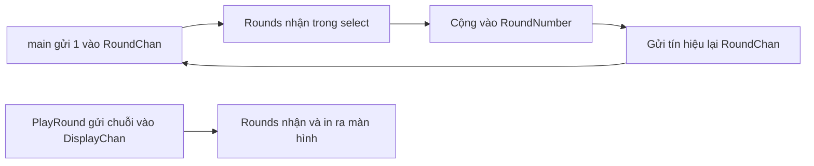

# 🔁 Đưa select vào game — Tách logic sang package `game`

> Nguồn: `066-Using-select-in-rock-paper-scissors.txt` · [Udemy](https://ua.udemy.com/course/go-programming-language-crash-course/learn/lecture/26162266)

Đúng như đã hứa, hôm nay chúng ta sẽ áp dụng những gì học được về `select` vào game rock paper scissors. Đây là một bài khá dài và nhiều bước, nên các bạn cứ đi chậm cùng mình — *rối chỗ nào thì xem lại cũng không sao cả*.

Mở lại dự án rock paper scissors đúng như trạng thái lần trước, chúng ta bắt đầu.

---

### 🗂️ Tách logic sang package `game`

Vì `select` chỉ thực sự hữu ích khi làm việc với channel, mà channel thường dùng để **giao tiếp giữa các package**, mình sẽ tạo một package mới:

1. Trong cửa sổ Explorer, tạo thư mục mới tên `game`.
2. Bên trong, tạo file `game.go` với khai báo `package game`.

Thư mục này sẽ chứa toàn bộ logic của game. Mình cũng chia cửa sổ editor thành hai phần (menu **View → Editor Layout → Split Right**) để vừa nhìn `main.go` vừa nhìn `game.go`, rồi ẩn Explorer cho rộng rãi.

Mình sẽ dần chuyển logic từ `main.go` sang `game.go`:

* Ba hằng số `ROCK`, `PAPER`, `SCISSORS` được **cắt khỏi `main.go`** và dán sang `game.go`.
* Biến `reader` cũng được khai báo lại trong `game.go` bằng `bufio.NewReader(os.Stdin)`, vì package `main` sẽ không đọc dữ liệu nữa.
* Tạo một hàm tên `Rounds` — ban đầu để rỗng, vì bên trong nó sẽ là `select` xử lý dữ liệu từ channel.

*Sẽ có lỗi hiện ra trong lúc chuyển, các bạn đừng lo — chúng ta sẽ dọn dần.*

---

### 🧩 Type Game và Round

Tiếp theo, mình khai báo hai type trong `game.go`. Type `Game` chứa hai channel và **nhúng (embed)** type `Round`; type `Round` giữ thông tin của một ván đấu:

```go
type Game struct {
	DisplayChan chan string
	RoundChan   chan int
	Round
}

type Round struct {
	RoundNumber   int
	PlayerScore   int
	ComputerScore int
}
```

Hàm `Rounds` được gắn với type `Game` bằng receiver `g` — con trỏ tới `Game`.

Mình cũng chuyển hàm `clearScreen` sang `game.go`, **đổi tên thành chữ hoa chữ đầu** để package khác dùng được, và gắn nó vào type `Game`. Từ giờ có thể gọi `game.ClearScreen()`.

Trong `main.go`, mình làm những việc sau:

* Tạo hai channel: `displayChan` kiểu `chan string` và `roundChan` kiểu `chan int` bằng `make`.
* Tạo biến `game` kiểu `game.Game`, gán hai channel vừa tạo vào hai field tương ứng, và khởi tạo `Round` với `RoundNumber`, `PlayerScore`, `ComputerScore` đều bằng `0`.
* Bỏ hai biến điểm số cũ, vì điểm giờ được lưu trong type `Round`.
* Gọi `game.ClearScreen()` rồi `game.PrintIntro()` — một hàm mới mình tạo bằng cách chuyển các dòng in hướng dẫn sang `game.go`.
* **Chạy `Rounds` ở chế độ nền** bằng `go game.Rounds()` — nó sẽ chạy **mãi mãi** vì bên trong là một vòng lặp vô hạn, nơi `select` sẽ sống.

---

### 🔁 Rounds — nơi select chạy mãi mãi

Trong `main.go`, vòng lặp chính được đơn giản hóa thành:

1. Gửi số `1` vào `game.RoundChan` để báo bắt đầu ván một.
2. **Chờ** kết quả trả về từ `game.RoundChan` — nếu không chờ, phần phía sau có thể chạy trước khi channel xử lý xong.
3. Nếu `game.Round.RoundNumber > 3` thì thoát khỏi vòng lặp.
4. Gọi `game.PlayRound()`: nếu hàm trả về `false` (ván chưa xong), gửi `-1` vào `RoundChan` rồi chờ phản hồi.

Bên `game.go`, hàm `Rounds` nhận tín hiệu qua `select`:

```go
case round := <-g.RoundChan:
	g.Round.RoundNumber = g.Round.RoundNumber + round
	g.RoundChan <- 1
case msg := <-g.DisplayChan:
	fmt.Println(msg)
```

`case` đầu nhận giá trị từ round channel rồi **cộng vào số ván hiện tại**: gửi `1` thì tăng một ván, gửi `-1` thì lùi lại một ván — đúng cách chúng ta chơi lại ván đang dang dở. Sau đó nó gửi `1` trở lại channel để bên gọi biết đã xử lý xong. `case` thứ hai nhận chuỗi từ display channel và in ra màn hình.



---

### 🎮 PlayRound và các hàm hỗ trợ

Hàm `PlayRound` được gắn với type `Game`, không nhận tham số và **trả về một giá trị `bool`**: `true` nếu ván đã xong, `false` nếu phải chơi lại. Bên trong, mình chuyển toàn bộ logic cũ vào:

* Seed bộ sinh số ngẫu nhiên và khởi tạo `playerValue` bằng `-1`.
* In thông tin ván đấu dùng `g.Round.RoundNumber` thay cho biến `i` ngày trước, và in lời nhắc bằng `fmt.Print` (không xuống dòng).
* Đọc lựa chọn người chơi bằng toán tử gán `:=`, rồi cắt ký tự xuống dòng.
* Tính `computerValue` bằng `rand.Intn(3)`.
* Gửi thông báo "player chose..." vào `DisplayChan` bằng `fmt.Sprintf` — hàm này **trả về chuỗi** thay vì in ra màn hình, đúng thứ chúng ta cần.
* `switch` trên `computerValue` để thông báo máy tính chọn gì.
* Nếu hòa: gửi `it's a draw` vào `DisplayChan` và trả về `false` để chơi lại.
* Hai hàm `ComputerWins` và `PlayerWins` được viết lại thành **method của `Game`**: không tham số, không trả về gì, chỉ tăng điểm (`g.Round.ComputerScore++` hoặc `g.Round.PlayerScore++`) rồi gửi thông báo vào `DisplayChan`.
* `default`: gửi `invalid choice` vào `DisplayChan` và trả về `false` vì cần chơi lại ván đó; mọi trường hợp còn lại trả về `true`.

Sau khi dọn import, package `main` chỉ còn đúng một import: package `game` của chúng ta.

---

### 🧪 Chạy thử — gần đúng nhưng chưa hoàn hảo

Mình chạy `go run main.go`. Mọi thứ khởi động tốt: hướng dẫn hiện ra, rồi **Round one**.

* Mình nhập `rock` → computer chose rock, player chose rock, **it's a draw**. Chương trình quay lại round one. Có vẻ chưa đúng lắm, nhưng đang tiến gần hơn rồi.
* Mình nhập `fish` → computer chose rock, player chose fish, **invalid choice**. Tốt.
* Mình nhập `paper` → chương trình hiện **round two**.

Vậy là chương trình chạy được, nhưng **việc đếm ván chưa thật chính xác**. Bài này cũng đã khá dài rồi, nên mình xin dừng ở đây và chúng ta sẽ tiếp tục đúng chỗ này trong bài sau. Hẹn gặp lại các bạn! 🚀
