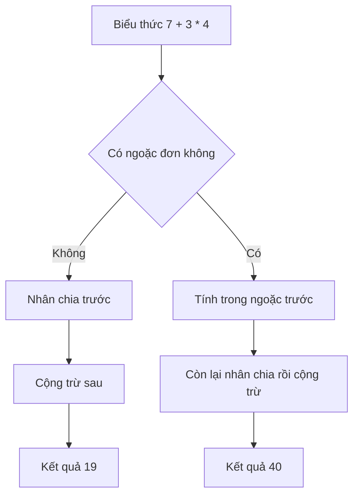

# 🧮 Toán tử và precedence — vì sao 7 + 3 * 4 lại bằng 19 mà không phải 40?

> Nguồn: `071-Operators-and-Precedence.txt` · [Udemy](https://ua.udemy.com/course/go-programming-language-crash-course/learn/lecture/26162294)

Chào các bạn! Hôm nay chúng ta "làm toán" thật sự. Nếu các bạn từng không thích môn toán ở trường hoặc học nó không giỏi — *cứ yên tâm, lần này các bạn sẽ không gặp khó khăn gì cả.* Máy tính sẽ làm phần lớn phép tính cho chúng ta; việc của chúng ta chỉ là tìm ra **câu lệnh nào** để yêu cầu máy tính thực hiện phép toán đó mà thôi.

---

### 🛠️ Chuẩn bị project `operators`

Mình mở Visual Studio Code với một cửa sổ trống, tạo thư mục project mới đặt tên là `operators` (nằm trong thư mục projects quen thuộc của mình), rồi mở terminal lên. Sau đó:

1. Chạy `go mod init myapp` để khởi tạo module cho project.
2. Tạo file `main.go` với `package main` và một hàm `main()` — đúng cấu trúc tối thiểu mà chương trình Go nào cũng cần.

Đoạn code đầu tiên: mình tạo biến tên `answer` và gán cho nó biểu thức `7 + 3 * 4`. Lưu ý dấu **nhân** trong lập trình là `*` (dấu hoa thị), chứ không phải dấu `x` như khi viết trên giấy:

```go
package main

import "fmt"

func main() {
	answer := 7 + 3*4
	fmt.Println("Answer is", answer)
}
```

Rồi mình in giá trị ra bằng `fmt.Println`.

---

### 🤔 Vậy 7 + 3 * 4 bằng bao nhiêu?

Thử tự hỏi chính mình câu này trước khi chạy code:

* Nếu đọc là "7 cộng 3 bằng 10, rồi nhân 4" → **40**.
* Nếu đọc là "3 nhân 4 bằng 12, rồi cộng 7" → **19**.

Câu trả lời phụ thuộc vào **ngôn ngữ lập trình** các bạn đang dùng:

| Ngôn ngữ | Cách xử lý biểu thức | Kết quả |
|---|---|---|
| Go, Java, C# | Theo thứ tự toán học: nhân chia trước, cộng trừ sau | 19 |
| Smalltalk | Tính theo thứ tự nhìn thấy, từ trái sang phải | 40 |
| Một số ngôn ngữ khác | Bắt buộc dùng ngoặc đơn để nhóm | Tùy cách nhóm |

Trong Go — cũng như Java, C# và rất nhiều ngôn ngữ khác — chúng ta tuân theo **thứ tự thực hiện phép toán thông thường**: nhân và chia trước, cộng và trừ sau. Vì vậy đáp án là **19**. Chạy `go run main.go`, các bạn sẽ thấy đúng con số 19 hiện ra.

---

### 📝 Ghi đè giá trị — và ngoặc đơn xuất hiện

Xuống vài dòng, mình **gán lại** một giá trị mới cho `answer`, lần này có thêm ngoặc đơn:

```go
answer = (7 + 3) * 4
fmt.Println("Answer is now", answer)
```

Phần trong ngoặc đơn được tính trước: `7 + 3 = 10`, rồi `10 * 4 = 40`. Chạy `go run main.go` lần nữa, các bạn sẽ thấy **hai dòng kết quả**:

* Dòng đầu là **19** — theo precedence được xây sẵn trong Go.
* Dòng sau là **40** — vì ngoặc đơn "buộc" cụm `7 + 3` phải được tính trước khi nhân.



---

### 🧭 Precedence — bộ luật quyết định mọi thứ

Điều quan trọng cần nhớ: dù chúng ta không làm toán cao cấp, chúng ta **vẫn cần biết**:

* Những **toán tử** thường dùng trong ngôn ngữ Go,
* và **precedence** của chúng — tức bộ quy tắc quyết định biểu thức được tính theo thứ tự nào.

Hai bài tới sẽ đi sâu vào từng nhóm toán tử và cả bảng precedence chi tiết. *Đừng lo nếu các bạn chưa quen ngay với khái niệm này* — chúng ta sẽ đi chậm mà chắc. Hẹn gặp lại các bạn! 🚀
