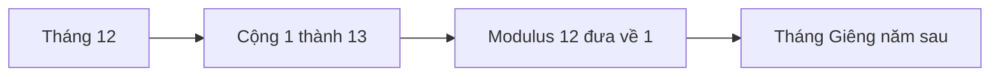

# 🌀 Modulus — phép chia lấy dư và câu hỏi "tháng sau là tháng mấy?"

> Nguồn: `074-Using-the-Modulus-Operator.txt` · [Udemy](https://ua.udemy.com/course/go-programming-language-crash-course/learn/lecture/26162306)

Chào các bạn! Lần này mình muốn khám phá **modulus (phép chia lấy dư)** kỹ hơn một chút. Mình vẫn đang nhìn vào code đúng như lúc kết thúc bài trước, và như thường lệ, mình xóa sạch hàm `main` cùng dòng import để bắt đầu lại. Chúng ta đã gặp ký hiệu này vài lần rồi — nó là dấu **phần trăm `%`** — nhưng lần này hãy xem nó "làm được gì" ngoài việc chia.

---

### 🔍 Ứng dụng đơn giản nhất: kiểm tra chia hết

Ví dụ đơn giản nhất: xác định **một số có chia hết cho số khác không**. Mình gán hai biến bằng toán tử rút gọn:

```go
x := 12
y := 3
if x%y == 0 {
	fmt.Println(y, "divides exactly into", x)
} else {
	fmt.Println(y, "does not divide exactly into", x)
}
```

Chạy `go run main.go`, chương trình in ra **"3 divides exactly into 12"** — vì `12 % 3 = 0`, không có phần dư. Đổi `y` thành `5`, chương trình in ra **"5 does not divide exactly into 12"**. Rất trực quan.

Cách này cũng dùng được để kiểm tra một số là **chẵn hay lẻ** — chắc các bạn đoán ra ngay cách làm rồi.

---

### 🗓️ Bài toán thú vị hơn: tháng sau là tháng mấy?

Giả sử mình đang viết một chương trình và cần biết **tháng kế tiếp** là tháng nào. Mình ghi âm bài này vào tháng Tư, nên:

```go
thisMonth := 4
fmt.Println("The month after this month is", thisMonth+1)
```

Chạy lên, kết quả là **5** — tháng Năm. Hoàn hảo! Nhưng chuyện gì xảy ra nếu mình ghi âm vào tháng Mười Hai? `thisMonth = 12`, cộng 1 thành **13** — mà thế gian này chỉ có 12 tháng để "chơi" thôi. *(Thú thật, có những lúc mình ước có 13 tháng vì mình quá bận — nhưng hiện tại thì vẫn chỉ có 12.)*

Có hai cách xử lý:

* Viết một câu `if` phức tạp: nếu `nextMonth > 12` thì gán `nextMonth = 1`.
* Dùng **modulus** — cách gọn gàng hơn nhiều.

---

### 🔁 Tổng quát hóa bằng vòng lặp và mẹo cộng 1

Modulus có thể áp dụng cho **mọi dải số tuần hoàn** — ở đây là 1 đến 12, nhưng có thể là bất kỳ khoảng nào. Mình viết một vòng lặp:

```go
for m := 1; m <= 12; m++ {
	fmt.Println("The month after", m, "is", m%12)
}
```

Chạy thử, mình phát hiện hai vấn đề:

* Với `m = 1`, kết quả là **1** — tức tháng hiện tại, không phải tháng sau.
* Với `m = 12`, kết quả là **0** — vì 12 chia hết cho 12, không còn dư.

Cách sửa cực đơn giản: **cộng thêm 1** vào kết quả:

```go
for m := 1; m <= 12; m++ {
	fmt.Println("The month after", m, "is", m%12+1)
}
```

Vậy là chạy đúng như mong đợi: tháng 1 → 2, tháng 11 → 12, và tháng 12 → 1 (vòng lại tháng Giêng).



---

### 💪 Modulus mạnh hơn bạn tưởng

Nhìn qua thì modulus có vẻ chỉ để "chia lấy dư", nhưng nó thật sự hữu dụng hơn thế:

* Kiểm tra chia hết, kiểm tra chẵn lẻ.
* Xử lý các bài toán **tuần hoàn** như tháng trong năm, giờ trên đồng hồ, lượt chơi trong game...
* Giữ code ngắn gọn thay vì cả chuỗi `if` rườm rà.

### ✅ Tự kiểm tra nhanh

**1. Toán tử modulus (`%`) trả về gì?**
<details>
<summary><b>Xem đáp án</b></summary>

**Đáp án:** Phần dư của phép chia.
Giải thích: `12 % 3 = 0` nghĩa là 3 chia hết vào 12; `50 % 3 = 2` nghĩa là còn dư 2.
Tham chiếu: Mục "Ứng dụng đơn giản nhất — kiểm tra chia hết"

</details>

**2. Làm sao kiểm tra một số có chia hết cho số khác bằng modulus?**
<details>
<summary><b>Xem đáp án</b></summary>

**Đáp án:** So sánh phần dư với 0, ví dụ `if x%y == 0`.
Giải thích: Nếu không có phần dư thì y chia hết vào x; cách này cũng dùng để kiểm tra chẵn lẻ.
Tham chiếu: Mục "Ứng dụng đơn giản nhất — kiểm tra chia hết"

</details>

**3. Vì sao `12 + 1` lại thành vấn đề trong bài toán tháng?**
<details>
<summary><b>Xem đáp án</b></summary>

**Đáp án:** Vì tháng 12 cộng 1 thành 13, mà một năm chỉ có 12 tháng.
Giải thích: Cần xử lý riêng bằng `if` hoặc gọn hơn là dùng modulus.
Tham chiếu: Mục "Bài toán thú vị hơn — tháng sau là tháng mấy?"

</details>

**4. Vì sao `m % 12` chưa đủ, phải viết `m%12+1`?**
<details>
<summary><b>Xem đáp án</b></summary>

**Đáp án:** Vì `m % 12` cho ra 0 khi m = 12, và cho ra chính m khi m = 1 (tức tháng hiện tại).
Giải thích: Cộng thêm 1 để kết quả luôn là tháng kế tiếp, kể cả khi vòng qua tháng Giêng.
Tham chiếu: Mục "Tổng quát hóa bằng vòng lặp và mẹo cộng 1"

</details>

**5. Modulus còn dùng được cho loại bài toán nào khác?**
<details>
<summary><b>Xem đáp án</b></summary>

**Đáp án:** Mọi dải số tuần hoàn — tháng trong năm, giờ trên đồng hồ, lượt chơi trong game...
Giải thích: Nó giữ code ngắn gọn, tránh chuỗi `if` rườm rà.
Tham chiếu: Mục "Modulus mạnh hơn bạn tưởng"

</details>

---

Bài tiếp theo, chúng ta sẽ mang modulus vào **game oẳn tù tì (rock-paper-scissors)** — nhưng lưu ý là phiên bản *trước* phiên bản dùng channels và `select` nhé. Các bạn tìm lại code đó trước, chúng ta sẽ dùng nó ngay. Hẹn gặp lại! 🚀

## Nguồn tham khảo

- [The Go Programming Language Specification](https://go.dev/ref/spec)
- [Udemy — Using the Modulus Operator](https://ua.udemy.com/course/go-programming-language-crash-course/learn/lecture/26162306)
