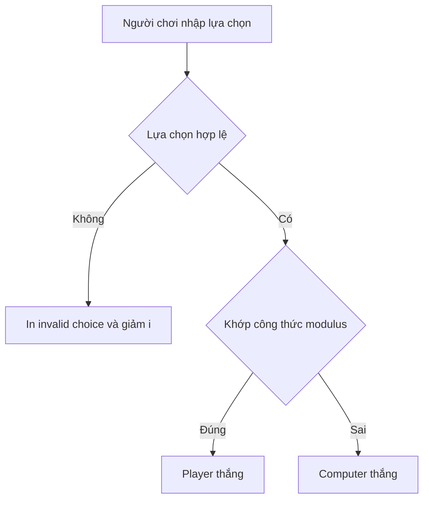

# ✂️ Modulus trong oẳn tù tì — ít code hơn, ít lỗi hơn

> Nguồn: `075-Modulus-in-rock-paper-scissors.txt` · [Udemy](https://ua.udemy.com/course/go-programming-language-crash-course/learn/lecture/26162312)

Đúng như hứa hẹn, lần này chúng ta sẽ sửa **game oẳn tù tì (rock-paper-scissors)** để dùng **modulus**. Nhờ vậy, chương trình sẽ được đơn giản hóa và số dòng code giảm đi đáng kể. Một lời nhắc quan trọng trước khi bắt đầu: đây **không phải** phiên bản dùng channels và `select` — mà là phiên bản *ngay trước đó*. Nếu đang mở nhầm phiên bản, các bạn mở lại file đúng trên máy hoặc tải source code từ bài giảng ở chương trước nhé.

---

### 📌 Ghi chú "cái gì thắng cái gì"

Mở file `main.go`, việc đầu tiên mình làm là viết vài dòng comment ở phần **constant** (dòng 14 đến 18 trong code của mình) để ghi rõ luật thắng thua và logic modulus đi kèm. Quy ước từ code cũ: `rock = 0`, `paper = 1`, `scissors = 2`.

| Lựa chọn | Đánh bại | Vì sao | Logic kiểm tra |
|---|---|---|---|
| rock | scissors | rock làm cùn kéo | `(scissors + 1) % 3 == 0` |
| paper | rock | giấy bọc đá | `(rock + 1) % 3 == 1` |
| scissors | paper | kéo cắt giấy | `(paper + 1) % 3 == 2` |

Thử kiểm tra bằng tay một dòng cho chắc: rock thắng scissors, và logic là `scissors + 1 % 3`. Scissors bằng 2, vậy `2 + 1 = 3`, mà `3 % 3 = 0` — không dư. Đúng bằng 0. Hai dòng còn lại cũng tương tự. Nếu muốn tự kiểm chứng, các bạn cứ in thử các biểu thức này bằng `fmt.Println` là thấy ngay.

---

### 🧹 Xóa chiếc `switch` khổng lồ

Trong chương trình cũ, phần xử lý thắng thua là một câu `switch` rất dài (bắt đầu từ dòng 85 trong code của mình). Mình **comment toàn bộ** đoạn đó lại và đóng ngoặc nhọn cho gọn. Ngay lúc này chương trình sẽ báo lỗi — *đừng lo, mình sửa ngay bây giờ.* Các bạn sẽ sớm thấy dùng modulus thì cần ít dòng code đến mức nào.

---

### ⚡ Logic mới: chỉ vài dòng thay cho cả cây `switch`

Đầu tiên là trường hợp **nhập sai** — ví dụ gõ "fish" thay vì rock, paper hay scissors. Modulus không giúp gì ở đây, nhưng phép kiểm tra rất dễ: nếu `playerValue` bằng giá trị mặc định `-1`, ta biết người chơi đã nhập sai, in ra "invalid choice" và **giảm `i`** để lặp lại lượt hiện tại.

Sau đó mới đến phần modulus. Toàn bộ logic nằm gọn như thế này:

```go
} else if playerValue == -1 {
	fmt.Println("invalid choice")
	i--
} else if playerValue == (computerValue+1)%3 {
	playerScore = playerWins(playerScore)
} else {
	computerScore = computerWins(computerScore)
}
```

Trước đây, mình phải xử lý ba trường hợp thắng thua riêng biệt rồi thêm cả `default` — giờ chỉ cần **một** điều kiện. Nếu người chơi không thắng thì đương nhiên máy thắng, nên nhánh `else` cứ thẳng thắn cộng điểm cho máy.



Xóa hết đoạn code đã comment, chương trình ngắn hơn hẳn — mà **code ngắn hơn nghĩa là ít cơ hội mắc lỗi hơn, và cũng ít việc bảo trì hơn.**

---

### 🎮 Chạy thử và lời nhắn cho người mới

Mở terminal và chạy `go run main.go` để xem kết quả:

1. Lượt 1 mình nhập **rock** — máy thắng.
2. Lượt 2 mình nhập **scissors** — mình thắng. Tỉ số đang hòa 1–1.
3. Lượt 3 nhập **rock** — hòa, chưa ai ghi điểm.
4. Lượt 4 nhập **rock** lần nữa — người chơi thắng cả ván.

Chơi thử bao nhiêu lần cũng được, kết quả luôn chính xác. Còn nếu các bạn **chưa thấy thoải mái với modulus** — điều này rất thường gặp ở người mới học lập trình — *cứ yên tâm.* Bạn hoàn toàn có thể dùng lại `switch` hoặc chuỗi `if/else` như cũ; miễn là bạn thấy dễ chịu. Nhưng theo thời gian, các bạn sẽ nhận ra modulus giúp code ngắn gọn, súc tích và ít lỗi đến mức nào. Rồi nó sẽ trở thành phản xạ tự nhiên thôi. Hẹn gặp lại các bạn! 🚀

## Nguồn tham khảo

- [The Go Programming Language Specification](https://go.dev/ref/spec)
- [Udemy — Modulus in rock-paper-scissors](https://ua.udemy.com/course/go-programming-language-crash-course/learn/lecture/26162312)
