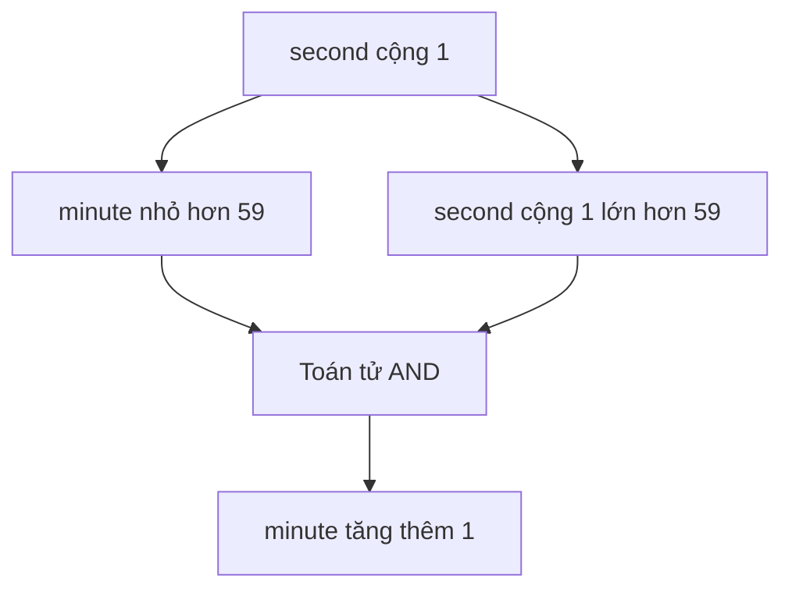

# ⚖️ Toán tử quan hệ và điều kiện — đọc đúng thứ tự đánh giá trong câu `if`

> Nguồn: `076-Relational-and-Conditional-Operators.txt` · [Udemy](https://ua.udemy.com/course/go-programming-language-crash-course/learn/lecture/26162318)

Chào các bạn! Lần này mình muốn nói về **toán tử quan hệ (relational operators)** và **toán tử điều kiện (conditional operators)** qua một ví dụ thật đơn giản. Mình mở lại một project cũ, xóa sạch hàm `main` và cả dòng import — Visual Studio Code sẽ tự thêm lại import khi cần. *Cứ thoải mái theo dõi, ví dụ này rất ngắn thôi.*

---

### ⌨️ Ví dụ nhỏ: đếm giây thành phút

Mình tạo hai biến bằng toán tử rút gọn:

```go
second := 31
minute := 1
if minute < 59 && second+1 > 59 {
	minute++
}
fmt.Println("minute is", minute)
```

Điều đáng chú ý nằm ở **câu lệnh `if`** — cụ thể là thứ tự các toán tử được đánh giá trong đó.

---

### 🧠 Thứ tự đánh giá trong câu `if`

Nếu nhìn kỹ, toán tử có precedence cao nhất trong dòng này là dấu **cộng `+`**. Vậy nên:

1. `second + 1` được tính trước tiên.
2. Tiếp theo là các toán tử **quan hệ**: dấu `<` và dấu `>`.
3. Cuối cùng mới đến toán tử **logic** `&&`.



Thử nghĩ ngược lại xem: sẽ vô lý thế nào nếu máy tính đánh giá cụm `59 && second` trước? Nếu mình bọc ngoặc đơn quanh cụm đó, Visual Studio Code lập tức phàn nàn. Đúng vậy, vì `59` là một số nguyên, `second` cũng là số nguyên — "số nguyên AND số nguyên" thì không tính ra giá trị Boolean nào cả. Vô nghĩa hoàn toàn.

Nếu mình đặt ngoặc đơn quanh các phần **theo đúng thứ tự được đánh giá** thì chương trình vẫn chạy y như cũ — những ngoặc đơn đó là dư thừa.

---

### 📖 Ngoặc đơn dư thừa — nhưng đôi khi rất đáng giá

Vậy vì sao vẫn nên cân nhắc thêm ngoặc đơn? Vì **tính dễ đọc**.

* Với một câu `if` phức tạp, ngoặc đơn giúp người đọc nắm ngay ý đồ của biểu thức.
* Một số IDE sẽ cảnh báo ngoặc đơn dư thừa — điều đó không sao cả; **không ai cấm bạn thêm chúng** nếu chúng làm code dễ hiểu hơn.
* Ai lập trình đủ lâu cũng sẽ nói với bạn điều này: quay lại đọc code mình viết sáu tháng trước, nếu không có comment chi tiết và không chịu khó viết cho rõ ràng, bạn sẽ gặp khó khăn để hiểu chính mình.

Và này, nếu thay `&&` bằng `||` trong ví dụ trên, cách viết vẫn diễn ra tương tự — hai toán tử logic `and` và `or` cùng nhóm precedence, nên bạn cứ thoải mái chọn cách diễn đạt dễ đọc nhất.

---

### 🧰 Bảng nhóm toán tử quan hệ và điều kiện

| Nhóm | Toán tử | Ý nghĩa |
|---|---|---|
| Quan hệ | `<` `<=` `>` `>=` | Nhỏ hơn, nhỏ hơn hoặc bằng, lớn hơn, lớn hơn hoặc bằng |
| Quan hệ | `==` `!=` | Bằng, không bằng |
| Điều kiện (logic) | `&&` | AND — cả hai vế phải đúng |
| Điều kiện (logic) | `\|\|` | OR — chỉ cần một vế đúng |
| Điều kiện (logic) | `!` | NOT — đảo giá trị Boolean |

Điều mình muốn các bạn ghi nhớ nhất khi viết code: **hãy thêm ngoặc đơn nếu nó giúp code dễ đọc hơn** — cho chính bạn, hoặc cho người sau này bảo trì code của bạn. Đó là một thói quen nhỏ nhưng đáng giá. Hẹn gặp lại các bạn ở bài sau! 🚀

## Nguồn tham khảo

- [The Go Programming Language Specification](https://go.dev/ref/spec)
- [Udemy — Relational and Conditional Operators](https://ua.udemy.com/course/go-programming-language-crash-course/learn/lecture/26162318)
