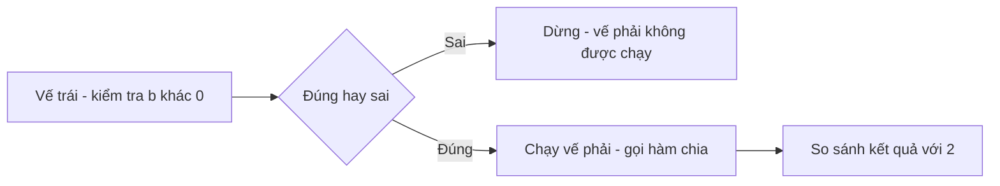

# ⚡ Short-circuit evaluation — cách Go "né" lỗi chia cho số 0

> Nguồn: `077-Short-Circuit-Evaluation.txt` · [Udemy](https://ua.udemy.com/course/go-programming-language-crash-course/learn/lecture/26162320)

Chào các bạn! Lần này mình muốn nói về một khía cạnh rất thú vị của việc đánh giá biểu thức trong Go: **short-circuit evaluation (đánh giá ngắt mạch)** — hay còn gọi là **McCarthy evaluation**. Đây là chủ đề mà hiểu rồi, các bạn sẽ viết code an toàn hơn hẳn. Mình xóa sạch code cũ và bắt đầu lại từ đầu nhé.

---

### 🚨 Bắt đầu bằng một đoạn code "tệ"

Mình khai báo hai biến số nguyên `a = 12`, `b = 6`, rồi viết một hàm chia hai số:

```go
func divideTwoNumbers(x, y int) int {
	return x / y
}

a := 12
b := 6
c := divideTwoNumbers(a, b)
if c == 2 {
	fmt.Println("we've found a 2")
}
```

Chạy `go run main.go` — in ra **"we've found a 2"** đúng như mong đợi. Nhưng mình phải nói thẳng: đây là code **rất tệ**. Vì nếu `a` và `b` được gán bằng logic khác trong chương trình (chứ không phải giá trị "cứng" như trên), hoàn toàn có thể xảy ra lỗi. Thử đổi `b` thành `0`, bạn sẽ nhận lỗi runtime `integer divide by zero`.

Đúng như chúng ta học ở trường: **chia cho 0 là điều không nên làm.** Nó có thể gây ra những hậu quả rất xấu. *(Mình thì thầm nghi ngờ nó có thể mở ra một hố đen và nuốt cả vũ trụ — nhưng dù thế nào đi nữa, chúng ta chắc chắn không được chia cho 0.)* Chương trình hiện tại hoàn toàn không xử lý trường hợp này.

---

### 🛡️ Cách xử lý thứ nhất: kiểm tra trước khi gọi

Cách đơn giản nhất là đặt một câu `if` **trước** lời gọi hàm:

```go
if b != 0 {
	c := divideTwoNumbers(a, b)
	if c == 2 {
		fmt.Println("we've found a 2")
	}
}
```

Nếu làm đúng, chương trình sẽ **không in gì cả** khi `b = 0` — nó kết thúc an toàn mà không có output. Một cách xử lý ổn, nhưng vẫn còn một cách khác thú vị hơn.

---

### ⚡ Short-circuit evaluation — điểm chính của bài

Mình comment đoạn code trên lại và viết lại như sau:

```go
if b != 0 && divideTwoNumbers(a, b) == 2 {
	fmt.Println("found 2")
}
```

Nhìn thoáng qua có thể chưa thấy điều đặc biệt. Nhưng đây chính là lúc **short-circuit evaluation** phát huy tác dụng:

* `&&` có precedence thấp nhất trong biểu thức này, nên **vế trái `b != 0` được đánh giá trước**.
* Chỉ khi vế trái **đúng**, phần sau dấu `&&` mới được đánh giá — nghĩa là hàm chia chỉ được gọi khi `b` thật sự khác 0.



Kiểm chứng: `a = 12`, `b = 0`. Nếu hàm chia được gọi, chắc chắn có lỗi. Chạy `go run main.go` — **không có gì xảy ra cả**. Điều đó chứng minh rõ ràng hàm chia chưa bao giờ được gọi.

Nhưng nhớ kỹ: **short-circuit evaluation luôn chạy từ trái sang phải**. Nếu mình đảo ngược thứ tự — gọi `divideTwoNumbers(a, b)` trước rồi mới kiểm tra `b != 0` — chương trình sẽ **lỗi ngay**, vì lời gọi hàm đã thực thi trước khi kịp kiểm tra.

---

### 🧰 Cách chuẩn nhất: trả về `error` từ trong hàm

Short-circuit rất hay, nhưng vấn đề gốc vẫn còn: hàm chia của mình **không hề kiểm tra lỗi**, mà nó có thể được gọi từ bất cứ đâu. Vậy nên cách tốt nhất là đưa việc kiểm tra **vào thẳng trong hàm**.

Thay vì trả về một `int`, hàm sẽ trả về **hai giá trị**: một `int` và một `error` — kiểu dựng sẵn của Go, có thể được "điền" thông tin khi có sự cố:

```go
func divideTwoNumbers(x, y int) (int, error) {
	if y == 0 {
		return 0, errors.New("cannot divide by zero")
	}
	return x / y, nil
}
```

Lưu ý: khi có lỗi, vẫn phải trả về một giá trị `int` nào đó (mình trả `0`), kèm lỗi tạo bằng `errors.New`. Một quy ước của Go: **thông báo lỗi luôn bắt đầu bằng chữ thường** — nên mình viết `"cannot divide by zero"`.

Phía người gọi, mình nhận cả hai giá trị, đặt tên lỗi là `err` (cách gọi quen thuộc trong Go):

```go
c, err := divideTwoNumbers(a, b)
if err != nil {
	fmt.Println("error:", err)
} else if c == 2 {
	fmt.Println("We found a 2")
}
```

`err` sẽ là `nil` khi mọi thứ suôn sẻ — nên ở nhánh thành công của hàm, mình trả về `x / y, nil`. Còn khi có lỗi, chương trình in thông báo và không làm gì thêm.

Chạy thử với `b = 0`: in ra **"cannot divide by zero"**. Đổi `b` về `6`: chương trình lại chạy êm như trước.

---

### ✅ Tự kiểm tra nhanh

**1. Vì sao chương trình báo lỗi khi `b = 0`?**
<details>
<summary><b>Xem đáp án</b></summary>

**Đáp án:** Vì xảy ra lỗi runtime `integer divide by zero` — chia cho 0 là điều không được phép.
Giải thích: Hàm chia ban đầu không hề kiểm tra trường hợp này.
Tham chiếu: Mục "Bắt đầu bằng một đoạn code tệ"

</details>

**2. Short-circuit (McCarthy) evaluation là gì?**
<details>
<summary><b>Xem đáp án</b></summary>

**Đáp án:** Là cách Go đánh giá biểu thức logic từ trái sang phải, và chỉ đánh giá vế phải khi vế trái cho phép.
Giải thích: Với `b != 0 && divideTwoNumbers(a, b) == 2`, hàm chia chỉ được gọi khi `b` khác 0.
Tham chiếu: Mục "Short-circuit evaluation — điểm chính của bài"

</details>

**3. Điều gì xảy ra nếu đảo ngược thứ tự hai vế?**
<details>
<summary><b>Xem đáp án</b></summary>

**Đáp án:** Chương trình lỗi ngay, vì lời gọi hàm được thực thi trước khi kiểm tra `b != 0`.
Giải thích: Short-circuit luôn chạy từ trái sang phải — đảo thứ tự là mất tác dụng bảo vệ.
Tham chiếu: Mục "Short-circuit evaluation — điểm chính của bài"

</details>

**4. Vì sao nên đưa việc kiểm tra lỗi vào trong hàm?**
<details>
<summary><b>Xem đáp án</b></summary>

**Đáp án:** Vì hàm có thể được gọi từ bất cứ đâu — không nên bắt mọi nơi gọi hàm phải tự nhớ kiểm tra.
Giải thích: Hàm trả về `(int, error)`; `err` là `nil` nếu không có lỗi, ngược lại chứa thông báo lỗi.
Tham chiếu: Mục "Cách chuẩn nhất — trả về error từ trong hàm"

</details>

**5. Quy ước viết thông báo lỗi trong Go là gì?**
<details>
<summary><b>Xem đáp án</b></summary>

**Đáp án:** Luôn bắt đầu bằng chữ thường.
Giải thích: Ví dụ `errors.New("cannot divide by zero")` — viết thường chữ "cannot".
Tham chiếu: Mục "Cách chuẩn nhất — trả về error từ trong hàm"

</details>

---

Chốt lại vài điều quan trọng: **short-circuit (McCarthy) evaluation** luôn chạy **từ trái sang phải**; khi viết hàm có khả năng sinh lỗi, có lúc logic tự sinh lỗi, có lúc bạn phải **chủ động tạo lỗi** bằng `errors.New`; và đặt phần kiểm tra lỗi **ngay trong hàm** luôn an toàn hơn là tin tưởng mọi nơi gọi hàm đều nhớ kiểm tra.

Chúng ta vừa đi gần hết chương Operators rồi đấy! *Nếu phần error handling này còn hơi lạ, các bạn đừng bận tâm* — mình sẽ còn nhắc lại nhiều lần trong khóa. Bài cuối chương sẽ là về **assignment operators**. Hẹn gặp lại! 🚀

## Nguồn tham khảo

- [Go Packages — errors](https://pkg.go.dev/errors)
- [The Go Programming Language Specification](https://go.dev/ref/spec)
- [Udemy — Short Circuit Evaluation](https://ua.udemy.com/course/go-programming-language-crash-course/learn/lecture/26162320)
