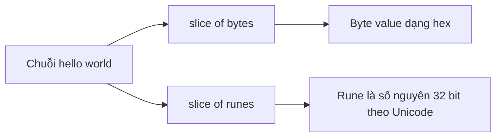

# 🔤 String trong Go là gì? Mổ xẻ từng byte và từng rune

> Nguồn: `079-What-is-a-string.txt` · [Udemy](https://ua.udemy.com/course/go-programming-language-crash-course/learn/lecture/26162334)

Chúng ta đã làm việc với string suốt khóa học, nhưng thú thật mình chưa dành thời gian mổ xẻ xem bên trong một string thực chất có gì. Trong bài này, mình sẽ cùng các bạn trả lời câu hỏi **string trong Go rốt cuộc là gì** — từ byte, rune, cho tới ba cách nối chuỗi và cách lấy chuỗi con. *Đừng lo nếu có đoạn chưa thấm ngay, cứ gõ theo mình rồi mọi thứ sẽ dần rõ.*

Mình mở Visual Studio Code, tạo folder mới tên **what is a string**, chạy `go mod init myapp`, rồi tạo file `main.go` với `package main` và hàm `main()` rỗng như mọi khi.

---

### 🧱 String thực chất là một slice of bytes

Việc đầu tiên, mình in ra một dòng trống bằng `fmt.Println()` không tham số cho thoáng màn hình, rồi khai báo biến `name` chứa `"hello world"` và in theo cách quen thuộc:

```go
name := "hello world"
fmt.Println("String:", name)
```

Kết quả đúng như mong đợi: `String: hello world`. Nhưng phần thú vị nằm ở bên trong. Vì string thực chất là một **tập hợp byte** — chính xác hơn là một **slice of bytes** (lát cắt byte) — mình lặp qua từng phần tử và in giá trị byte bằng placeholder `%x` của `fmt.Printf`:

```go
for i := 0; i < len(name); i++ {
    fmt.Printf("%x ", name[i])
}
```

`len` là hàm chúng ta đã gặp từ lâu, trả về độ dài của slice. Ban đầu các byte in ra dính liền nhau rất khó đọc, nên mình thêm khoảng trắng sau `%x`. Chạy lại là thấy rõ từng byte cấu tạo nên `hello world`.

---

### 🧠 Byte, rune và sức mạnh của Unicode

Tiếp theo, mình in một bảng nhỏ bằng cách duyệt chuỗi với `range` — một cách khác để đi qua slice of bytes:

```go
for x, y := range name {
    fmt.Println(x, "\t", y, "\t", string(y))
}
```

Trong đó `x` là index, `y` là **rune**. Bảng cho thấy chữ `h` đầu tiên có index `0`, rune value `72`, string value là `h`; còn ở bảng byte phía trên, chính chữ `h` đó mang byte value `48` (hệ thập lục phân). Cùng một ký tự, hai góc nhìn: **string vừa là slice of bytes, vừa là slice of runes**.

Vậy **rune** là gì? Nó không gì khác ngoài **một số nguyên 32-bit**. Điểm hay là rune lưu giá trị theo chuẩn **Unicode**, nên các bạn không bị giới hạn ở bảng chữ La-tinh a–z hay chữ số 0–9: rune chứa được tiếng Nhật, tiếng Hy Lạp, và mọi ký tự có trong Unicode. Điều này cực kỳ hữu ích khi viết các chương trình quốc tế hóa (**internationalized programs**).

Để chứng minh, mình mở Google Translate, dịch `hello world` sang tiếng Hy Lạp, sao chép kết quả rồi gán lại biến `name` bằng các ký tự đó. Chạy lại chương trình, mọi thứ vẫn hoạt động trơn tru — vì đó đều là các số nguyên 32-bit, tức rune.



---

### 🔗 Ba cách nối string và câu chuyện hiệu năng

Mình khai báo `h` chứa `"hello, "` (lần này có dấu phẩy và khoảng trắng) và `w` chứa `"world."`, rồi thử ba cách nối.

**Cách 1 — dấu cộng** quen thuộc:

```go
myString := h + w
```

Cách này dễ dùng nhưng **không hiệu quả lắm**. Nhớ lại chuyện đã nói từ trước: string trong Go là **immutable (bất biến)**, nên mỗi phép nối là mỗi lần tạo ra một string mới.

**Cách 2 — `fmt.Sprintf`** với placeholder `%s`:

```go
myString = fmt.Sprintf("%s%s", h, w)
```

`Sprintf` trả về string để mình gán lại vào biến. Cách này **hiệu quả hơn hẳn** dấu cộng.

**Cách 3 — `strings.Builder`**, thứ các bạn chưa từng thấy:

```go
var sb strings.Builder
sb.WriteString(h)
sb.WriteString(w)
fmt.Println(sb.String())
```

`Builder` nằm trong package `strings` có sẵn của thư viện chuẩn. Gọi `WriteString` để nối thêm nội dung, rồi `sb.String()` để lấy ra string hoàn chỉnh. Đây là cách **hiệu quả nhất** và cho nhiều quyền kiểm soát hơn — chúng ta sẽ còn gặp lại nó ở phần sau của section này.

| Cách nối | Cách viết | Hiệu năng |
|---|---|---|
| Dấu cộng | `h + w` | Không hiệu quả lắm |
| `fmt.Sprintf` | `fmt.Sprintf("%s%s", h, w)` | Hiệu quả hơn |
| `strings.Builder` | `WriteString` rồi `String()` | Hiệu quả nhất |

Vì sao lại có tận ba cách cho cùng một việc? Một phần vì tác giả Go hiểu rằng lập trình viên **mong đợi** được nối chuỗi bằng dấu cộng — nó là dấu `+` trong Go, dấu `.` trong PHP, dấu `+` trong Java. Giữ cách quen thuộc là tôn trọng thói quen cộng đồng, còn `Builder` là lựa chọn cho người cần hiệu năng.

---

### ✂️ Lấy chuỗi con bằng cú pháp slice

Cuối bài, mình gán lại `name` thành bảng chữ cái in hoa và lấy ra một đoạn:

```go
name = "ABCDEFGHIJKLMNOPQRSTUVWXYZ"
fmt.Println(name[0:13])
```

Kết quả là `ABCDEFGHIJKLM` — từ `A` đến ký tự thứ 13. Đổi điểm bắt đầu thành `10`:

```go
fmt.Println(name[10:13])
```

ta được `KLM`. Cách đếm này nghe hơi lạ với người mới, nhưng đây chính là cách slice được xử lý trong Go: **bắt đầu từ vị trí 0** và **không bao gồm vị trí kết thúc**. Quan trọng hơn, cú pháp này áp dụng cho **mọi loại slice**, không riêng gì string.

---

### ✅ Tự kiểm tra nhanh

**1. String trong Go thực chất là gì?**
<details>
<summary><b>Xem đáp án</b></summary>

**Đáp án:** Một slice of bytes (lát cắt byte).
Giải thích: Ngoài ra còn có thể xem là slice of runes; rune là số nguyên 32-bit theo Unicode.
Tham chiếu: Mục "String thực chất là một slice of bytes"

</details>

**2. Rune là gì và vì sao nó lưu được tiếng Hy Lạp, tiếng Nhật?**
<details>
<summary><b>Xem đáp án</b></summary>

**Đáp án:** Rune là số nguyên 32-bit, lưu giá trị theo chuẩn Unicode.
Giải thích: Vì theo Unicode, rune không bị giới hạn ở bảng chữ La-tinh và chữ số.
Tham chiếu: Mục "Byte, rune và sức mạnh của Unicode"

</details>

**3. Ba cách nối string trong Go là gì?**
<details>
<summary><b>Xem đáp án</b></summary>

**Đáp án:** Dấu cộng `+`, `fmt.Sprintf` với placeholder `%s`, và `strings.Builder`.
Giải thích: Hiệu quả tăng dần theo thứ tự: dấu cộng kém nhất, `Builder` tốt nhất.
Tham chiếu: Mục "Ba cách nối string và câu chuyện hiệu năng"

</details>

**4. Vì sao nối string bằng dấu cộng kém hiệu quả?**
<details>
<summary><b>Xem đáp án</b></summary>

**Đáp án:** Vì string trong Go là immutable (bất biến).
Giải thích: Mỗi phép nối tạo ra một string mới thay vì sửa chuỗi cũ.
Tham chiếu: Mục "Ba cách nối string và câu chuyện hiệu năng"

</details>

**5. `name[10:13]` trên bảng chữ cái in hoa cho ra kết quả gì?**
<details>
<summary><b>Xem đáp án</b></summary>

**Đáp án:** `KLM`.
Giải thích: Bắt đầu từ index 10 và không bao gồm index 13, nên lấy được ba ký tự K, L, M.
Tham chiếu: Mục "Lấy chuỗi con bằng cú pháp slice"

</details>

---

Đó là khá nhiều thứ cho một khái niệm tưởng chừng đơn giản: string là slice of bytes, rune mở ra thế giới Unicode, ba cách nối chuỗi với ba mức hiệu năng, và cú pháp slice để lấy chuỗi con. *Các bạn không cần thuộc hết ngay — để nó ngấm dần là được.*

Bài tiếp theo, chúng ta sẽ nói kỹ về **indexing** — cách đếm ký tự trong chuỗi và vì sao chuyện bắt đầu từ số 0 lại quan trọng đến thế. Hẹn gặp lại các bạn! 🚀

## Nguồn tham khảo

- [Wikipedia — Unicode](https://en.wikipedia.org/wiki/Unicode)
- [pkg.go.dev — Package strings](https://pkg.go.dev/strings)
- [pkg.go.dev — Package fmt](https://pkg.go.dev/fmt)
