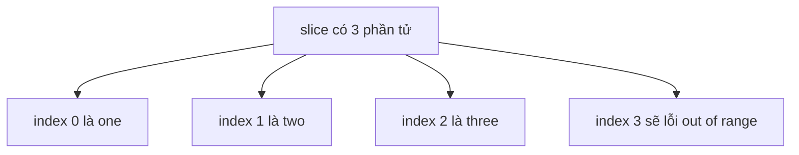

# 📏 Độ dài chuỗi trong Go và cạm bẫy index out of range

> Nguồn: `081-String-length.txt` · [Udemy](https://ua.udemy.com/course/go-programming-language-crash-course/learn/lecture/26162344)

Chúng ta đã dùng hàm `len` vài lần rồi, nhưng trong bài này mình muốn nói kỹ hơn về **độ dài chuỗi** và nhân đó ôn lại chuyện indexing. *Đây là cặp đôi luôn đi cùng nhau: muốn lấy phần tử mà không vượt biên, các bạn phải hiểu độ dài.*

---

### 📏 Độ dài của courseName

Mình bỏ phần code in từng ký tự của bài trước đi vì không cần nữa, rồi in ra độ dài chuỗi:

```go
fmt.Println("Length of courseName is", len(courseName))
```

Trước khi chạy, mình tự hỏi: theo bảng đồ ở đầu file, chuỗi dài bao nhiêu ký tự? Comment ghi 34, nhưng chạy lên thì kết quả là **35** — vì chúng ta đếm từ 0. Chuyện này hết sức đơn giản, và rồi nó sẽ trở nên quá quen thuộc với các bạn.

---

### 🧺 len không chỉ dành cho string

Hàm `len` còn dùng được với mọi thứ đếm được, ví dụ một slice of strings:

```go
var mySlice []string
mySlice = append(mySlice, "one", "two", "three")
fmt.Println("My slice has", len(mySlice), "elements")
```

Kết quả đúng như dự đoán: `My slice has 3 elements`. Điều này rất hợp lý, vì như các bạn đã biết, string bản chất cũng là một slice of bytes.

Giống như có thể tham chiếu phần tử trong chuỗi theo vị trí, mình cũng có thể tham chiếu phần tử trong slice theo vị trí. Nhưng đây là chỗ dễ sai nhất: nếu viết `mySlice[len(mySlice)]`, chương trình sẽ **báo lỗi** `index out of range 3 with length 3`. Vì đếm từ 0, phần tử cuối cùng phải là `len(mySlice) - 1`:

```go
fmt.Println("The last element in my slice is", mySlice[len(mySlice)-1])
```

Lần này chương trình chạy đúng: phần tử cuối là `three`.



*Mình nhấn mạnh chuyện đếm từ 0 vì đây chính là lỗi người mới gặp nhiều nhất — nhưng cứ luyện vài lần là hết.*

---

### 🐝 Liên hệ với project Eliza

Mình mở lại code của **Eliza** và xem file `doctor.go`, dòng 148 — ở đó có đúng kiểu xử lý này. Ta lặp qua danh sách `matches`; trong trường hợp này `matches` là một slice of strings, giống hệt `mySlice` vừa rồi.

Vòng lặp chạy `i` từ 0 và điều kiện là **`i < len(matches)`** — dùng toán tử **nhỏ hơn** nên **không cần trừ 1**, khác với khi các bạn muốn lấy trực tiếp phần tử cuối cùng. Khi `i` đạt đúng `len(matches)` thì vòng lặp dừng trước khi chạm vào index không tồn tại.

Qua ví dụ này, các bạn thấy đấy: indexing và độ dài được dùng rất nhiều trong lập trình Go, không chỉ với string mà còn với slice of strings và mọi thứ đếm được.

---

### ✅ Tự kiểm tra nhanh

**1. `len(courseName)` trả về bao nhiêu?**
<details>
<summary><b>Xem đáp án</b></summary>

**Đáp án:** 35.
Giải thích: Comment ghi 34, nhưng thực tế là 35 vì chúng ta đếm từ 0.
Tham chiếu: Mục "Độ dài của courseName"

</details>

**2. `mySlice[len(mySlice)]` xảy ra chuyện gì?**
<details>
<summary><b>Xem đáp án</b></summary>

**Đáp án:** Lỗi `index out of range 3 with length 3`.
Giải thích: Với slice 3 phần tử, index hợp lệ chỉ từ 0 đến 2.
Tham chiếu: Mục "len không chỉ dành cho string"

</details>

**3. Muốn lấy phần tử cuối của slice thì viết thế nào?**
<details>
<summary><b>Xem đáp án</b></summary>

**Đáp án:** `mySlice[len(mySlice)-1]`.
Giải thích: Phải trừ 1 vì index bắt đầu từ 0.
Tham chiếu: Mục "len không chỉ dành cho string"

</details>

**4. Vì sao trong `doctor.go` của Eliza không cần trừ 1?**
<details>
<summary><b>Xem đáp án</b></summary>

**Đáp án:** Vì vòng lặp dùng `<` thay vì `<=`.
Giải thích: Khi `i` đạt đúng `len(matches)` thì vòng lặp đã dừng, không chạm vào index không tồn tại.
Tham chiếu: Mục "Liên hệ với project Eliza"

</details>

**5. `len` dùng được với những gì?**
<details>
<summary><b>Xem đáp án</b></summary>

**Đáp án:** String, slice và mọi thứ đếm được.
Giải thích: Đây là lý do `len` xuất hiện liên tục khi làm việc với chuỗi và slice trong Go.
Tham chiếu: Đoạn mở bài

</details>

---

Chỉ một hàm `len` nhỏ bé mà chứa cả một bài học: hiểu nó, các bạn tránh được lỗi `index out of range` — lỗi mà ai cũng từng gặp ít nhất một lần. *Cứ gõ theo, sai cũng không sao, quan trọng là nhớ vì sao mình sai.*

Bài tiếp theo, chúng ta sẽ bước vào **package strings** — bộ công cụ tìm kiếm, đếm và định vị chuỗi con cực kỳ hữu dụng. Hẹn gặp lại các bạn! 🚀

## Nguồn tham khảo

- [pkg.go.dev — builtin: len](https://pkg.go.dev/builtin#len)
