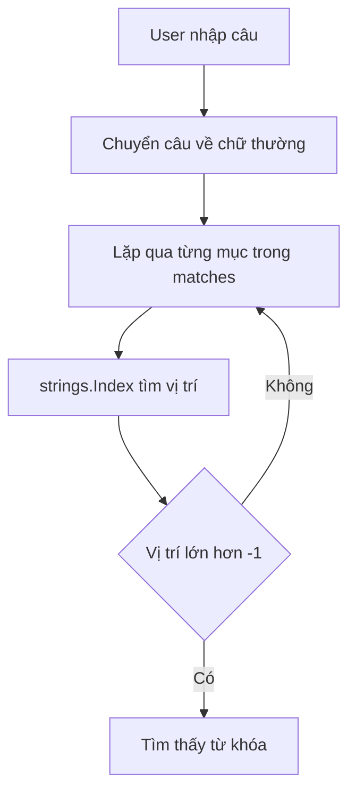

# 🧰 Package strings — Bộ công cụ tìm kiếm và định vị chuỗi con

> Nguồn: `082-The-strings-package.txt` · [Udemy](https://ua.udemy.com/course/go-programming-language-crash-course/learn/lecture/26162350)

Khi làm việc với string trong Go, việc thường gặp nhất là xác định xem một chuỗi **có chứa** ký tự hay đoạn ký tự nào đó không, và **nếu có thì nằm ở đâu**. May mắn thay, package `strings` trong thư viện chuẩn cho chúng ta một bộ công cụ rất tiện. *Đừng lo, các hàm này rất trực quan — cứ đọc tên là đoán được việc chúng làm.*

---

### 📦 Tạo dữ liệu mẫu với slice courses

Mình xóa sạch hàm `main()` và bắt đầu lại. Lần này tạo một slice of strings tên `courses`, gồm tên khóa học của chúng ta và ba bản sao đổi sang ngôn ngữ khác:

```go
courses := []string{
    "Learn Go for Beginners Crash Course",
    "Learn Java for Beginners Crash Course",
    "Learn Python for Beginners Crash Course",
    "Learn C for Beginners Crash Course",
}
```

Rồi mình lặp qua slice bằng `range`, bỏ qua index (dùng dấu `_`), mỗi vòng lấy ra phần tử hiện tại gọi là `x`.

---

### 🔍 strings.Contains — có hay không?

Đầu tiên là `strings.Contains` — kiểm tra chuỗi có chứa đoạn ký tự cần tìm hay không. Mình tìm chữ `Go` (G in hoa, o thường) trong từng khóa học:

```go
for _, x := range courses {
    if strings.Contains(x, "Go") {
        fmt.Println("Go is found in", x)
    }
}
```

Chạy chương trình, đúng như dự đoán: **chỉ dòng đầu tiên** khớp, vì chỉ khóa học của chúng ta mới chứa chữ `Go`. `Contains` trả về `true` nếu tìm thấy, `false` nếu không.

---

### 📍 strings.Index — nằm ở đâu?

Biết "có" là tốt, nhưng biết **nằm ở đâu** còn hữu ích hơn. Mình dùng `strings.Index` để tìm vị trí chữ `Go`:

```go
fmt.Println("Go is found in", x, "and index is", strings.Index(x, "Go"))
```

Kết quả in ra: `Go is found in Learn Go for Beginners Crash Course and index is 6`. Vì đếm từ 0, index 6 có nghĩa ký tự thứ 7 trong chuỗi chính là chữ `G` mở đầu của "Go". Một điểm quan trọng từ tài liệu: `Index` trả về index của **lần xuất hiện đầu tiên** của substring, hoặc **-1** nếu không tìm thấy.

---

### 🧵 Chuỗi mới với hai lần xuất hiện của Go

Lần này mình tạo một chuỗi mới có chữ `Go` xuất hiện **hai lần**:

```go
newString := "Go is a great programming language, Go for it!"
```

Mình cũng dán vào các comment đánh dấu vị trí từng ký tự để tiện tra cứu. Từ đây, mình thử một loạt hàm:

* `strings.HasPrefix(newString, "Go")` — trả về `true` vì chuỗi **bắt đầu** bằng `Go`.
* `strings.HasPrefix(newString, "Python")` — trả về `false`, vì `Python` không nằm ở đầu chuỗi.
* `strings.HasSuffix(newString, "!")` — cũng trả về `true`, nhưng lần này kiểm tra ký tự **kết thúc** chuỗi.
* `strings.Count(newString, "Go")` — đếm số lần xuất hiện, kể cả khi nó là một phần của từ khác. Kết quả là **2**. Nếu tìm `fish`, kết quả là **0** vì chuỗi không hề chứa `fish`.
* `strings.Index(newString, "Go")` — trả về `0`, vì `Go` nằm ngay đầu chuỗi.
* `strings.Index(newString, "Python")` — trả về **-1**, nghĩa là không tìm thấy.
* `strings.LastIndex(newString, "Go")` — trả về **36**, vị trí lần xuất hiện **cuối cùng**. Nếu không tìm thấy, hàm này cũng trả về -1.

| Hàm | Câu hỏi nó trả lời | Kết quả ví dụ |
|---|---|---|
| `strings.Contains` | Chuỗi có chứa đoạn này không? | `true` / `false` |
| `strings.Index` | Đoạn này xuất hiện đầu tiên ở đâu? | `6`, hoặc `-1` |
| `strings.LastIndex` | Đoạn này xuất hiện cuối cùng ở đâu? | `36`, hoặc `-1` |
| `strings.HasPrefix` | Chuỗi có bắt đầu bằng đoạn này không? | `true` / `false` |
| `strings.HasSuffix` | Chuỗi có kết thúc bằng đoạn này không? | `true` / `false` |
| `strings.Count` | Đoạn này xuất hiện bao nhiêu lần? | `2` |

---

### 🐝 Eliza dùng strings.Index như thế nào?

Cũng như bài trước, mình mở lại project **Eliza**, file `doctor.go` dòng 150 — đoạn lặp qua `matches`. Ở đó, `matches` là một slice of strings chứa những cụm từ khóa như "life", "I need", "why don't", "why can't"…

Vòng lặp đi qua từng phần tử `match` và dùng `strings.Index` để tìm nó trong câu người dùng nhập vào — câu này đã được chuyển về chữ thường trước khi tìm. Điểm mấu chốt: vị trí trả về **chỉ lớn hơn -1 khi tìm thấy**, nên code chỉ cần kiểm tra điều kiện đó là biết người dùng có nhắc tới từ khóa hay không. Nói cách khác, `strings.Index` đóng vai trò "đèn báo" cho Eliza biết nên phản hồi gì.



Còn sau khi tìm thấy rồi, làm sao để **thay thế** hay **xóa** đoạn đó khỏi câu? Đó sẽ là nội dung của bài tiếp theo: **string manipulation** — thao tác chuỗi.

---

### ✅ Tự kiểm tra nhanh

**1. `strings.Contains` trả về giá trị gì?**
<details>
<summary><b>Xem đáp án</b></summary>

**Đáp án:** `true` nếu tìm thấy, `false` nếu không.
Giải thích: Trong ví dụ, chỉ khóa học Go mới chứa `Go` nên chỉ dòng đầu khớp.
Tham chiếu: Mục "strings.Contains — có hay không?"

</details>

**2. `strings.Index` trả về gì khi không tìm thấy substring?**
<details>
<summary><b>Xem đáp án</b></summary>

**Đáp án:** -1.
Giải thích: Tài liệu ghi rõ: trả về index lần xuất hiện đầu tiên, hoặc -1 nếu không có.
Tham chiếu: Mục "strings.Index — nằm ở đâu?"

</details>

**3. Vì sao `strings.Count(newString, "fish")` trả về 0?**
<details>
<summary><b>Xem đáp án</b></summary>

**Đáp án:** Vì chuỗi không chứa `fish` lần nào.
Giải thích: `Count` đếm mọi lần xuất hiện, kể cả khi chuỗi con nằm trong một từ khác.
Tham chiếu: Mục "Chuỗi mới với hai lần xuất hiện của Go"

</details>

**4. `strings.LastIndex(newString, "Go")` trả về bao nhiêu và vì sao?**
<details>
<summary><b>Xem đáp án</b></summary>

**Đáp án:** 36.
Giải thích: Đó là vị trí lần xuất hiện cuối cùng của `Go` trong chuỗi; không tìm thấy sẽ trả về -1.
Tham chiếu: Mục "Chuỗi mới với hai lần xuất hiện của Go"

</details>

**5. Eliza dùng `strings.Index` để làm gì?**
<details>
<summary><b>Xem đáp án</b></summary>

**Đáp án:** Tìm từ khóa trong câu người dùng đã chuyển về chữ thường.
Giải thích: Vị trí trả về chỉ lớn hơn -1 khi tìm thấy, nên code dùng nó như "đèn báo" để phản hồi.
Tham chiếu: Mục "Eliza dùng strings.Index như thế nào?"

</details>

---

Package `strings` còn rất nhiều hàm thú vị mà mình sẽ giới thiệu trong bài tiếp theo, nhưng các bạn đã có trong tay bộ công cụ nền tảng: `Contains`, `Index`, `LastIndex`, `HasPrefix`, `HasSuffix` và `Count`. *Cứ thử nghiệm thoải mái — đây là những hàm các bạn sẽ dùng hằng ngày khi làm việc với dữ liệu người dùng.*

Hẹn gặp các bạn ở bài **String manipulation**, nơi chúng ta sẽ học cách thay thế và biến đổi chuỗi. 🚀

## Nguồn tham khảo

- [pkg.go.dev — Package strings](https://pkg.go.dev/strings)
