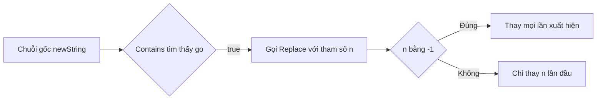

# 🔧 Biến đổi chuỗi trong Go — Replace, ReplaceAll và TrimSpace

> Nguồn: `083-String-manipulation.txt` · [Udemy](https://ua.udemy.com/course/go-programming-language-crash-course/learn/lecture/26162352)

Chúng ta đã biết tìm một chuỗi con nằm ở đâu trong chuỗi lớn. Hôm nay, mình và các bạn sẽ học cách **thay đổi chính chuỗi đó** bằng những method có sẵn trong package `strings`. Cứ gõ theo từng bước nhé — toàn là những hàm các bạn sẽ dùng rất nhiều về sau, nên *chưa hiểu hết ngay cũng không sao*.

---

### 🎯 Kiểm tra trước khi thay — thói quen tốt cần luyện

Mình bắt đầu với biến `newString` đang chứa câu:

* "go is a great programming language, go for it."

Trước khi thay thế, mình dùng `strings.Contains(newString, "go")` để kiểm tra xem chuỗi có chứa cụm `go` hay không. Hàm này trả về **Boolean**: `true` nếu tìm thấy, `false` nếu không. Mình biết chắc nó sẽ trả về `true`, nhưng vẫn đặt kiểm tra cho quen tay — khi làm việc thật với dữ liệu người dùng, thói quen này sẽ cứu các bạn đấy.

---

### 🔁 strings.Replace — thay bao nhiêu lần là do bạn

Hàm `strings.Replace` nhận **4 tham số**, đúng như gợi ý hiện ra trong VS Code:

1. Chuỗi đang làm việc — `newString`.
2. Chuỗi cần tìm — `"go"`.
3. Chuỗi thay thế — `"golang"`.
4. Số lần muốn thay thế — tham số thú vị nhất.

```go
newString = strings.Replace(newString, "go", "golang", -1)
fmt.Println(newString)
```

Với `-1`, kết quả là "golang is a great programming language golang for it" — nghe... vô nghĩa. Mình đổi tham số cuối thành `1`:

```go
newString = strings.Replace(newString, "go", "golang", 1)
```

Lần này ta được "golang is a great programming language go for it" — hợp lý hơn hẳn.

Nhưng Go còn một hàm khác tên `strings.ReplaceAll`, **ít tham số hơn** và thay **mọi** lần xuất hiện:

```go
newString = strings.ReplaceAll(newString, "go", "golang")
```

Chạy `go run main.go` — mọi `go` đều thành `golang`, đúng như các bạn đoán.



---

### ⚖️ So sánh chuỗi — vì sao "a" không lớn hơn "b"?

So sánh bằng `==` hay `!=` thì quá quen thuộc — việc kiểm tra bằng nhau của chuỗi trong Go giống hệt mọi phép so sánh khác. Nhưng `>` và `<` với chuỗi nghe hơi lạ:

```go
if "a" > "b" {
	fmt.Println("a is greater than b")
} else {
	fmt.Println("a is not greater than b")
}
```

Kết quả là **"a is not greater than b"**. Nhìn mặt chữ thì vô lý, nhưng với máy tính lại hoàn toàn hợp lý — nếu không so sánh được, chúng ta chẳng bao giờ **sắp xếp theo alphabet** được. Nhớ lại bài trước: chuỗi là **slice of bytes hoặc runes**, mà mỗi rune thực chất là một `int32`. Vậy nên so sánh chuỗi chính là so sánh các giá trị số.

Thử với từ dài hơn: `"alpha" > "absolute"` → `true`. Hai từ cùng bắt đầu bằng `a`, còn `l` có giá trị `int32` lớn hơn `b`.

---

### 🧹 strings.TrimSpace — dọn dẹp email người dùng nhập

Hãy tưởng tượng các bạn làm web app và yêu cầu người dùng nhập email. Họ gõ `" me@here.com  "` — với họ nhìn thì "ổn", nhưng với máy tính đó **không phải email hợp lệ**: không ai gửi thư tới "space me at here dot com space" được cả.

`strings.TrimSpace` xử lý đúng chuyện này: hàm trả về chuỗi với **leading và trailing white space** (khoảng trắng đầu và cuối) đã bị gỡ bỏ, theo định nghĩa Unicode.

```go
badEmail = strings.TrimSpace(badEmail)
fmt.Printf("=%s=", badEmail)
fmt.Println()
```

Kết quả in ra `=me@here.com=` — sạch sẽ, không còn khoảng trắng thừa. *Đây là hàm bạn sẽ dùng rất nhiều đấy.*

---

### ✅ Tự kiểm tra nhanh

**1. `strings.Replace` nhận mấy tham số, tham số cuối nghĩa là gì?**
<details>
<summary><b>Xem đáp án</b></summary>

**Đáp án:** 4 tham số; tham số cuối là số lần thay thế, `-1` nghĩa là thay mọi lần xuất hiện.
Giải thích: Ba tham số đầu lần lượt là chuỗi gốc, chuỗi cần tìm và chuỗi thay thế.
Tham chiếu: Mục "strings.Replace — thay bao nhiêu lần là do bạn".

</details>

**2. `strings.ReplaceAll` khác `strings.Replace` ở điểm nào?**
<details>
<summary><b>Xem đáp án</b></summary>

**Đáp án:** `ReplaceAll` ít tham số hơn và thay thế mọi lần xuất hiện, không cần truyền `-1`.
Giải thích: Cả hai cho kết quả giống nhau khi muốn thay tất cả, nhưng `ReplaceAll` gọn hơn.
Tham chiếu: Mục "strings.Replace — thay bao nhiêu lần là do bạn".

</details>

**3. Vì sao có thể dùng `>` hay `<` để so sánh chuỗi?**
<details>
<summary><b>Xem đáp án</b></summary>

**Đáp án:** Vì chuỗi là slice of bytes hoặc runes, và rune thực chất là `int32`.
Giải thích: So sánh chuỗi là so sánh giá trị số, nhờ đó mới sắp xếp alphabet được.
Tham chiếu: Mục "So sánh chuỗi".

</details>

**4. Vì sao `" me@here.com  "` không được coi là email hợp lệ?**
<details>
<summary><b>Xem đáp án</b></summary>

**Đáp án:** Vì có khoảng trắng ở đầu và cuối chuỗi.
Giải thích: Người dùng nhìn thấy "ổn" nhưng máy tính thấy các ký tự space thừa, không thể gửi email tới đó.
Tham chiếu: Mục "strings.TrimSpace".

</details>

**5. `strings.TrimSpace` loại bỏ những gì?**
<details>
<summary><b>Xem đáp án</b></summary>

**Đáp án:** Mọi khoảng trắng ở đầu và cuối chuỗi (leading và trailing white space), theo định nghĩa Unicode.
Giải thích: Khoảng trắng nằm giữa chuỗi vẫn được giữ nguyên.
Tham chiếu: Mục "strings.TrimSpace".

</details>

---

Vậy là mình đã biết tìm, thay thế, so sánh và dọn dẹp chuỗi. Ở bài tiếp theo, chúng ta sẽ gặp một tình huống thú vị hơn: **thay đúng lần xuất hiện thứ n** — Go không có sẵn hàm này, nên mình sẽ cùng các bạn tự viết lấy. Hẹn gặp lại! 🚀

## Nguồn tham khảo

- [strings package — pkg.go.dev](https://pkg.go.dev/strings)
- [strings.Replace](https://pkg.go.dev/strings#Replace)
- [strings.ReplaceAll](https://pkg.go.dev/strings#ReplaceAll)
- [strings.TrimSpace](https://pkg.go.dev/strings#TrimSpace)
