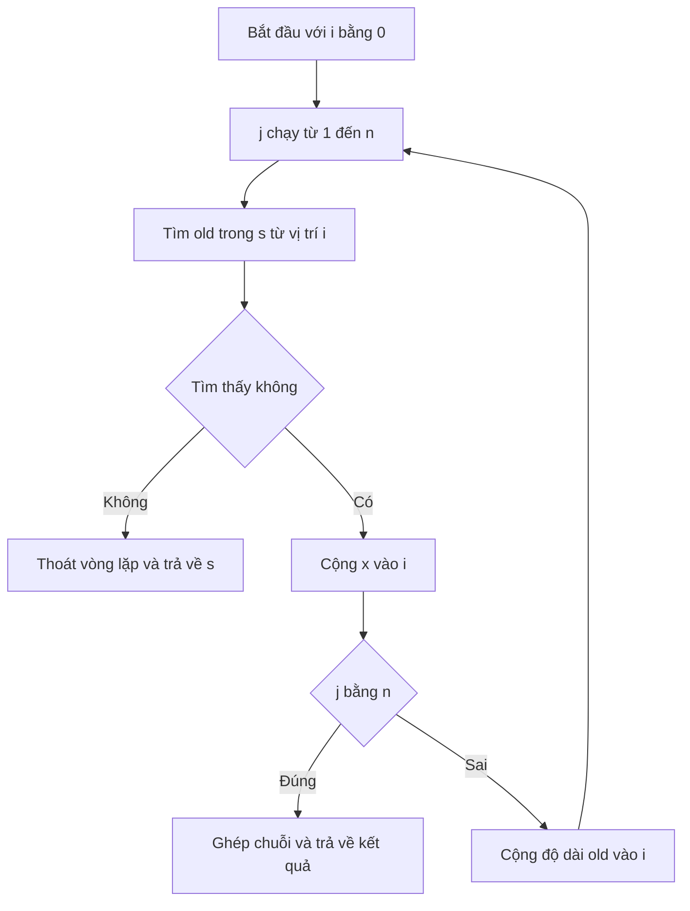

# 🧩 Tự viết replaceNth — Thay thế đúng lần xuất hiện bạn muốn

> Nguồn: `084-More-string-manipulation.txt` · [Udemy](https://ua.udemy.com/course/go-programming-language-crash-course/learn/lecture/26162354)

Bài trước chúng ta đã tìm chuỗi con, thay lần xuất hiện đầu tiên, thay tất cả, rồi so sánh chuỗi. Nhưng nếu mình muốn thay **đúng lần xuất hiện thứ ba** thì sao? Các ngôn ngữ khác có sẵn hàm này, còn Go thì không — và đó lại là cơ hội tuyệt vời để các bạn tự viết một hàm. *Đừng lo, nó không khó như các bạn nghĩ đâu.*

---

### 🎯 Thử thách đặt ra

Mình có chuỗi:

* `str = "alpha alpha alpha alpha alpha"`

Yêu cầu: thay **`alpha` ở vị trí thứ ba** thành `beta`, giữ nguyên mọi từ còn lại. Vì Go không cung cấp hàm kiểu này, mình sẽ tự viết một hàm — và theo mình, đây là **bài luyện cực tốt**, bởi làm việc với chuỗi trong Go đơn giản đến mức ai cũng làm được.

---

### 🧩 Thiết kế hàm replaceNth

Hàm có tên `replaceNth` với các tham số:

1. `s` — chuỗi mình muốn tìm trong đó.
2. `old` — từ hoặc cụm cần tìm.
3. `new` — từ sẽ thay vào.
4. `n` — vị trí xuất hiện cần thay, kiểu `int`.

Ba tham số đầu đều là `string`, và hàm **trả về một `string`**. Nghe qua thì hơi rối, nhưng thật ra hàm này không dùng gì mới ngoài **một điểm nhỏ** mà mình sẽ chỉ ngay sau đây. Mình cũng sẽ đăng một phiên bản source code chú thích chi tiết ở phần tài nguyên để các bạn tham khảo.

---

### 🔍 Đi từng bước qua thuật toán

Đầu tiên, mình tạo biến index `i := 0`, rồi viết một vòng lặp `for` ba phần quen thuộc: `j` chạy từ `1` đến `n` (đúng vị trí cần tìm), mỗi vòng cộng thêm 1.

Điểm mới duy nhất nằm ở chỗ tìm kiếm: mình tìm `old` trong `s` **bắt đầu từ vị trí `i`** bằng cách cắt bỏ phần đầu của chuỗi — `s[i:]`.

```go
x := strings.Index(s[i:], old)
if x < 0 {
	break
}
i += x
```

`strings.Index` trả về index nếu tìm thấy, hoặc `-1` nếu không. Vì vậy `x < 0` nghĩa là hết hy vọng — thoát khỏi vòng lặp, và cuối hàm trả về chuỗi gốc `s`. Nếu tìm thấy, mình cộng `x` vào `i` để index nhảy đúng tới vị trí xuất hiện.

Khi `j == n`, đây chính là lần xuất hiện cần thay, mình ghép chuỗi ngay trong một dòng:

```go
return s[:i] + new + s[i+len(old):]
```

Công thức gồm ba phần: **toàn bộ chuỗi từ đầu đến `i`**, cộng với **từ mới**, cộng với **phần còn lại từ `i + len(old)` đến hết chuỗi**. Còn nếu chưa tới `n` thì mình cộng `len(old)` vào `i` để nhảy qua lần xuất hiện hiện tại và tìm tiếp.



---

### 🐛 Chạy thử và soi bằng debugger

Mình gọi hàm trong `main`:

```go
str = replaceNth(str, "alpha", "beta", 3)
fmt.Println(str)
```

Chạy `go run main.go`, kết quả là **"alpha alpha beta alpha alpha"** — chính xác tuyệt đối! Rồi mình đặt breakpoint và bật debugger để xem từng bước:

* Ban đầu: `i = 0`, `j = 1`, `x = 0`. Sau lần tìm đầu, `i` vẫn là `0`; vì `j` chưa bằng `n` nên cộng thêm độ dài `alpha` (5 ký tự) → `i = 5`.
* Vòng hai: tìm thấy `alpha` trong `s[5:]` với `x = 1` → `i = 6`; vẫn chưa tới `n` → `i` thành **11**.
* Vòng ba: tìm thấy với `x = 1` → `i = 12`, và `j == n` → hàm ghép chuỗi và trả về kết quả với `beta` nằm đúng vị trí.

*Đừng ngại bấm step qua từng dòng và nhìn bảng biến đổi giá trị* — đó là cách nhanh nhất để thấu hiểu vòng lặp. Mình khuyến khích các bạn chơi với hàm này đủ nhiều, vì làm chủ được nó nghĩa là các bạn bắt đầu **"think in Go"** — điều này cần một chút thời gian và một chút cam kết, nhưng hoàn toàn xứng đáng.

---

### ✅ Tự kiểm tra nhanh

**1. Vì sao bài này phải tự viết hàm thay vì dùng hàm có sẵn?**
<details>
<summary><b>Xem đáp án</b></summary>

**Đáp án:** Vì Go không cung cấp sẵn chức năng thay thế lần xuất hiện thứ n.
Giải thích: Nhiều ngôn ngữ khác có sẵn, nhưng Go thì không — tự viết lại là bài luyện tốt vì xử lý chuỗi trong Go rất đơn giản.
Tham chiếu: Mục "Thử thách đặt ra".

</details>

**2. Hàm `replaceNth` nhận tham số gì và trả về gì?**
<details>
<summary><b>Xem đáp án</b></summary>

**Đáp án:** Nhận `s`, `old`, `new` (kiểu `string`) và `n` (kiểu `int`); trả về `string`.
Giải thích: `n` là vị trí xuất hiện cần thay; kết quả là chuỗi đã được thay thế.
Tham chiếu: Mục "Thiết kế hàm replaceNth".

</details>

**3. Điều gì xảy ra khi `strings.Index` trả về `-1`?**
<details>
<summary><b>Xem đáp án</b></summary>

**Đáp án:** Nghĩa là không tìm thấy `old` trong phần chuỗi còn lại, nên thoát vòng lặp và cuối cùng trả về chuỗi gốc `s`.
Giải thích: Hàm chỉ thay khi tìm đủ `n` lần xuất hiện; tìm không đủ thì giữ nguyên chuỗi ban đầu.
Tham chiếu: Mục "Đi từng bước qua thuật toán".

</details>

**4. Khi `j == n` thì hàm ghép chuỗi như thế nào?**
<details>
<summary><b>Xem đáp án</b></summary>

**Đáp án:** `s[:i] + new + s[i+len(old):]` — phần đầu chuỗi, từ mới, rồi phần còn lại sau từ cũ.
Giải thích: `i` là vị trí bắt đầu của lần xuất hiện cần thay, nên đoạn `old` bị thay bằng `new`.
Tham chiếu: Mục "Đi từng bước qua thuật toán".

</details>

**5. Vì sao chưa tới `n` thì phải cộng `len(old)` vào `i`?**
<details>
<summary><b>Xem đáp án</b></summary>

**Đáp án:** Để nhảy qua lần xuất hiện vừa tìm thấy và tiếp tục tìm lần kế tiếp trong phần còn lại của chuỗi.
Giải thích: Nếu không cộng, vòng lặp sẽ tìm mãi cùng một vị trí và không bao giờ tiến tới lần xuất hiện thứ `n`.
Tham chiếu: Mục "Đi từng bước qua thuật toán".

</details>

---

Vậy là các bạn vừa cùng mình viết xong một hàm "khó nhằn" mà thực chất chỉ dùng toàn kiến thức cũ: `strings.Index`, vòng lặp `for`, cắt chuỗi và ghép chuỗi. Ở bài cuối của section, chúng ta sẽ chuyển sang một chủ đề rất thực tế: **xử lý chữ hoa chữ thường** khi tìm kiếm chuỗi. Hẹn gặp lại! 🚀

## Nguồn tham khảo

- [strings package — pkg.go.dev](https://pkg.go.dev/strings)
- [strings.Index](https://pkg.go.dev/strings#Index)
