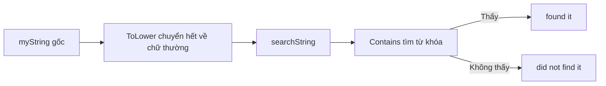

# 🔠 Chuyện chữ hoa chữ thường — Vì sao ta luôn tìm kiếm ở một kiểu chữ?

> Nguồn: `085-Dealing-with-case.txt` · [Udemy](https://ua.udemy.com/course/go-programming-language-crash-course/learn/lecture/26162358)

Đây là bài cuối trong nhóm chủ đề xử lý chuỗi, và mình muốn nói về **case** — nhưng không phải `case` trong `switch` hay `select` đâu nhé, mà là **chữ hoa và chữ thường**. Chuyện tưởng nhỏ này lại ảnh hưởng rất nhiều đến cách chúng ta tìm kiếm chuỗi mỗi ngày. Cùng đi qua từng bước với mình.

---

### 🎯 "Case" ở đây không phải switch

Mình dọn sạch function `main`, chỉ giữ lại một chuỗi duy nhất để bắt đầu:

* `myString = "this is a clear example of why we search in one case only"`

Và mình muốn tìm từ `this` trong đó. Nghe thì đơn giản, nhưng khoan — hãy nhìn kỹ chữ cái đầu tiên. Ở chuỗi gốc là `t` thường, còn nếu người dùng gõ `This` với `T` hoa thì sao?

---

### 🔍 Vì sao tìm hoài không thấy?

Mình thử ngay:

```go
if strings.Contains(myString, "This") {
```

Kết quả trả về `false` — không tìm thấy, dù nhìn bằng mắt thì rõ ràng chuỗi có chứa cụm đó. Lý do nằm ở bài so sánh chuỗi chúng ta vừa học: với compiler, `This` (T hoa) **không phải** là `this` (t thường). Đây là hai chuỗi hoàn toàn khác nhau.

Vậy nên mới có chuyện: nếu cứ đi tìm đúng một kiểu chữ trong khi dữ liệu người dùng nhập vào đủ kiểu, các bạn sẽ "hụt" kết quả hoài.

---

### 🔡 Chuẩn hóa trước khi tìm — mẹo đơn giản hóa mọi thứ

Cách xử lý quen thuộc là tạo thêm một chuỗi đã được chuyển về chữ thường, rồi tìm trên chuỗi đó:

```go
searchString := strings.ToLower(myString)

if strings.Contains(searchString, "this") {
	fmt.Println("found it")
} else {
	fmt.Println("did not find it")
}
```

Lần này chương trình in ra **found it**. Còn nếu bỏ bước chuyển đổi và tìm trực tiếp trên `myString`, kết quả sẽ là **did not find it**.



Quy ước mình luôn làm: chuyển mọi thứ về **tất cả chữ hoa** hoặc **tất cả chữ thường**, rồi chỉ tìm kiếm ở đúng kiểu chữ đó. Nghe đơn giản nhưng nó khiến mọi thứ nhẹ nhàng hơn rất nhiều.

---

### 🛠️ Bộ ba ToLower, ToUpper và Title

Package `strings` còn vài hàm xử lý case rất hay dùng:

```go
fmt.Println(strings.ToLower(myString))
fmt.Println(strings.ToUpper(myString))
fmt.Println(strings.Title(myString))
```

* `ToLower` — chuyển mọi ký tự về **chữ thường**.
* `ToUpper` — chuyển mọi ký tự thành **chữ hoa**.
* `Title` — hơi khác một chút: chỉ đổi **chữ cái đầu của mỗi từ** thành chữ hoa, phần còn lại giữ nguyên.

Để thấy rõ sự khác biệt, mình sửa chuỗi gốc và cho từ `example` thành `EXAMPLE` (viết hoa toàn bộ) rồi chạy lại. Chú ý vào dòng cuối do `Title` in ra: `EXAMPLE` vẫn giữ nguyên chữ hoa — vì `Title` chỉ thay chữ cái đầu tiên, chứ không hạ phần còn lại xuống.

---

### 🎮 Thử thách nhỏ cho các bạn

Nhiệm vụ của các bạn: sửa chương trình sao cho dòng output cuối cùng **toàn bộ là title case** — tức `EXAMPLE` phải trở thành `Example` (E hoa, phần còn lại chữ thường), các từ khác giữ nguyên như cũ.

Các bạn đã có trong tay mọi thứ cần thiết để làm điều đó. Hãy tự mình thử trong vài phút, *sai cũng không sao cả*, rồi quay lại xem lời giải của mình ở bài sau. Gợi ý nho nhỏ: đáp án đang nằm ngay trên màn hình của các bạn đấy.

---

### ✅ Tự kiểm tra nhanh

**1. "Case" trong bài này nói về điều gì?**
<details>
<summary><b>Xem đáp án</b></summary>

**Đáp án:** Chữ hoa và chữ thường trong chuỗi.
Giải thích: Không liên quan tới `case` trong `switch` hay `select`; đây là vấn đề phân biệt hoa thường khi làm việc với chuỗi.
Tham chiếu: Đoạn mở bài.

</details>

**2. Vì sao tìm `This` trong chuỗi chứa `this` lại thất bại?**
<details>
<summary><b>Xem đáp án</b></summary>

**Đáp án:** Vì Go phân biệt chữ hoa chữ thường; `This` khác hoàn toàn `this`.
Giải thích: Với compiler, `T` hoa + `his` thường là chuỗi khác với `t` thường + `his`.
Tham chiếu: Mục "Vì sao tìm hoài không thấy?".

</details>

**3. Cách xử lý phổ biến để tìm kiếm chuỗi không phụ thuộc vào hoa thường là gì?**
<details>
<summary><b>Xem đáp án</b></summary>

**Đáp án:** Chuyển toàn bộ chuỗi về một kiểu chữ duy nhất (hoa hoặc thường) rồi mới tìm kiếm.
Giải thích: Thường dùng `strings.ToLower` hoặc `strings.ToUpper` trước khi `Contains` / `Index`.
Tham chiếu: Mục "Chuẩn hóa trước khi tìm".

</details>

**4. `strings.Title` khác `ToLower` và `ToUpper` như thế nào?**
<details>
<summary><b>Xem đáp án</b></summary>

**Đáp án:** `Title` chỉ chuyển chữ cái đầu của mỗi từ thành chữ hoa và giữ nguyên phần còn lại.
Giải thích: `ToLower` và `ToUpper` thì biến đổi toàn bộ ký tự trong chuỗi.
Tham chiếu: Mục "Bộ ba ToLower, ToUpper và Title".

</details>

**5. Vì sao `EXAMPLE` vẫn giữ nguyên chữ hoa khi đi qua `Title`?**
<details>
<summary><b>Xem đáp án</b></summary>

**Đáp án:** Vì `Title` chỉ thay chữ cái đầu tiên thành chữ hoa, không chuyển phần còn lại về chữ thường.
Giải thích: Đó là lý do thử thách yêu cầu kết hợp thêm một hàm nữa để có kết quả title case đúng nghĩa.
Tham chiếu: Mục "Bộ ba ToLower, ToUpper và Title".

</details>

---

*Hãy thử làm bài challenge trước khi xem đáp án nhé — tự tay thử rồi mới nhớ lâu được.* Ở bài tiếp theo, mình sẽ trình bày cách giải của mình chỉ trong một dòng, đồng thời ghé thăm dự án Eliza để xem kỹ thuật chuẩn hóa chữ thường được dùng thực tế ra sao. Hẹn gặp lại! 🚀

## Nguồn tham khảo

- [strings package — pkg.go.dev](https://pkg.go.dev/strings)
- [strings.ToLower](https://pkg.go.dev/strings#ToLower)
- [strings.ToUpper](https://pkg.go.dev/strings#ToUpper)
- [strings.Title](https://pkg.go.dev/strings#Title)
