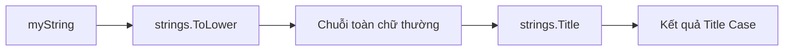

# ✅ Lời giải challenge — Một dòng là đủ với ToLower và Title

> Nguồn: `086-Solution-to-Challenge.txt` · [Udemy](https://ua.udemy.com/course/go-programming-language-crash-course/learn/lecture/26162360)

Các bạn làm bài challenge thế nào? Hy vọng nó không quá khó với các bạn. Mình đã nói là đáp án nằm ngay trên màn hình rồi mà — và hôm nay chúng ta sẽ cùng đi qua cách mình xử lý, chỉ với **một dòng code**. Nhân tiện, mình cũng sẽ ghé thăm dự án Eliza để xem kỹ thuật này được dùng trong thực tế ra sao.

---

### 🎯 Thay đổi nằm ở dòng 22

Chỗ cần sửa chỉ có một: **dòng 22**. Các bạn có thể làm theo nhiều cách — chẳng hạn tạo một biến trung gian giữa chừng rồi dùng lại biến đó. Còn mình thì chọn cách gọn nhất: **gói tất cả vào một dòng** bằng cách lồng hai hàm vào nhau:

```go
fmt.Println(strings.Title(strings.ToLower(myString)))
```

Chạy `go run main.go`, kết quả đúng như mong đợi: từ `example` xuất hiện với đúng một chữ `E` hoa ở đầu, phần còn lại chữ thường.

---

### 🪄 Thứ tự đánh giá — điều quan trọng nhất trong dòng lệnh này

Điều thú vị nằm ở thứ tự thực thi. Trên dòng 22, chương trình đánh giá **từ trong ra ngoài**:

1. `myString` được truyền vào package `strings`.
2. Hàm `ToLower` chuyển toàn bộ nội dung `myString` thành **chữ thường**.
3. Chuỗi chữ thường đó được truyền ngược trở lại package `strings`.
4. Lần này đến lượt hàm `Title`, chuyển mọi thứ về **title case**.

Kết quả: `EXAMPLE` được hạ xuống `example` trước, rồi `Title` mới nâng chữ cái đầu thành `Example`. Nếu đảo ngược thứ tự, kết quả sẽ không còn đúng nữa.



---

### 🧹 Đơn giản hóa luôn biến searchString

Cũng với ý tưởng đó, mình rút gọn luôn phần tìm kiếm ở phía trên. Không cần tạo biến `searchString` nữa — xóa dòng khai báo, rồi thay chỗ dùng bằng lời gọi trực tiếp:

```go
if strings.Contains(strings.ToLower(myString), "this") {
```

Chạy lại `go run main.go`, chương trình hoạt động y hệt như trước. Đó là minh chứng cho việc: khi code đã đủ rõ, viết ngắn lại vẫn dễ đọc như thường.

---

### 🐹 ToLower trong dự án Eliza — bài học về sự nhất quán

Trong chương trình này, `ToLower` được dùng tới **3 lần**: dòng 11, dòng 18 và dòng 20. Còn nếu các bạn mở file `doctor.go` trong dự án Eliza mà mình đang mở sẵn đây, tìm từ khóa `ToLower`, các bạn sẽ thấy nó xuất hiện **4 lần**: dòng 150, dòng 155 và tận **hai lần** ở dòng 164.

Mục đích trong mọi trường hợp đều giống nhau: **đơn giản hóa việc tìm kiếm** — chuyển hết về chữ thường rồi mới đem so khớp chuỗi này với chuỗi kia. Đó cũng là lý do khi kéo lên đầu file, nhìn vào danh sách `matches` (những mẫu câu cần dò tìm), các bạn sẽ không thấy **một chữ hoa nào** — kể cả `I`, `I've` hay `I'd` đều được viết thường hết. Tất cả là để khớp với dữ liệu đã chuẩn hóa.

*Đây chính là bài học thực tế đáng giá nhất của section này:* muốn tìm kiếm chính xác, trước tiên hãy thống nhất một kiểu chữ cho mọi thứ.

---

Vậy là chúng ta đã khép lại phần xử lý chuỗi trong Go. Các bạn giờ đã biết tìm, thay thế, so sánh, dọn dẹp và chuẩn hóa chữ hoa chữ thường — một bộ kỹ năng dùng hằng ngày khi làm việc thật. Hãy chơi với hàm `replaceNth` và các hàm của package `strings` thật nhiều để bắt đầu "think in Go" nhé. Section tiếp theo đang chờ chúng ta, hẹn gặp lại các bạn! 🚀

## Nguồn tham khảo

- [strings package — pkg.go.dev](https://pkg.go.dev/strings)
- [strings.ToLower](https://pkg.go.dev/strings#ToLower)
- [strings.Title](https://pkg.go.dev/strings#Title)
