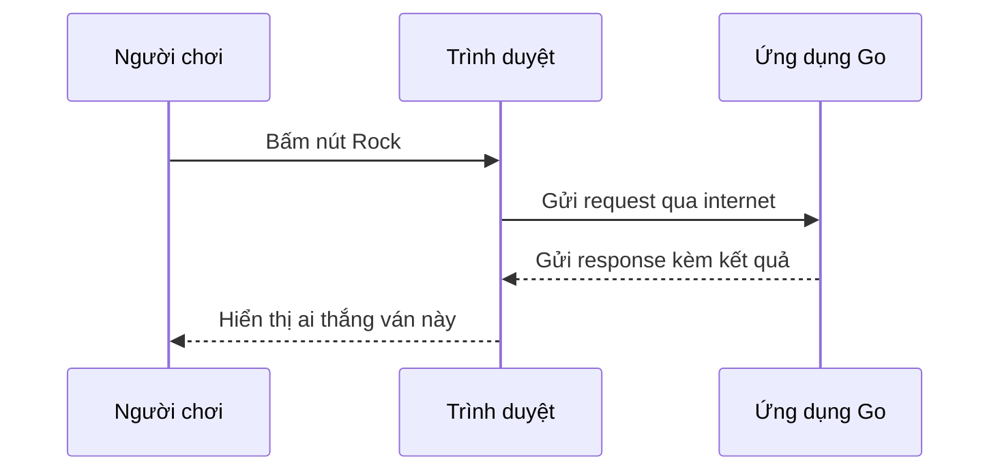

# 🌐 Từ terminal lên trình duyệt — Rock Paper Scissors chuẩn bị "ra biển lớn"

> Nguồn: `087-Introduction.txt` · [Udemy](https://ua.udemy.com/course/go-programming-language-crash-course/learn/lecture/26162362)

Chào các bạn! Ở một section trước, chúng ta đã viết xong game **rock paper scissors** chạy trong terminal và nó hoạt động rất tốt. Trong section này, mình muốn đưa game đó lên một sân khấu mới — đúng cái khu vực mà Go thật sự tỏa sáng: **web**.

### 🎮 Ôn lại "đứa con tinh thần" của chúng ta

Mở terminal cho project cũ và gõ `go run main.go` — game chạy đúng như mong đợi:

* Chơi **3 ván**, phân thắng bại theo thể thức **best of three** (thắng 2 trong 3 ván).
* Gõ `rock`, `paper` hoặc `scissors` để ra chiêu và nhận kết quả ngay lập tức.

Trong video, mình thử vài lượt cho các bạn xem: gõ `rock` rồi `paper`, kết quả hiện ra liền. Có ván hòa, có ván máy thắng — thú thật là mình đang thua khá đậm. Dù vậy, đây là một game nhỏ gọn, chạy ổn định và làm đúng việc của nó **trong terminal**.

---

### 🌍 Chuyển từ console-based sang web application

Trong section này, mình muốn tận dụng đúng điểm mạnh nhất của Go: lấy ứng dụng này và **chuyển từ console-based (chạy trong terminal) thành một ứng dụng web**.

Mình mở trình duyệt cho các bạn xem trước thành quả cuối cùng: rock paper scissors chạy như một **web application** rất đơn giản — nhưng là phiên bản chuyển thể lên internet của gần như toàn bộ những gì chúng ta đã học trong bản console.

Ứng dụng chỉ có **một trang web duy nhất**. Khi mình bấm chọn `rock`, trang web này **giao tiếp với một ứng dụng Go đang chạy phía sau**: nó gửi request qua internet tới ứng dụng của mình, rồi ứng dụng gửi response trả về. Kết quả hiện ra: lần này mình chọn rock, máy chọn scissors — mình thắng!

Mình thử tiếp `paper` thì máy thắng, thử `scissors` thì máy lại thắng. *Không phải ngày may mắn của mình* — nhưng luồng hoạt động thì đúng như thiết kế. Các bạn hình dung toàn bộ vòng tròn giao tiếp đó như sau:

---

### 🗺️ Lộ trình của section này

Để đi từ con số không đến ứng dụng hoàn chỉnh, chúng ta sẽ tiến từng bước thật chậm:

1. Bắt đầu với một ứng dụng cực kỳ đơn giản: gửi **hello world** lên trình duyệt.
2. Từng bước xây dựng thêm, cho đến khi có phiên bản **rock paper scissors hoàn chỉnh chạy như một web application**.

Nghe thì có vẻ nhiều, nhưng các bạn cứ thư thả — mỗi bài một bước nhỏ, và mình sẽ ở bên cạnh giải thích từng dòng. *Nếu có đoạn nào chưa thấm ngay, cũng đừng lo, mọi thứ sẽ sáng dần khi chúng ta viết code.*

---

Vậy là mục tiêu đã rõ: biến game terminal quen thuộc thành ứng dụng web đầu tiên của các bạn. Bài tiếp theo, chúng ta sẽ mở project mới và viết chương trình Go đầu tiên gửi **Hello World** thẳng lên trình duyệt. Hẹn gặp lại! 🚀
