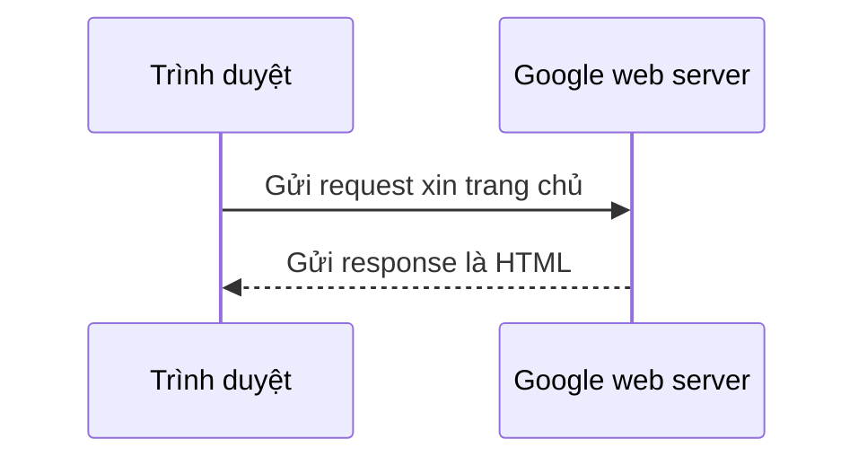

# 🐹 Hello World trên trình duyệt — web server đầu tiên của bạn bằng Go

> Nguồn: `088-Hello-World-web.txt` · [Udemy](https://ua.udemy.com/course/go-programming-language-crash-course/learn/lecture/26162368)

Chào các bạn! Hôm nay chúng ta làm lại đúng bài **Hello World** đầu tiên của khóa — nhưng lần này không in ra terminal, mà gửi thẳng lên trình duyệt. Nghe có vẻ to tát, nhưng mình hứa chỉ mất vài dòng code, và chúng ta sẽ đi từng bước thật chậm rãi.

1. Mở một cửa sổ trống trong Visual Studio Code, chọn **Open Folder**, tạo thư mục mới tên `rock-paper-scissors-web` rồi mở nó ra.
2. Mở terminal, gõ `go mod init` với tên module là `myapp` — file `go mod` sẽ được tạo.
3. Tạo file mới `main.go` với khai báo `package main` và hàm `func main()` — tạm thời chưa làm gì cả.

### 🧠 Request, response và handler đầu tiên

Việc đầu tiên cần làm, tin hay không, là **khởi động một web server**. Nhiều ngôn ngữ có sẵn server để phát triển — PHP phục vụ được file PHP, Python cũng vậy. Nhưng Go thú vị ở chỗ: thứ nằm sẵn trong **thư viện chuẩn (standard library)** không chỉ là server để dev, mà là web server **production ready (sẵn sàng chạy thật)**, xử lý được **hàng nghìn kết nối đồng thời**.

Mình tạo một hàm mới nằm ngoài `main`, dùng để render trang chủ, nhận hai tham số: `w` kiểu `http.ResponseWriter` — thuộc package `net/http`, viết tắt của **hypertext transfer protocol** (giao thức internet dùng hypertext để render web page) — và `r`, một **con trỏ (pointer)** tới kiểu `http.Request`. Hai kiểu này rất dễ hình dung qua ví dụ đời thường: khi các bạn mở Chrome hay Firefox, gõ `google.com` và nhấn Enter, trình duyệt sẽ **tạo ra một request** gửi lên internet, nội dung đại khái là *"tôi muốn lấy trang mặc định của google.com"* — rồi ngồi chờ **response**. Response đó chính là **HTML (hypertext markup language)**: một file văn bản mô tả trang web trông như thế nào, có ảnh gì, chữ gì.



Khác một điều: ứng dụng của chúng ta **không phải trình duyệt mà là web server** — nên nó **nhận request rồi tự tay xây response**. Trong hàm `homepage`, mình dùng package `fmt` (mình gõ nhầm `Fprint` một lần, phải sửa lại) và gọi hàm họ `Fprintf` để gửi trả chuỗi `Hello World` — giống `fmt.Print`, chỉ khác là ghi thẳng vào **response writer** `w` thay vì in ra terminal.

---

### 🔌 Đăng ký handler và bật web server bằng một dòng code

Trong `main`, mình nối đường dẫn `/` với hàm `homepage` bằng `http.HandleFunc`. Người ta gọi `homepage` là một **handler** — nó xử lý request đến những trang hoặc phần cụ thể của ứng dụng web. Dấu `/` nghĩa là **tầng trên cùng**: khi bạn vào `google.com` mà không gõ gì thêm sau tên miền, thực ra bạn đang xin **trang chủ** — dấu `/` chính là "trang mặc định của server này". Giờ đến phần mình thích nhất: khởi động web server trong Go dễ đến mức khó tin — đúng **một dòng**:

```go
func main() {
    http.HandleFunc("/", homepage)
    log.Println("Starting web server on port 8080")
    http.ListenAndServe(":8080", nil)
}
```

`http.ListenAndServe` nhận vào một **port** (cổng) dạng chuỗi, bắt đầu bằng dấu hai chấm, và tham số thứ hai tạm để `nil`. Mình thêm dòng `log.Println` — package `log` có sẵn trong thư viện chuẩn — để chắc chắn chương trình đang thực sự chạy.

---

### 🌐 Cổng 8080, Hello World trên trình duyệt — và lời cảnh báo Ctrl+C

Vì sao lại là 8080 mà không phải 80? Web server thường lắng nghe ở **port 80** cho kết nối không bảo mật, hoặc **port 443** cho kết nối bảo mật dùng mã hóa SSL. Nhưng mình đang chạy môi trường phát triển (development), và nếu thử dùng port 80 sẽ gặp lỗi bảo mật — vì **1024 cổng đầu tiên trên máy tính được bảo vệ**. Chọn số nào đó phía trên, như `8080`, thì thoải mái.

Chạy `go run main.go`, terminal báo *"Starting web server on port 8080"*. Mở trình duyệt và gõ `http://localhost:8080` — và kìa, **Hello World** hiện lên. Chưa đẹp, chỉ là một chuỗi ký tự, nhưng đó là cột mốc đầu tiên: tổng cộng chỉ **3 dòng trong `main` và 1 dòng trong `homepage`**.

**Một lời cảnh báo nhỏ nhưng quan trọng:** nếu đóng thẳng cửa sổ terminal trong khi server đang chạy, **web server vẫn tiếp tục chạy nền** — và bạn không thể khởi động lại vì đã có thứ gì đó lắng nghe ở port 8080. Cách thoát đúng là nhấn **Ctrl+C** trong terminal. Nếu lỡ quên, chỉ cần thoát hẳn Visual Studio Code rồi mở lại — mọi thứ trở về bình thường.

---

### 🎯 Tự kiểm tra nhanh

**Câu 1:** Một handler trong Go nhận những tham số nào?

<details>
<summary><b>Xem đáp án</b></summary>

**Đáp án:** `http.ResponseWriter` và một con trỏ tới `http.Request`.
Giải thích: `w` để ghi response trả về, `r` chứa thông tin request trình duyệt gửi tới.
Tham chiếu: Mục "Request, response và handler đầu tiên".

</details>

**Câu 2:** `http.HandleFunc("/", homepage)` làm nhiệm vụ gì?

<details>
<summary><b>Xem đáp án</b></summary>

**Đáp án:** Gắn đường dẫn trang chủ `/` với hàm handler `homepage`.
Giải thích: Dấu `/` đại diện cho tầng trên cùng — trang mặc định của server.
Tham chiếu: Mục "Đăng ký handler và bật web server".

</details>

**Câu 3:** Vì sao dùng port 8080 thay vì port 80?

<details>
<summary><b>Xem đáp án</b></summary>

**Đáp án:** Vì 1024 cổng đầu tiên của máy tính được bảo vệ; port 80 khi phát triển sẽ gây lỗi bảo mật.
Giải thích: Port 80 dành cho kết nối không mã hóa, port 443 cho kết nối mã hóa SSL.
Tham chiếu: Mục "Cổng 8080, Hello World trên trình duyệt".

</details>

**Câu 4:** `http.ListenAndServe(":8080", nil)` làm gì?

<details>
<summary><b>Xem đáp án</b></summary>

**Đáp án:** Khởi động web server production ready, lắng nghe ở port 8080.
Giải thích: Một dòng đã tạo server xử lý hàng nghìn kết nối đồng thời; tham số hai để `nil`.
Tham chiếu: Mục "Đăng ký handler và bật web server".

</details>

**Câu 5:** Nếu đóng thẳng cửa sổ terminal khi server đang chạy thì chuyện gì xảy ra?

<details>
<summary><b>Xem đáp án</b></summary>

**Đáp án:** Web server vẫn chạy nền và bạn không thể khởi động lại vì port 8080 đang bị chiếm.
Giải thích: Cách dừng đúng là nhấn `Ctrl+C`; nếu lỡ quên thì thoát hẳn Visual Studio Code rồi mở lại.
Tham chiếu: Mục "Cổng 8080, Hello World trên trình duyệt".

</details>

---

*Đừng lo nếu các khái niệm request, response writer hay handler còn hơi mơ hồ* — chúng ta sẽ gặp lại chúng liên tục trong cả section này, và mọi thứ sẽ khắc sâu theo từng bài. Bài tiếp theo, chúng ta sẽ thôi gửi chuỗi chữ trơn và bắt đầu **gửi HTML thật** về trình duyệt. Hẹn gặp lại! 🚀

## Nguồn tham khảo

- [pkg.go.dev — net/http](https://pkg.go.dev/net/http)
- [pkg.go.dev — fmt](https://pkg.go.dev/fmt)
