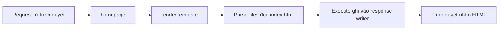

# 🧩 Phục vụ trang HTML bằng `html/template` — gọn gàng và đúng chuẩn

> Nguồn: `092-Serving-our-HTML-Page.txt` · [Udemy](https://ua.udemy.com/course/go-programming-language-crash-course/learn/lecture/26162384)

Chào các bạn! Trang `index.html` của chúng ta đã bắt đầu trông ra dáng một web page. Giờ là lúc **nối nó với code Go** — thay vì tự tay dựng HTML trong hàm `homepage` như trước. Mình xóa toàn bộ đoạn code cũ (tạo HTML trong biến, đặt header, gửi bằng họ `Fprint`) và dùng một package khác có sẵn trong thư viện chuẩn: **`html/template`**. Mình hứa đây là một trong những bài "đã tay" nhất của section này.

### ⚙️ Đọc file HTML vào template và gửi về trình duyệt

Ý tưởng rất đơn giản: **parse (phân tích) file HTML** thành dạng mà Go xử lý được, rồi gửi kết quả cho trình duyệt. Package `html/template` sẽ tự lo phần đặt header và mọi thứ lặt vặt khác.

```go
t, err := template.ParseFiles("index.html")
if err != nil {
    log.Println(err)
    return
}
err = t.Execute(w, nil)
```

Giải thích nhanh:

* `template.ParseFiles` nhận **đường dẫn tới file** `index.html` nằm ngay cạnh `main.go`, trả về biến `t` (viết tắt của *template*); nếu `err != nil` thì `log.Println` lỗi ra rồi `return` — có gì đó sai thì không nên đi tiếp.
* `t.Execute(w, nil)` là "phép thuật" **ghi nội dung vào response writer** `w`. Tham số thứ hai là chỗ truyền dữ liệu vào template, bài này chưa cần nên để `nil`.
* Cả hai bước đều có thể phát sinh lỗi, nên mình kiểm tra ở cả hai.

Chạy thử lần đầu, terminal báo lỗi — à, mình quên chưa lưu file để Go xóa import `fmt` không còn dùng nữa. Lưu lại và chạy `go run main.go`, server lắng nghe ở port 8080. Mở trình duyệt, thay địa chỉ thành `http://localhost:8080` — **trang HTML của chúng ta hiện ra đúng như mong đợi**. Xem `view page source` cũng thấy đúng phần HTML đã được render.

---

### 🔁 Tổng quát hóa thành hàm `renderTemplate`

Xong rồi, mình chợt nghĩ: *lỡ trang web có nhiều trang thì sao?* Không lẽ copy đoạn code trên cho từng handler. Thú thật là bài này chúng ta chỉ có một handler phục vụ HTML, nhưng **giữ thói quen tốt bao giờ cũng đáng**.

Mình cắt toàn bộ đoạn code vừa viết, đưa vào hàm mới `renderTemplate` với hai tham số: `w` kiểu `http.ResponseWriter` và `page` kiểu string — tên file HTML muốn render. Bên trong, chỗ `index.html` cứng trước đây được thay bằng biến `page`, để hàm nhận **bất kỳ template nào**. Còn hàm `homepage` giờ chỉ còn một việc: gọi `renderTemplate(w, "index.html")`.

Chạy lại `go run main.go`, tải lại trang — mọi thứ **vẫn hoạt động y như trước**, nhưng code đã thông minh hơn nhiều.



---

### 🎯 Tự kiểm tra nhanh

**Câu 1:** Package nào của thư viện chuẩn được dùng để phục vụ file HTML?

<details>
<summary><b>Xem đáp án</b></summary>

**Đáp án:** `html/template`.
Giải thích: Package này parse file HTML và gửi về trình duyệt, tự lo cả phần header.
Tham chiếu: Mục "Đọc file HTML vào template và gửi về trình duyệt".

</details>

**Câu 2:** `template.ParseFiles("index.html")` làm gì?

<details>
<summary><b>Xem đáp án</b></summary>

**Đáp án:** Đọc và phân tích file `index.html` thành dạng template mà Go có thể xử lý.
Giải thích: Hàm nhận đường dẫn tới file HTML; kết quả lưu vào biến `t` và cần kiểm tra lỗi.
Tham chiếu: Mục "Đọc file HTML vào template và gửi về trình duyệt".

</details>

**Câu 3:** `t.Execute(w, nil)` làm gì?

<details>
<summary><b>Xem đáp án</b></summary>

**Đáp án:** Ghi nội dung template vào response writer để gửi về trình duyệt.
Giải thích: Tham số thứ hai dùng để truyền dữ liệu vào template; bài này để `nil` vì chưa cần.
Tham chiếu: Mục "Đọc file HTML vào template và gửi về trình duyệt".

</details>

**Câu 4:** Vì sao nên tạo hàm `renderTemplate` thay vì viết code trực tiếp trong `homepage`?

<details>
<summary><b>Xem đáp án</b></summary>

**Đáp án:** Để tái sử dụng cho bất kỳ trang HTML nào, không phải copy code cho từng handler.
Giải thích: Hàm nhận tên file qua tham số `page`; `homepage` chỉ cần gọi `renderTemplate(w, "index.html")`.
Tham chiếu: Mục "Tổng quát hóa thành hàm renderTemplate".

</details>

**Câu 5:** Ai chịu trách nhiệm đặt header khi dùng `html/template`?

<details>
<summary><b>Xem đáp án</b></summary>

**Đáp án:** Package `html/template` tự lo header và các chi tiết cần thiết.
Giải thích: Nhờ vậy ta bỏ được đoạn code thủ công đặt `Content-Type` như bài trước.
Tham chiếu: Mục "Đọc file HTML vào template và gửi về trình duyệt".

</details>

---

Trang HTML đã được phục vụ "đúng bài bản". Việc tiếp theo là mang logic của bản rock paper scissors console vào phiên bản web — bắt đầu bằng một package mới tên `rps` và handler cho đường dẫn `/play`. Hẹn gặp lại! 🚀

## Nguồn tham khảo

- [pkg.go.dev — html/template](https://pkg.go.dev/html/template)
