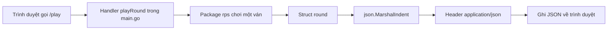

# 📦 Giới thiệu JSON — Cách đưa dữ liệu từ Go về trang web

> Nguồn: `094-Introducing-JSON.txt` · [Udemy](https://ua.udemy.com/course/go-programming-language-crash-course/learn/lecture/26162394)

Chúng ta đã đưa logic rock-paper-scissors vào web app, nhưng trình duyệt vẫn chưa nhận được kết quả ván đấu. Hôm nay mình giới thiệu **JSON** — định dạng dữ liệu phổ biến nhất để web app nói chuyện với trang web — rồi cùng các bạn chuyển struct trong Go thành JSON. *Cứ đọc chậm thôi, phần code mình sẽ giải thích từng bước.*

### 🔍 Vấn đề: ba mảnh dữ liệu đang nằm lại phía server

Nhìn lại `main.go` của web app:

* Hàm `main` match đường dẫn `/play` ở **dòng 20** và gọi handler `playRound` — hàm này nằm ở **dòng 14**.
* Ở **dòng 21**, `main` match đường dẫn trang chủ và gọi handler `homePage` — hàm ở **dòng 10**.

Trang chủ hiện chỉ hiển thị HTML. Còn `playRound` chỉ gọi hàm `playRound` bên trong package `rps` rồi đổ kết quả vào **ba biến** ở dòng 15: `winner`, `computerChoice` và `roundResult`. Ba mẩu dữ liệu đó chưa hề được gửi về trang web.

Nếu gửi riêng lẻ, ta sẽ phải gửi response **ba lần**: gửi `winner`, rồi `computerChoice`, rồi `roundResult` — vừa rườm rà vừa kém hiệu quả. Gửi **tất cả cùng lúc** luôn tốt hơn, và cách làm phổ biến nhất trong web app là dùng một định dạng tên là **JSON**.

---

### 🧩 JSON là gì?

JSON viết đủ là **JavaScript Object Notation**; tên gọi có nhiều cách đọc, không quan trọng — quan trọng là hiểu nó để làm gì.

File JSON ví dụ mình mở ra có các đặc điểm:

* **Bắt đầu và kết thúc bằng ngoặc nhọn** `{ }`.
* Mỗi mục nằm trên **một dòng riêng**.
* **Tên** ở bên trái, đặt trong ngoặc kép, theo sau là dấu hai chấm.
* **Giá trị** ở bên phải, kết thúc bằng dấu phẩy — trừ dòng cuối cùng.

JSON thực tế có thể lồng nhau hay chứa mảng, nhưng file đơn giản là đủ cho hôm nay. Ví dụ của mình có `id` (số nguyên), `language` (chuỗi) và `strongly typed` (Boolean — chỉ nhận `true` hoặc `false`).

Đây là đường đi mình muốn dữ liệu đi qua:



---

### 🏗️ Trong rps.go: tạo type round

Mình quay lại `rps.go`. Thay vì để `playRound` trả về một `int` và hai `string`, mình định nghĩa **một type mới** tên là `round` — toàn bộ thông tin của một ván đấu — và nó là một `struct`.

Type `round` có ba member, đúng bằng ba thứ `playRound` từng trả về: `Winner` kiểu `int`, `ComputerChoice` kiểu `string` và `RoundResult` kiểu `string`.

Trong hàm `playRound`, mình không trả ba thứ nữa mà chỉ trả **một giá trị kiểu `round`**. Ở cuối hàm, mình tạo biến `result` kiểu `round` rồi gán từng member: `result.Winner = winner`, `result.ComputerChoice = computerChoice`, `result.RoundResult = roundResult`, và trả về `result`. Dòng return cũ có thể bỏ đi.

Sang `main.go`, thay vì dòng 15 đổ vào ba biến, mình chỉ nhận **một giá trị duy nhất** do `playRound` trả về.

---

### ⚙️ Chuyển struct thành JSON bằng json.MarshalIndent

Một struct kiểu `rps.round` không thể trả thẳng về dưới dạng JSON. Nhưng Go cho phép **chuyển struct thành JSON cực kỳ dễ**, nhờ package `json` nằm sẵn trong standard library.

Mình khai báo biến `out` (kèm kiểm tra lỗi) và gọi `json.MarshalIndent`:

```go
out, err := json.MarshalIndent(result, "", "  ")
if err != nil {
    log.Println(err)
    return
}
w.Header().Set("Content-Type", "application/json")
w.Write(out)
```

`json.MarshalIndent` nhận **ba tham số**: giá trị bất kỳ có thể chuyển thành JSON (ở đây là `result` nhận từ `rps.playRound`), `prefix` (mình truyền chuỗi rỗng để bỏ qua) và số khoảng trắng dùng để thụt lề.

Nếu `err != nil`, mình ghi log bằng `log.Println` rồi `return` ngay, không đi tiếp. Cuối cùng, nhớ lại đoạn set header chúng ta từng làm: lần này `Content-Type` là `application/json` để báo cho browser biết nó sắp nhận JSON, rồi `w.Write(out)` ghi dữ liệu ra.

Chạy `go run main.go` và vào `localhost:8080/play`, browser hiển thị JSON gọn gàng. Bấm xem raw data, mình thấy `winner` bằng 3, computer chọn paper, round result là *it's a draw*.

---

### 📝 Đặt tên trường JSON bằng struct tag

Mình không thích cách đặt tên mặc định — JSON thực tế hiếm khi viết `Winner` hay `ComputerChoice`. Quy ước thường là chữ thường, các từ nối bằng dấu gạch dưới: `winner`, `computer_choice`, `round_result`.

Go cho phép "mách" tên hiển thị bằng **struct tag**: đặt trong cặp dấu huyền (backtick), bắt đầu bằng `json:` rồi tên mong muốn trong ngoặc kép.

```go
type round struct {
    Winner         int    `json:"winner"`
    ComputerChoice string `json:"computer_choice"`
    RoundResult    string `json:"round_result"`
}
```

| Member trong Go | Tên khi render JSON | Nhờ struct tag |
|---|---|---|
| `Winner` | `winner` | `json:"winner"` |
| `ComputerChoice` | `computer_choice` | `json:"computer_choice"` |
| `RoundResult` | `round_result` | `json:"round_result"` |

À, trong lúc gõ mình lỡ quên một dấu ngoặc kép nên Go báo lỗi cú pháp ngay — *chuyện rất bình thường, gõ code thì kiểu gì cũng có lúc quên, sửa là xong*. Sau khi sửa, chạy lại và reload trang: tên trường đã đúng quy ước. Refresh vài lần, kết quả đổi khác nhau — có lần computer chọn scissors và computer thắng, lần khác computer chọn rock và người chơi thắng.

---

### ✅ Tự kiểm tra nhanh

**1. Vì sao nên gửi một response JSON thay vì ba response riêng lẻ?**

<details>
<summary><b>Xem đáp án</b></summary>

**Đáp án:** Vì gửi tất cả cùng lúc hiệu quả hơn nhiều so với gửi winner, rồi computer choice, rồi round result.
Giải thích: Ba mẩu dữ liệu thuộc cùng một ván đấu, nên gửi chung một lần là hợp lý nhất.
Tham chiếu: Mục "Vấn đề: ba mảnh dữ liệu đang nằm lại phía server"

</details>

**2. Hàm `json.MarshalIndent` nhận những tham số nào?**

<details>
<summary><b>Xem đáp án</b></summary>

**Đáp án:** Giá trị cần chuyển, prefix và số khoảng trắng thụt lề.
Giải thích: Mình truyền `result`, chuỗi rỗng cho prefix và một chuỗi khoảng trắng cho lề.
Tham chiếu: Mục "Chuyển struct thành JSON bằng json.MarshalIndent"

</details>

**3. Vì sao phải set header trước khi ghi JSON ra response?**

<details>
<summary><b>Xem đáp án</b></summary>

**Đáp án:** Để báo cho browser biết nội dung sắp nhận là JSON — `application/json`.
Giải thích: Header `Content-Type` giúp browser xử lý đúng định dạng.
Tham chiếu: Mục "Chuyển struct thành JSON bằng json.MarshalIndent"

</details>

**4. Struct tag `json:"computer_choice"` có tác dụng gì?**

<details>
<summary><b>Xem đáp án</b></summary>

**Đáp án:** Đặt tên trường là `computer_choice` khi render ra JSON.
Giải thích: Không có tag, tên mặc định sẽ là `ComputerChoice` — không đúng quy ước JSON thường gặp.
Tham chiếu: Mục "Đặt tên trường JSON bằng struct tag"

</details>

**5. File JSON ví dụ trong bài chứa những kiểu dữ liệu nào?**

<details>
<summary><b>Xem đáp án</b></summary>

**Đáp án:** Một số nguyên (`id`), một chuỗi (`language`) và một Boolean (`strongly typed`).
Giải thích: Boolean chỉ nhận `true` hoặc `false`.
Tham chiếu: Mục "JSON là gì?"

</details>

---

Giờ thì web app đã **trả về JSON thật sự**. Browser nào cũng có JavaScript tích hợp, mà JavaScript thì đọc được JSON — nên bước tiếp theo, chúng ta sẽ để browser nhận JSON, phân tích và làm điều gì đó thú vị. Hẹn gặp lại các bạn ở bài sau! 🚀

## Nguồn tham khảo

- [pkg.go.dev — package encoding/json](https://pkg.go.dev/encoding/json)
- [MDN — JSON](https://developer.mozilla.org/en-US/docs/Web/JavaScript/Reference/Global_Objects/JSON)
- [Udemy — Introducing JSON](https://ua.udemy.com/course/go-programming-language-crash-course/learn/lecture/26162394)
