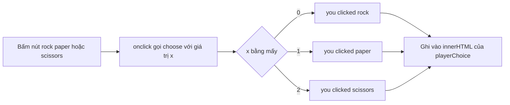

# 🎮 Đổi nội dung trang web bằng JavaScript — Bấm nút là chữ đổi ngay

> Nguồn: `095-Changing-content-using-JavaScript.txt` · [Udemy](https://ua.udemy.com/course/go-programming-language-crash-course/learn/lecture/26162396)

Web app của chúng ta đã có khả năng gửi JSON, nhưng chưa ai "hỏi" nó cả. Hôm nay mình sẽ viết JavaScript vào `index.html` để trang web phản ứng khi người dùng bấm nút — tất cả diễn ra ngay trên trang, không hề reload. *Nếu các bạn chưa từng viết JavaScript, đừng lo, bài này rất nhẹ nhàng.*

### 🚀 Chuẩn bị chỗ viết JavaScript

Mình chạy `go run main.go` để có thể vừa sửa HTML vừa thấy kết quả ngay trong browser, rồi reload trang cho chắc chắn mọi thứ đang chạy.

Ở **cuối file `index.html`**, giữa thẻ đóng `</body>` và thẻ đóng `</html>`, mình viết thẻ `<script>`. Mọi thứ nằm giữa thẻ mở và thẻ đóng `script` đều là một đoạn script — và trong đại đa số trường hợp, đó là **JavaScript**.

JavaScript có sẵn trong mọi trình duyệt hiện đại và đã tồn tại rất lâu. Nếu các bạn từng làm quen với nó thì bài này rất dễ; còn chưa từng thì cũng không khó chút nào.

---

### 🧠 Hàm choose — khác biệt đầu tiên so với Go

Mình định nghĩa một hàm để xử lý cú click vào các nút. Trong Go, các bạn tạo hàm bằng keyword `func`; còn trong JavaScript, keyword được viết đầy đủ là `function`.

Hàm của mình tên là `choose`, nhận **một tham số** tên `x`. Đây là điểm khác biệt lớn: trong Go phải khai báo kiểu cho tham số, còn JavaScript **không cần** — nó không phải ngôn ngữ strongly typed. Hàm này không trả về gì cả, nên chỉ cần cặp ngoặc nhọn mở và đóng.

| Tiêu chí | Go | JavaScript |
|---|---|---|
| Tạo hàm bằng | `func` | `function` |
| Khai báo kiểu tham số | Bắt buộc | Không cần |
| Kiểu ngôn ngữ | Strongly typed | Không strongly typed |
| Kết thúc câu lệnh | Không cần dấu `;` | Nên có dấu `;` |

---

### 🎯 Thay nội dung đoạn playerChoice

Khi bấm nút rock (nằm ở **dòng 25** trong HTML), mình muốn đoạn văn ở **dòng 16** — có tên `playerChoice` — đổi nội dung.

Cách truy cập: dùng `document` — đại diện cho toàn bộ trang web — rồi gọi `document.getElementById("playerChoice")`. *Nhớ viết đúng chữ hoa chữ thường, sai một ký tự là không chạy đâu nhé.* Sau đó mình đổi `.innerHTML` của đoạn văn thành `"you clicked rock"`. Câu lệnh JavaScript kết thúc bằng dấu chấm phẩy — không bắt buộc, nhưng nên viết cho thành thói quen.

```javascript
function choose(x) {
    document.getElementById("playerChoice").innerHTML = "you clicked rock";
}
```

Mình lưu lại, quay sang browser, reload... và bấm thử. **Không có gì xảy ra cả.** Hàm đã viết rồi mà, tại sao vậy? Vì mình mới chỉ **định nghĩa** hàm, chứ chưa gọi nó lần nào.

---

### 🖱️ Nút bấm phải gọi hàm — thuộc tính onclick

Quay lại dòng 25, mình thêm thuộc tính `onclick` cho nút rock: `onclick="choose(0)"`. Thuộc tính này nói rằng mỗi khi người dùng bấm nút, hàm `choose` sẽ được gọi kèm giá trị `0`.

Mình lưu bài, reload trang — *phải reload thì mới thấy thay đổi* — rồi bấm rock. Lần này chữ **"you clicked rock"** hiện ra. Bấm paper rồi scissors thì chưa có gì, vì hai nút đó chưa được gắn gì cả. Bấm rock lần nữa thì đoạn văn lại được ghi đè đúng nội dung cũ.

---

### 🔀 Rẽ nhánh theo từng lựa chọn

Mình muốn trang phản hồi đúng theo nút được bấm, nên thêm rẽ nhánh vào hàm `choose`:

1. Nếu `x` bằng `0` → "you clicked rock".
2. Ngược lại, nếu `x` bằng `1` → "you clicked paper".
3. Còn lại → "you clicked scissors".

```javascript
function choose(x) {
    if (x == 0) {
        document.getElementById("playerChoice").innerHTML = "you clicked rock";
    } else if (x == 1) {
        document.getElementById("playerChoice").innerHTML = "you clicked paper";
    } else {
        document.getElementById("playerChoice").innerHTML = "you clicked scissors";
    }
}
```

Ở nút paper, mình gắn `onclick="choose(1)"`; nút scissors gắn `onclick="choose(2)"`. Lưu và reload: bấm rock ra "you clicked rock", bấm paper ra "you clicked paper", bấm scissors ra "you clicked scissors".



Điều tuyệt vời là **chúng ta không hề rời khỏi trang**. Trang chỉ reload khi mình tự tay reload — còn mọi thay đổi đều do JavaScript thực hiện.

---

### ✅ Tự kiểm tra nhanh

**1. Đoạn JavaScript nên đặt ở đâu trong file `index.html`?**

<details>
<summary><b>Xem đáp án</b></summary>

**Đáp án:** Giữa thẻ đóng `</body>` và thẻ đóng `</html>`, trong cặp thẻ `<script>`.
Giải thích: Mọi thứ giữa thẻ mở và đóng `script` được browser hiểu là script, hầu hết là JavaScript.
Tham chiếu: Mục "Chuẩn bị chỗ viết JavaScript"

</details>

**2. Vì sao lần bấm nút đầu tiên không có gì xảy ra?**

<details>
<summary><b>Xem đáp án</b></summary>

**Đáp án:** Vì hàm `choose` mới được định nghĩa chứ chưa bao giờ được gọi.
Giải thích: Cần thêm thuộc tính `onclick` cho nút để hàm được gọi mỗi lần bấm.
Tham chiếu: Mục "Thay nội dung đoạn playerChoice"

</details>

**3. JavaScript khác Go thế nào khi khai báo tham số hàm?**

<details>
<summary><b>Xem đáp án</b></summary>

**Đáp án:** JavaScript không cần khai báo kiểu cho tham số.
Giải thích: JavaScript không phải ngôn ngữ strongly typed, khác với Go.
Tham chiếu: Mục "Hàm choose — khác biệt đầu tiên so với Go"

</details>

**4. `document.getElementById("playerChoice")` dùng để làm gì?**

<details>
<summary><b>Xem đáp án</b></summary>

**Đáp án:** Lấy tham chiếu tới element có id `playerChoice` trên trang.
Giải thích: `document` đại diện cả trang web; id phân biệt chữ hoa chữ thường nên phải viết đúng.
Tham chiếu: Mục "Thay nội dung đoạn playerChoice"

</details>

**5. Vì sao bấm nút mà trang không bị reload?**

<details>
<summary><b>Xem đáp án</b></summary>

**Đáp án:** Vì JavaScript xử lý ngay trên trang, không gửi request mới.
Giải thích: Trang chỉ reload khi người dùng tự reload; mọi thay đổi do `innerHTML` thực hiện.
Tham chiếu: Mục "Rẽ nhánh theo từng lựa chọn"

</details>

---

Bước tiếp theo: để hàm `choose` **gọi thật** web app Go, nhận JSON trả về và xử lý nó. Nghe thú vị rồi đấy chứ — hẹn gặp lại các bạn ở bài sau! 🚀

## Nguồn tham khảo

- [MDN — Document: getElementById()](https://developer.mozilla.org/en-US/docs/Web/API/Document/getElementById)
- [MDN — script element](https://developer.mozilla.org/en-US/docs/Web/HTML/Element/script)
- [Udemy — Changing content using JavaScript](https://ua.udemy.com/course/go-programming-language-crash-course/learn/lecture/26162396)
