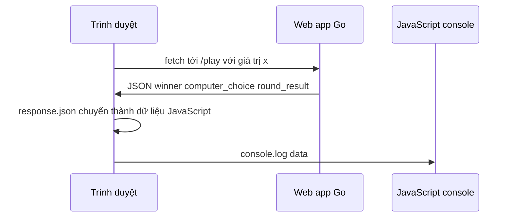

# 🌐 Gọi web app từ trình duyệt — fetch, then và JavaScript console

> Nguồn: `096-Calling-our-web-application-from-the-browser.txt` · [Udemy](https://ua.udemy.com/course/go-programming-language-crash-course/learn/lecture/26162398)

JavaScript đã đổi được nội dung một đoạn văn, và bước tiếp theo là để nó **gọi thật** web app Go rồi lấy JSON về. Bài này mình sẽ giới thiệu `fetch` — hàm sẵn có của JavaScript — và cách xem kết quả trong JavaScript console. *Chưa dùng console bao giờ cũng không sao, các bạn sẽ thấy nó ngay thôi.*

### 🧰 fetch — gửi request ngầm, không rời trang

Mình vẫn đang mở `index.html` và web app vẫn chạy. Trong hàm `choose`, ngay sau dòng khai báo hàm (**dòng 32**), mình thêm lời gọi web app và in kết quả JSON ra JavaScript console.

`fetch` là một trong những hàm built-in của JavaScript: nó gửi request tới một URL giống hệt trình duyệt làm, nhưng **ở hậu trường** và **không rời khỏi trang hiện tại**. Đó chính xác là điều mình muốn — không thể reload trang mỗi lần người dùng bấm một nút.

---

### 🔗 URL với query parameter

Nếu các bạn còn nhớ, URL của chúng ta là `/play`. Mình thêm vào một chút: `play?c=` rồi nối với giá trị của `x`. Dấu **`?`** đánh dấu **URL parameter** — nó gửi kèm thông tin phụ trong request tới `/play`.

Ví dụ, nếu bấm paper thì `x` bằng 1, URL sẽ thành `<host>/play?c=1`. Các bạn thấy đấy, chỉ là thêm một mẩu thông tin vào request mà thôi.

---

### ⛓️ Chuỗi .then — biến response thành dữ liệu JavaScript

Sau khi request được gửi đi, mình dùng keyword `then` để xử lý response. Dãy xử lý gồm hai bước:

1. Chuyển response thành `response.json()` — tức là **parse JSON** nhận được thành thứ JavaScript có thể dùng.
2. Nhận dữ liệu ở bước trước (mình gọi là `data`) và in ra console bằng `console.log(data)`.

```javascript
fetch("/play?c=" + x)
    .then(response => response.json())
    .then(data => {
        console.log(data);
    });
```

Cả đoạn code chỉ làm một việc: gọi `/play?c=<giá trị x>`, lấy response, chuyển từ JSON sang dạng JavaScript đọc được, rồi ghi kết quả ra console.

---

### 🖥️ Mở JavaScript console và xem kết quả

Chạy web app, reload trang cho chắc, rồi mở **web developer tools** ở góc trên bên phải để tìm JavaScript console.

Điểm cần lưu ý: `console.log` sẽ in ra ở khu vực console, **không phải** cửa sổ trình duyệt chính. Mình bấm nút rock và nhận được dữ liệu ngay:

* computer choice — máy chọn paper,
* round result — hòa (*it's a draw*),
* winner — 3.

Mình đang dùng Firefox nên giao diện sẽ khác một chút nếu các bạn dùng Chrome, nhưng thông tin nhận được là như nhau. Vậy là chúng ta đã **request thành công** dữ liệu từ web app và nhận về JSON đúng như mong đợi.



---

### ✅ Tự kiểm tra nhanh

**1. `fetch` khác gì so với việc mở một URL mới trên trình duyệt?**

<details>
<summary><b>Xem đáp án</b></summary>

**Đáp án:** `fetch` gửi request ngầm và không rời khỏi trang hiện tại.
Giải thích: Nhờ đó người dùng bấm nút liên tục mà trang không bị reload.
Tham chiếu: Mục "fetch — gửi request ngầm, không rời trang"

</details>

**2. Phần `?c=` trong URL có tác dụng gì?**

<details>
<summary><b>Xem đáp án</b></summary>

**Đáp án:** Đó là URL parameter, gửi thêm thông tin kèm theo request.
Giải thích: Giá trị `c` bằng đúng giá trị `x` — tức nút người dùng vừa bấm.
Tham chiếu: Mục "URL với query parameter"

</details>

**3. `response.json()` làm gì?**

<details>
<summary><b>Xem đáp án</b></summary>

**Đáp án:** Parse JSON nhận được thành dữ liệu mà JavaScript có thể dùng.
Giải thích: Nếu không parse, response chỉ là dữ liệu thô không dùng được trong code.
Tham chiếu: Mục "Chuỗi .then — biến response thành dữ liệu JavaScript"

</details>

**4. `console.log` in kết quả ở đâu?**

<details>
<summary><b>Xem đáp án</b></summary>

**Đáp án:** Trong JavaScript console của web developer tools, không phải cửa sổ trình duyệt chính.
Giải thích: Mình mở developer tools và theo dõi console để thấy dữ liệu JSON.
Tham chiếu: Mục "Mở JavaScript console và xem kết quả"

</details>

**5. Vì sao cần hai lần `.then`?**

<details>
<summary><b>Xem đáp án</b></summary>

**Đáp án:** Lần đầu chuyển response thành JSON, lần sau nhận `data` và xử lý tiếp.
Giải thích: `response.json()` trả về kết quả bất đồng bộ, nên cần `.then` thứ hai để dùng dữ liệu.
Tham chiếu: Mục "Chuỗi .then — biến response thành dữ liệu JavaScript"

</details>

---

Chúng ta đã lấy được JSON từ web app Go — phần khó nhất qua rồi. Bước tiếp theo, mình sẽ dùng chính dữ liệu đó để **cập nhật nội dung trang web**. Hẹn gặp lại các bạn ở bài sau! 🚀

## Nguồn tham khảo

- [MDN — Using the Fetch API](https://developer.mozilla.org/en-US/docs/Web/API/Fetch_API/Using_Fetch)
- [Udemy — Calling our web application from the browser](https://ua.udemy.com/course/go-programming-language-crash-course/learn/lecture/26162398)
