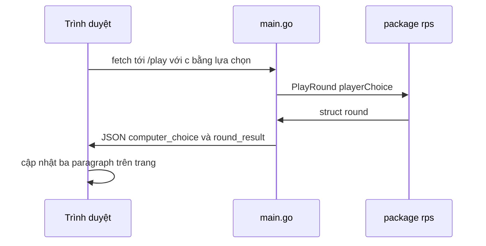

# 🛠️ Hoàn thiện web app — Đọc lựa chọn người chơi và cập nhật trang

> Nguồn: `097-Finishing-up-our-application.txt` · [Udemy](https://ua.udemy.com/course/go-programming-language-crash-course/learn/lecture/26162404)

Chúng ta đang tiến rất gần tới một web app hoàn chỉnh. Nhưng có một lỗi khá "đáng yêu" cần sửa: dù bấm nút nào, máy cũng chỉ chọn paper. Bài này mình sẽ đọc **query parameter** phía Go, đưa kết quả JSON lên trang, rồi tô màu cho kết quả cho đẹp. *Bám sát từng bước là được, không có gì hóc búa cả.*

### 🐞 Lỗi cần sửa: nút nào cũng ra paper

Ở phần JavaScript cuối `index.html` (**dòng 32**), chúng ta gọi `/play?c=` kèm giá trị người dùng vừa bấm — bấm rock thì `x` bằng 0, bấm scissors thì `x` bằng 2.

Nhưng trong `main.go` ở **dòng 15**, handler `playRound` vẫn đang **hard-code giá trị 1**. Nghĩa là dù người dùng bấm gì, app cũng chỉ nhận một giá trị duy nhất và luôn coi như người chơi chọn paper. Như vậy thì không ổn chút nào.

---

### 🔎 Đọc tham số c từ URL bằng strconv

Cách sửa rất gọn. Trong `main.go`, ở dưới handler `playRound`, mình thêm một dòng: khai báo biến `playerChoice`, dấu phẩy và **dấu gạch dưới** — vì mình bỏ qua tham số trả về thứ hai — rồi gán giá trị từ `strconv.Atoi`.

Package `strconv` chúng ta đã dùng trước đây để chuyển một chuỗi thành số nguyên, và hàm làm việc đó là `Atoi`. Chuỗi cần lấy nằm trong biến request `r`:

* `r.URL.Query()` — nói rằng hãy chú ý tới các query parameter.
* `.Get("c")` — lấy tham số tên `c`, đúng tên chúng ta đặt trong JavaScript.

```go
playerChoice, _ := strconv.Atoi(r.URL.Query().Get("c"))
result := rps.PlayRound(playerChoice)
```

Và thay vì hard-code `1`, mình truyền `playerChoice` vào `rps.PlayRound`. Giờ đây người chơi thật sự chọn được giá trị của mình.

| Paragraph id | Hiển thị gì | Lấy từ đâu |
|---|---|---|
| `playerChoice` | Người chơi chọn gì | Biến `x` trong JavaScript |
| `computerChoice` | Máy chọn gì | `data.computer_choice` |
| `roundResult` | Ai thắng ván này | `data.round_result` |

---

### 🖼️ Đưa logic hiển thị vào trong .then

Quay lại `index.html`, mình không chỉ log dữ liệu nữa, nên **comment** dòng `console.log` lại. Toàn bộ logic đổi nội dung trang được chuyển **vào bên trong `.then`** — vì chỉ khi nhận được response từ server thì mới nên đụng vào trang.

Đồng thời mình đổi lời hiển thị cho giống bản console app: "Player chose ROCK", "PAPER", "SCISSORS" — viết hoa cho rõ. Phần chọn máy và kết quả ván thì lấy trực tiếp từ JSON:

```javascript
.then(data => {
    if (x == 0) {
        document.getElementById("playerChoice").innerHTML = "Player chose ROCK";
    } else if (x == 1) {
        document.getElementById("playerChoice").innerHTML = "Player chose PAPER";
    } else {
        document.getElementById("playerChoice").innerHTML = "Player chose SCISSORS";
    }
    document.getElementById("computerChoice").innerHTML = data.computer_choice;
    document.getElementById("roundResult").innerHTML = data.round_result;
});
```

Tên `data.computer_choice` và `data.round_result` đến từ đâu? Từ **JSON** đấy. Trong `rps.go`, mình đã đặt struct tag `json:"computer_choice"` và `json:"round_result"` — nên tên trong JSON khớp chính xác với tên mình dùng trong JavaScript.

---

### ▶️ Chạy thử và tinh chỉnh giao diện

Nhớ một điều quan trọng: **phải restart app** (`go run main.go` lại), nếu không những thay đổi trong main package sẽ không được phản ánh. Mình mở lại browser, refresh trang, và giữ JavaScript console mở để kịp thấy lỗi nếu có chỗ gõ sai.

* Bấm rock → "Player chose rock, computer chose rock. It's a draw."
* Bấm paper → "Player chose paper, computer chose rock. Player wins."

Mọi thứ chạy hoàn hảo. Còn một chi tiết nhỏ mang tính "làm đẹp": mình thêm class Bootstrap `text-danger` cho dòng kết quả để chữ đổi sang màu đỏ — *chỉ để nó khác màu thôi, các bạn không thích cũng không sao*. Reload lại, kết quả hiện màu đỏ, trông bắt mắt hơn hẳn.



Vậy là chúng ta đã có một web app **hoàn chỉnh, rất đơn giản nhưng chạy trọn vẹn**. Qua đó các bạn cũng thấy Go cực kỳ phù hợp cho web: vừa làm back-end REST API, vừa làm web app sinh trang HTML gửi thẳng tới người dùng cuối.

---

Còn một điều thú vị nữa: trong code vẫn còn vài hằng số chưa dùng tới, và mình cố ý để lại vì đã chuẩn bị một **thử thách nhỏ** cho các bạn. Hẹn gặp lại ở bài sau! 🚀

## Nguồn tham khảo

- [pkg.go.dev — package strconv](https://pkg.go.dev/strconv)
- [pkg.go.dev — package net/http](https://pkg.go.dev/net/http)
- [Udemy — Finishing up our application](https://ua.udemy.com/course/go-programming-language-crash-course/learn/lecture/26162404)
