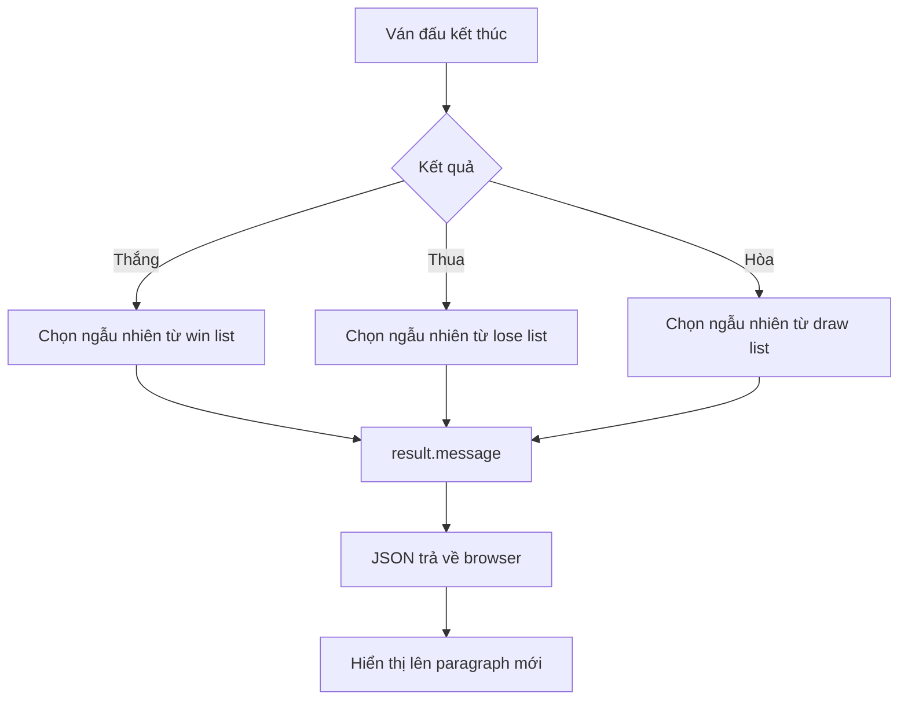

# 🧩 Thử thách — Biến con số thắng/thua/hòa thành những lời nhắn thú vị

> Nguồn: `098-Challenge.txt` · [Udemy](https://ua.udemy.com/course/go-programming-language-crash-course/learn/lecture/26162408)

Web app rock-paper-scissors của chúng ta đã chạy trọn vẹn, nhưng mình cố ý để lại trong code một thứ chưa ai dùng tới. Hôm nay mình giao cho các bạn một **thử thách nhỏ** — đừng lo, mình sẽ gợi ý đầy đủ, và bài sau chúng ta sẽ cùng đi qua lời giải. *Cứ thử sức trước đã, sai cũng không sao cả.*

### 🕵️ Manh mối nằm ở winner

Trong file `rps.go` của chúng ta có những **hằng số**: `playerWins`, `computerWins` và `draw`. Type `round` cũng có một member tên `winner` kiểu `int`.

Member này được gán giá trị bằng các hằng số đó ở phía dưới:

* **Dòng 45**: `winner` được gán bằng `draw`.
* **Dòng 48**: `winner` được gán bằng `playerWins`.
* **Dòng 51**: `winner` được gán bằng `computerWins`.

Rồi giá trị đó được trả về, được encode vào JSON... nhưng **chưa bao giờ được sử dụng** ở phía trang web. Mình để nguyên như vậy là có chủ đích — để dành cho thử thách này.

---

### 🎬 Kết quả mình muốn các bạn làm ra

Mình đã sửa thử code và cho các bạn xem trước thành quả. Khi bấm nút, ngoài ba dòng quen thuộc, trang web sẽ hiện thêm **một lời nhắn**:

* Hòa với rock → *"great minds think alike"*.
* Hòa tiếp với paper → *"uh-oh try again"*.
* Hòa với scissors → *"nobody wins, but you can try again"*.
* Người chơi thắng → *"you should buy a lottery ticket"*.
* Máy thắng → *"too bad"*.

Điểm đáng chú ý: ba lần hòa liên tiếp cho ra **ba lời nhắn khác nhau** — nghĩa là lời nhắn được chọn ngẫu nhiên.

---

### 🧩 Nhiệm vụ của các bạn

Đây là các bước mình gợi ý:

1. Bỏ các hằng số `playerWins`, `computerWins`, `draw` — không cần nữa.
2. Đổi member `winner`: ít nhất là đổi kiểu, và tốt hơn nữa là **đổi tên cho có nghĩa** — vì nó sẽ lưu **lời nhắn**, là một chuỗi.
3. Tạo **ba cấu trúc dữ liệu**: một cho thắng, một cho thua, một cho hòa. Dùng `map` hay `slice` đều được, miễn là cả ba có **đúng cùng số phần tử** (các bạn có thể đặt tên kiểu `winList`, `loseList`, `drawList` tùy thích).
4. Sinh một **số ngẫu nhiên** rồi chọn một entry từ cấu trúc phù hợp với kết quả ván đấu, lưu vào biến.
5. Thay chỗ `result.winner` bằng `result.message` — lời nhắn ở dạng `string`.
6. Trong `index.html`, thêm **chỗ để hiển thị lời nhắn**, và thêm code để đổ nội dung vào chỗ đó.

---

### 💪 Đừng ngại, cứ thử

Thử thách này **không quá khó**, nhưng cũng sẽ ngốn của các bạn một chút thời gian — chuyện hoàn toàn bình thường khi phải vừa sửa Go vừa sửa JavaScript. Cứ thử, vấp chỗ nào ghi chú chỗ đó, rồi sang bài sau so với cách mình làm.

Hẹn gặp lại các bạn ở bài giải! Chúc may mắn nhé! 🚀
