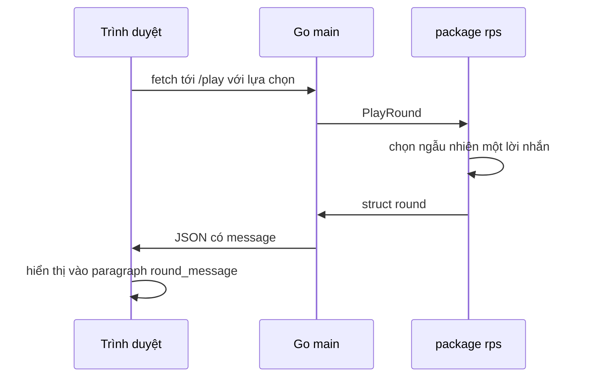

# ✅ Lời giải thử thách — Lời nhắn ngẫu nhiên và hoàn tất web app

> Nguồn: `099-Solution-to-Challenge.txt` · [Udemy](https://ua.udemy.com/course/go-programming-language-crash-course/learn/lecture/26162410)

Các bạn xử lý thử thách thế nào? Hy vọng không quá khó, dù có thể sẽ mất một chút thời gian. Giờ mình cùng các bạn đi qua từng thay đổi — phần lớn nằm ở `rps.go`, còn `index.html` chỉ cần thêm một paragraph và một dòng JavaScript. *Nếu cách làm của các bạn khác mình mà kết quả giống, điều đó hoàn toàn ổn.*

### 🔍 Dấu vết các thay đổi

Như lần trước, ở mọi chỗ có thay đổi mình đều để lại **comment với ba dấu hoa thị** phía trước, để tìm cho dễ. Các bạn tải source trong phần course resources của bài này là thấy đầy đủ các comment đó.

Mình comment out **dòng 13, 14 và 15** — thật ra xóa hẳn cũng được, nhưng giữ lại để các bạn thấy mình đã thay đổi những gì.

---

### 🏗️ Type round và ba slice lời nhắn

Thay đổi đầu tiên nằm ở type `round`: member đầu tiên đổi từ `winner` kiểu `int` thành `message` kiểu `string`, kèm struct tag để trong JSON nó hiện ra với chữ m thường:

```go
type round struct {
    Message        string `json:"message"`
    ComputerChoice string `json:"computer_choice"`
    RoundResult    string `json:"round_result"`
}
```

Ngay bên dưới, mình tạo **ba slice chuỗi**, mỗi slice có đúng **ba entry**:

* một slice cho khi người chơi thắng,
* một slice cho khi máy thắng,
* một slice cho khi hòa.

Các bạn hoàn toàn có thể dùng `map` thay vì slice — cách nào cũng chạy tốt, miễn cả ba cấu trúc có số phần tử bằng nhau.

---

### 🎲 Chọn lời nhắn ngẫu nhiên trong playRound

Cũng trong `rps.go`, ở **dòng 51**, biến `winner` kiểu `int` không còn được dùng nữa, nên không cần khởi tạo nó bằng 0 nữa — bỏ luôn cho gọn.

Ngay sau câu lệnh `switch`, ở **dòng 53 của bản sửa**, mình sinh một **số ngẫu nhiên từ 0 đến 2** (không cần tới hàm sinh số thực). Vì slice bắt đầu đếm từ 0, số này cho đúng một trong ba vị trí của mỗi slice.

Sang **dòng 69**, mình khai báo biến `message` kiểu `string` với giá trị mặc định là chuỗi rỗng. Rồi ở chuỗi `if` bắt đầu từ **dòng 71**:

1. Nhánh hòa → lấy ngẫu nhiên một lời nhắn từ slice `drawMessages`.
2. Nhánh thắng → lấy từ slice `winMessages`.
3. Nhánh thua → lấy từ slice `loseMessages`.

Và ở cuối hàm, thay vì gán `result.winner`, mình gán `result.message` — vì `result.winner` không còn tồn tại nữa.

---

### 🌐 index.html: paragraph mới và một dòng JavaScript

Trong HTML, comment viết khác hẳn Go và JavaScript: bắt đầu bằng dấu nhỏ hơn, dấu chấm than rồi hai gạch ngang, và kết thúc bằng hai gạch ngang rồi dấu lớn hơn. Mình cũng đặt comment ở đúng những chỗ có thay đổi.

Mình thêm một **paragraph mới**, gắn class `text-success` để chữ xanh — *không làm cũng chẳng sao nhé* — và gán id `round_message` (dùng đúng chữ thường: round gạch dưới message). Nội dung mặc định của nó là một **non-breaking space**.

Rồi trong phần JavaScript, mình chỉ cần thêm **một dòng** để lấy giá trị từ `data.message` — có sẵn trong JSON — và đổ vào element có id `round_message`:

```javascript
document.getElementById("round_message").innerHTML = data.message;
```



---

### 🤝 Kết thúc section

Nếu các bạn gặp trục trặc, cứ tải source của bài giảng này về và so với bài làm của mình. Còn nếu cách tiếp cận hơi khác nhưng kết quả cuối cùng giống nhau — chuyện đó **hoàn toàn bình thường và chẳng sao cả**.

Vậy là hết **section Building a Simple Web Application**. Mình đã có khoảng thời gian rất vui, hy vọng các bạn cũng vậy. Hẹn gặp lại ở bài bonus tiếp theo nhé! 🚀

## Nguồn tham khảo

- [pkg.go.dev — package math/rand](https://pkg.go.dev/math/rand)
- [pkg.go.dev — package encoding/json](https://pkg.go.dev/encoding/json)
- [Udemy — Solution to Challenge](https://ua.udemy.com/course/go-programming-language-crash-course/learn/lecture/26162410)
