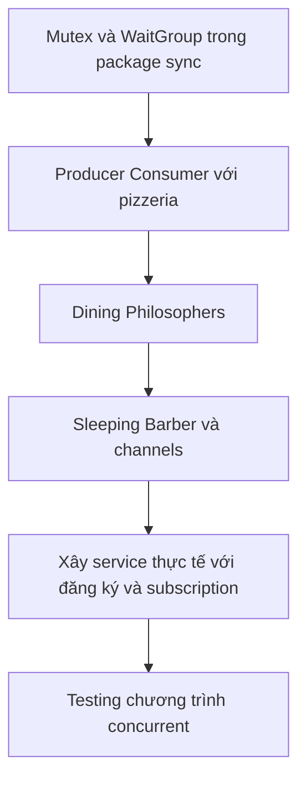

# 🚀 Working with Concurrency in Go: Tổng quan khóa học và triết lý khác biệt của Go

> Nguồn: `001-Introduction.txt` · [Udemy](https://ua.udemy.com/course/working-with-concurrency-in-go-golang/learn/lecture/32032356)

Chào mừng các bạn đến với **Working with Concurrency in Go**! Trong khóa học này, chúng ta sẽ cùng xem ngôn ngữ **Go** hiệu quả và hữu ích đến mức nào khi viết các chương trình **concurrent (chạy đồng thời)**. Quan trọng không kém: chúng ta sẽ học cả **khi nào nên** và **khi nào không nên** dùng concurrency — vì đây thực sự là một con dao hai lưỡi.

### 🧠 Triết lý của Go: đừng giao tiếp bằng cách chia sẻ bộ nhớ

Go có cách tiếp cận concurrency rất khác so với hầu hết ngôn ngữ lập trình khác, và tất cả được tóm gọn trong câu nói nổi tiếng của chính các tác giả Go:

> **"Don't communicate by sharing memory; share memory by communicating."**
> *(Đừng giao tiếp bằng cách chia sẻ bộ nhớ — hãy chia sẻ bộ nhớ bằng cách giao tiếp.)*

Nghe xong chắc các bạn cũng thắc mắc: *ai đang giao tiếp với ai ở đây?* Câu trả lời bắt đầu từ một sự thật thú vị: trong Go, việc "phóng" một đoạn code ra chạy nền dễ đến mức đáng kinh ngạc. Chỉ cần gõ chữ `go` trước lời gọi hàm, hai hàm lập tức chạy song song với nhau.

Nhưng một khi đã phóng thứ gì đó ra nền, làm sao nói chuyện với nó? Có vài cách:

* **Primitives (nguyên thủy) từ package `sync`**: khóa tài nguyên — kiểu như "mình đang dùng cái này, đừng ai đụng vào cho tới khi mình xong".
* **WaitGroup**: khi làm xong, báo cho WaitGroup biết là đã hoàn thành.
* **Channels (kênh)**: các goroutine trò chuyện với nhau — theo mình đây là cách phổ biến, hữu ích và hiệu quả nhất trong Go. Channels gần như là "đặc sản" riêng của Go, và khóa học sẽ dành rất nhiều thời gian cho chúng.

| Cách giao tiếp | Cơ chế | Ghi chú |
|---|---|---|
| Primitive `sync` | Khóa tài nguyên | "Đang dùng, đừng đụng" |
| `WaitGroup` | Báo khi hoàn thành | Đếm số việc đã xong |
| `Channels` | Message passing | Cách Go khuyến khích |

Nếu diễn giải câu nói trên thành lời lẽ đời thường: **đừng over-engineer chương trình bằng shared memory và những primitive đồng bộ hóa phức tạp**; hãy dùng **message passing (truyền thông điệp)** giữa các goroutine để biến và dữ liệu được dùng theo đúng trình tự.

### ⚖️ Quy tắc vàng: không cần thì đừng dùng

Mình muốn các bạn ghi nhớ điều này như một **golden rule (quy tắc vàng)**: **nếu không cần concurrency, đừng dùng nó.**

Lập trình concurrent rất dễ sinh lỗi. Go làm cho việc này trở nên **dễ hơn** — chứ không phải **dễ**. Một lỗi concurrency có thể nằm im trong chương trình hàng tháng, thậm chí hàng năm trời mới lộ ra.

* Hãy giữ độ phức tạp của ứng dụng ở mức tối thiểu.
* Code đơn giản thì dễ viết, dễ hiểu và dễ bảo trì hơn.

*Nhưng cũng phải nói ngay: có rất nhiều tình huống concurrency là lựa chọn hoàn toàn hợp lý — và đó chính là những gì khóa học này sẽ chỉ cho các bạn.*

### 🗺️ Chúng ta sẽ học những gì?

Khóa học bắt đầu với các kiểu dữ liệu cơ bản trong package `sync`, gồm **Mutex** (đôi khi còn gọi là semaphore) và **WaitGroup**, rồi đi qua ba bài toán kinh điển của khoa học máy tính:

1. **Producer-Consumer**: viết một chương trình dạng text mô phỏng tiệm pizza — một bên sản xuất pizza, một bên tiêu thụ là khách đặt hàng, và chúng ta giải các bài toán concurrency bằng ví dụ này.
2. **Dining Philosophers** (các triết gia dùng bữa): một bài toán rất thú vị nhưng cũng đầy thách thức.
3. **Sleeping Barber** (thợ cắt tóc ngủ quên): bài toán kinh điển thứ ba, cũng là nơi mình sẽ đào sâu về channels.

Cả ba đều là những ví dụ mang đậm "mùi" năm nhất khoa học máy tính, nhưng chúng kinh điển vì một lý do: chúng cho người học phơi nhiễm với đúng những vấn đề của lập trình concurrent, và buộc phải tìm ra cách giải hiệu quả nhất. Sau ba bài toán này, các bạn sẽ có hiểu biết vững vàng về **khi nào dùng Mutex, khi nào dùng WaitGroup, khi nào dùng channel** cùng các loại channel khác nhau mà Go cung cấp.

### 🍕 Dự án thực tế và chuyện testing

Sau phần kinh điển, chúng ta sẽ xây một phần nhỏ của một service tưởng tượng. Trong service này, người dùng có thể:

1. **Đăng ký, tạo tài khoản** và xác thực tài khoản qua **email**.
2. Mua một trong các gói **subscription (thuê bao)** — mình gọi là **Bronze, Silver, Gold** (không quá sáng tạo, mình biết 😄).
3. Sau khi mua, hệ thống sẽ tạo **invoice (hóa đơn)**, gửi **email** và tạo một **PDF manual (sách hướng dẫn PDF)** tùy chỉnh cho người dùng đó.

Hóa đơn và manual sẽ "đơn giản chết đi được" — vì chúng không phải trọng tâm của khóa học. Điều quan trọng là chúng ta sẽ làm **tất cả những việc đó một cách đồng thời**, và học luôn cách viết **test cho chương trình concurrent** — điều cực kỳ quan trọng, bởi lỗi concurrency rất dễ lọt vào mà bạn không hề hay biết.

### 🎯 Tự kiểm tra nhanh

**Câu 1:** Quy tắc vàng của concurrency mà mình nhấn mạnh là gì?

<b>Xem đáp án</b>

**Đáp án:** Nếu không cần concurrency thì đừng dùng nó.

Giải thích: Lập trình concurrent rất dễ sinh lỗi, Go chỉ làm nó dễ hơn chứ không hề dễ.

Tham chiếu: Mục Quy tắc vàng.

**Câu 2:** Câu nói nổi tiếng của các tác giả Go về concurrency là gì?

<b>Xem đáp án</b>

**Đáp án:** "Don't communicate by sharing memory; share memory by communicating."

Giải thích: Nên dùng message passing giữa các goroutine thay vì shared memory và đồng bộ hóa phức tạp.

Tham chiếu: Mục Triết lý của Go.

**Câu 3:** Ba bài toán kinh điển sẽ được giải trong khóa học là gì?

<b>Xem đáp án</b>

**Đáp án:** Producer-Consumer (tiệm pizza), Dining Philosophers và Sleeping Barber.

Giải thích: Đây là các bài toán "highly contrived" kiểu năm nhất nhưng kinh điển vì lý do rất thực tế.

Tham chiếu: Mục Chúng ta sẽ học những gì.

**Câu 4:** Ba cách để goroutine báo chuyện/giao tiếp với nhau là gì?

<b>Xem đáp án</b>

**Đáp án:** Primitives trong package `sync` (Mutex), WaitGroup và channels.

Giải thích: Channels là cách mình đánh giá là phổ biến và hiệu quả nhất trong Go.

Tham chiếu: Mục Triết lý của Go.

**Câu 5:** Vì sao testing lại đặc biệt quan trọng với chương trình concurrent?

<b>Xem đáp án</b>

**Đáp án:** Vì rất dễ đưa lỗi vào chương trình concurrent mà không hề hay biết; lỗi có thể ẩn hàng tháng hoặc hàng năm trời.

Giải thích: Đó là lý do khóa học dành hẳn phần testing cho concurrent programs.

Tham chiếu: Mục Dự án thực tế và chuyện testing.

Vậy là các bạn đã nắm được bức tranh tổng thể của khóa học: triết lý của Go, quy tắc vàng và danh sách những gì chúng ta sẽ cùng nhau chinh phục. Mọi thứ sẽ rất thú vị — chúng ta bắt đầu thôi! 🚀
