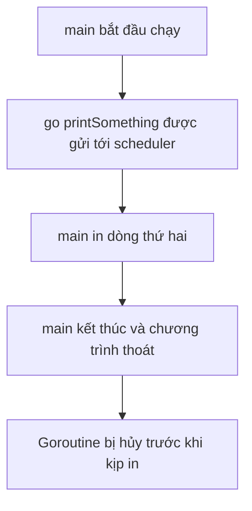

# ⚡ Tạo goroutine bằng một chữ go: Dễ tới mức... có vấn đề ngay

> Nguồn: `009-Creating-GoRoutines-and-identifying-a-problem.txt` · [Udemy](https://ua.udemy.com/course/working-with-concurrency-in-go-golang/learn/lecture/32051922)

Hôm nay chúng ta bắt đầu với **goroutines** — trái tim của concurrency trong Go. Mình sẽ đi từ những nguyên lý cơ bản nhất để mọi người cùng nằm trên một "mặt sân phẳng" (*level playing field*), kể cả những bạn đã từng dùng goroutine. Với vài bạn phần này sẽ là ôn lại, nhưng cứ đi cùng mình nhé.

### 📁 Chuẩn bị project đầu tiên

Mình mở Visual Studio Code và tạo một thư mục tên `first-example`. Các bạn đặt tên gì cũng được, miễn là có một thư mục đang mở. Sau đó, như một thói quen tốt, mình mở terminal và khởi tạo module:

```bash
go mod init first-example
```

Lệnh này tạo ra file `go.mod` cho project. Tiếp theo, mình tạo file `main.go` — bắt đầu từ `package main` cùng hàm `main` mà mọi chương trình Go đều cần. Một chương trình tối giản trông như thế này:

```go
package main

import "fmt"

func main() {
	fmt.Println("Hello, world!")
}
```

### 🐹 Chương trình Go nào cũng có ít nhất một goroutine

Một điều thú vị: chạy chương trình nhỏ xíu trên, bạn đã có **một goroutine** — chính **hàm `main`**. Một chương trình có thể chỉ có một goroutine như ví dụ này, nhưng chúng ta sắp tạo những chương trình có ít nhất hai.

Goroutine thực chất là những **thread siêu nhẹ**. Chúng chạy trên các thread riêng của Go (không phải thread phần cứng của CPU), tốn rất ít bộ nhớ, chạy rất nhanh, và tất cả được quản lý bởi **Go scheduler** — bộ lập lịch quyết định cái gì chạy, khi nào chạy, ai được bao nhiêu thời gian xử lý. Mọi "phép thuật" đó Go lo hết ở hậu trường cho chúng ta.

### ⌨️ Chỉ cần thêm chữ go

Giờ mình viết thêm một hàm phía trên `main`:

```go
func printSomething(s string) {
	fmt.Println(s)
}
```

Trong `main`, mình gọi hàm này hai lần lần lượt — chạy `go run .`, kết quả in ra đúng thứ tự, không có gì bất ngờ. Giờ mình thêm chữ `go` vào trước lời gọi **đầu tiên**:

```go
go printSomething("This is the first thing to be printed!")
printSomething("This is the second thing to be printed!")
```

Chữ `go` bảo compiler rằng: phần phía sau hãy chạy trong **goroutine riêng của nó**. Go sinh ra một goroutine, giao cho scheduler, và scheduler nói "được, để tôi lo phần chạy nó cho bạn".

Logic mà các bạn mong đợi là thấy cả hai dòng được in. Nhưng khi chạy `go run .`... **chỉ có dòng thứ hai xuất hiện!**

Chuyện gì vậy? Chương trình chạy quá nhanh, không kịp cho goroutine vừa sinh ra thực thi. Kết quả của nó **chết lặng trong hư không**, chúng ta không bao giờ thấy nữa. Điều đáng chú ý: chương trình **không hề báo lỗi gì cả** — nó chạy như không có chuyện gì xảy ra.



### 💤 Cách sửa tệ nhất: time.Sleep

Có vài cách sửa tốt, và có một cách **cực kỳ tệ** mà mình sẽ cho các bạn xem ngay bây giờ. Mình chèn vào giữa hai dòng:

```go
go printSomething("This is the first thing to be printed!")
time.Sleep(1 * time.Second)
printSomething("This is the second thing to be printed!")
```

Chạy lại `go run .`, cả hai dòng đều được in. Về mặt kỹ thuật, vấn đề đã được "giải quyết". Nhưng đây là **một lời giải tồi tệ hạng nhất**:

* Nếu bạn làm thế này trong môi trường **production** mà quản lý nhìn thấy, nhẹ nhất là bị nói vài câu nặng nề.
* Nặng hơn thì... bạn đang ngồi đánh bóng CV và tìm việc mới 😅.

*Đừng lo, bài sau chúng ta sẽ sửa chương trình này bằng một khái niệm tên là **WaitGroup** — đúng cách, sạch sẽ, và không phải "ngủ" vô tội vạ.*

### 🎯 Tự kiểm tra nhanh

**Câu 1:** Hàm `main` có phải là một goroutine không?

<details>
<summary><b>Xem đáp án</b></summary>

**Đáp án:** Có. Mọi chương trình Go đều có ít nhất một goroutine, chính là `main`.

Giải thích: Ví dụ đơn giản nhất cũng đã chạy trong một goroutine là hàm `main`.

Tham chiếu: Mục Chương trình Go nào cũng có ít nhất một goroutine.

</details>

**Câu 2:** Goroutine chạy trên thread phần cứng của CPU đúng hay sai?

<details>
<summary><b>Xem đáp án</b></summary>

**Đáp án:** Sai. Goroutine chạy trên những thread siêu nhẹ riêng của Go, không phải thread phần cứng.

Giải thích: Chúng tốn rất ít bộ nhớ, chạy rất nhanh và được quản lý bởi Go scheduler.

Tham chiếu: Mục Chương trình Go nào cũng có ít nhất một goroutine.

</details>

**Câu 3:** Chữ `go` đặt trước một lời gọi hàm có tác dụng gì?

<details>
<summary><b>Xem đáp án</b></summary>

**Đáp án:** Chạy hàm đó trong một goroutine riêng, rồi giao cho Go scheduler lo việc thực thi.

Giải thích: Đây chính là cách Go tạo goroutine — chỉ hai ký tự và một khoảng trắng.

Tham chiếu: Mục Chỉ cần thêm chữ go.

</details>

**Câu 4:** Vì sao kết quả của goroutine đầu tiên "biến mất" khi chạy chương trình?

<details>
<summary><b>Xem đáp án</b></summary>

**Đáp án:** Vì `main` chạy quá nhanh và kết thúc trước khi goroutine kịp thực thi; goroutine bị hủy mà không báo lỗi.

Giải thích: Chương trình chạy xong không có nghĩa mọi goroutine đã chạy xong.

Tham chiếu: Mục Chỉ cần thêm chữ go.

</details>

**Câu 5:** Vì sao `time.Sleep` là lời giải tồi?

<details>
<summary><b>Xem đáp án</b></summary>

**Đáp án:** Vì nó chỉ "ngủ mù" một khoảng thời gian cố định, không đảm bảo goroutine đã xong, và sẽ bị coi là code tệ trong môi trường production.

Giải thích: Cần một cơ chế chờ đúng đắn — đó là WaitGroup ở bài tiếp theo.

Tham chiếu: Mục Cách sửa tệ nhất.

</details>

Nắm được vì sao chương trình "nuốt" mất kết quả rồi chứ? Ở bài tiếp theo, **WaitGroups** sẽ vào cuộc giải cứu. 🚀
