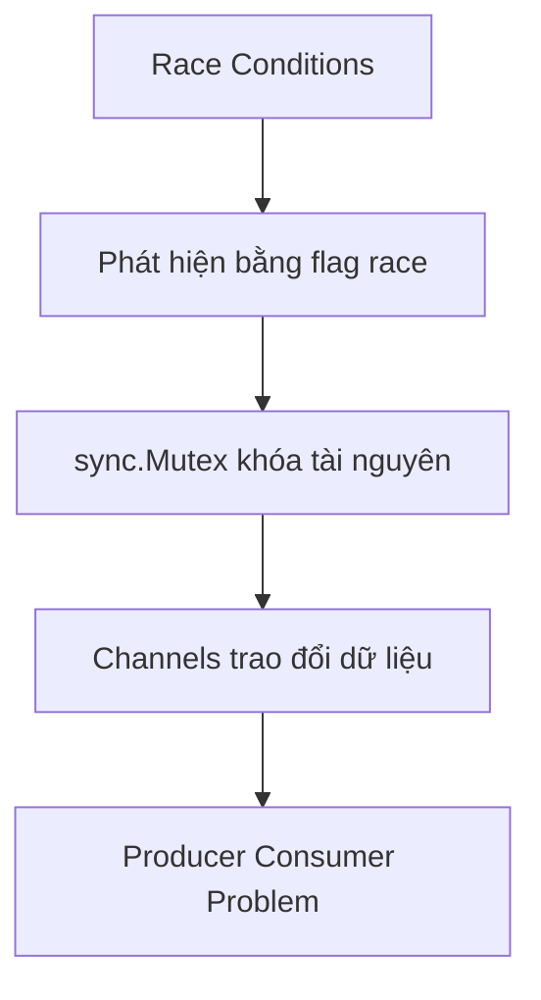

# 🧵 Mở màn Section 3: Race Conditions, Mutex và cánh cửa bước vào Channels

> Nguồn: `014-What-well-cover-in-this-section.txt` · [Udemy](https://ua.udemy.com/course/working-with-concurrency-in-go-golang/learn/lecture/32032406)

Chào các bạn, mình Trevor đây 👋. Trong Go, chỉ cần gõ thêm chữ `go` là một goroutine đã lặng lẽ chạy ở nền — tiện thì tiện thật, mà cũng chính vì quá dễ nên chúng ta rất dễ vướng vào những lỗi cực khó thấy. Section này sẽ trang bị cho các bạn ba thứ: cách nhận diện **race conditions (tranh chấp dữ liệu)**, cách dùng `sync.Mutex` để khóa tài nguyên dùng chung, và một cái nhìn đầu tiên về **channels**. *Đừng lo nếu các bạn thấy hơi rối, cứ theo mình từng bước là sẽ ổn thôi.*

### 🎯 Section này chúng ta sẽ học gì?

Đây là những "món" chính mình chuẩn bị cho các bạn:

* **Race conditions**: điều gì xảy ra khi nhiều goroutine cùng lúc đụng vào một tài nguyên dùng chung, và vì sao chúng ta phải đặc biệt cảnh giác.
* **`sync.Mutex`**: cơ chế khóa cho phép một phần chương trình có quyền truy cập **độc quyền** vào tài nguyên, dùng xong thì mở khóa cho phần khác.
* **Kiểm tra race condition**: chỉ cần thêm flag `-race` khi chạy chương trình hoặc khi chạy test.
* **Channels**: cách ưu việt để các goroutine trò chuyện với nhau, và bài toán kinh điển **Producer/Consumer** để khép lại section.

`Mutex` là viết tắt của **mutual exclusion (loại trừ lẫn nhau)**. Mình hay hình dung nó như chìa khóa của một căn phòng chỉ cho một người vào tại một thời điểm: ai đang giữ chìa thì người khác phải đợi, làm xong trả chìa thì người kế tiếp mới vào được.

---

### ⚠️ Race condition — kẻ thù khó nhìn thấy

Race condition xảy ra khi có **ít nhất hai goroutine** chạy đồng thời và cùng truy cập vào một thứ gì đó — ví dụ một biến kiểu `string`. Các bạn để ý nhé: chỉ có `main` và một goroutine thì chưa đủ "điều kiện" đâu; phải từ hai goroutine trở lên cùng đụng vào một tài nguyên thì vấn đề mới xuất hiện.

Điều khiến race condition nguy hiểm là nó **cực kỳ khó phát hiện khi đọc code**. Các bạn có thể chạy một chương trình đang có race condition mà nó vẫn cho kết quả đúng như mong đợi, rồi ung dung đi tiếp với suy nghĩ "mọi thứ ổn cả". Nhưng không ổn chút nào — vì mình không biết goroutine nào sẽ chạy trước, goroutine nào kết thúc trước, nên khi cả hai cùng thao tác trên một tài nguyên, kết quả có thể **không thể đoán trước**.

Ví dụ trực quan: `main` sinh ra hai goroutine, cả hai cùng truy cập một vùng dữ liệu chung. Vì thứ tự thực thi nằm ngoài tầm kiểm soát của chúng ta, chuyện "không hay" hoàn toàn có thể xảy ra.

---

### 🔒 sync.Mutex — khóa để có quyền độc quyền

Khi có hai thứ chạy nền và cả hai cùng nhắm vào một mẩu dữ liệu, kết quả rất dễ rơi vào vùng "bất định". Cách xử lý là **khóa (lock)** tài nguyên, và khi xong việc thì **mở khóa (unlock)** để những goroutine khác tiếp cận.

* Tài nguyên dùng chung có thể là **biến**, **cấu trúc dữ liệu**, hay bất cứ thứ gì bị **ít nhất hai goroutine** truy cập cùng lúc.
* `sync.Mutex` nằm trong package `sync` — cùng "nhà" với `WaitGroup` mà các bạn đã quen.
* Mức độ dễ dùng: **rất dễ**, tuy không "dễ như ăn kẹo" bằng `WaitGroup`, nhưng gần như vậy.

Cách dùng cụ thể thế nào thì chúng ta sẽ viết code ngay trong các bài tới, các bạn cứ yên tâm.

---

### 🧪 Kiểm tra race condition bằng flag `-race`

Go cho phép kiểm tra race condition theo hai cách rất tiện:

1. Khi chạy chương trình: thêm flag vào lệnh `go` — `go run -race .`
2. Khi chạy test: làm điều tương tự với lệnh test — `go test -race .`

Nếu có vấn đề, Go sẽ in cảnh báo **data race** kèm thông tin về những chỗ truy cập xung đột. Trong section này mình sẽ dùng cả hai cách để các bạn thấy tận mắt. *Đây là thói quen cực kỳ đáng giá, mong các bạn sớm hình thành nó.*

---

### 🚰 Channels — cách Go "ưu ái" nhất

Channel thực chất chỉ là **một phương tiện để goroutine này chia sẻ dữ liệu, thông tin cho goroutine khác**. Các bạn hãy hình dung đó là những đường ống nối giữa các goroutine đang chạy song song, cho phép chúng gửi nhận qua lại.

* Channel có thể là **một chiều (uni-directional)** hoặc **hai chiều (bidirectional)**.
* Các bạn có thể tạo **bao nhiêu channel tùy thích** để luân chuyển dữ liệu.
* Đây chính là hiện thân của triết lý trong Go: **chia sẻ bộ nhớ bằng giao tiếp, thay vì giao tiếp bằng cách chia sẻ bộ nhớ** (*share memory by communicating rather than communicating by sharing memory*).
* Channels là **cách được ưu tiên** để xử lý concurrency trong Go — vì vậy đây là phần rất đáng đầu tư thời gian.

Cách học channel nhanh nhất là viết một chương trình dùng nó thật. Vì thế, cuối section mình sẽ giới thiệu một bài toán kinh điển của khoa học máy tính: **Producer Consumer Problem** — và lần này chúng ta sẽ giải nó bằng một quán pizza 🍕.

### 🎯 Tự kiểm tra nhanh

**Câu 1:** `Mutex` là viết tắt của cụm từ nào?

<b>Xem đáp án</b>

**Đáp án:** Mutual exclusion (loại trừ lẫn nhau).

Giải thích: Mutex cho phép một goroutine có quyền truy cập độc quyền vào tài nguyên cho đến khi mở khóa.

Tham chiếu: Đoạn mở bài và mục sync.Mutex.

**Câu 2:** Race condition có thể xảy ra khi nào?

<b>Xem đáp án</b>

**Đáp án:** Khi có ít nhất hai goroutine chạy đồng thời và cùng truy cập một tài nguyên dùng chung.

Giải thích: Chỉ main với một goroutine thì chưa đủ; phải từ hai goroutine trở lên cùng thao tác trên một chỗ.

Tham chiếu: Mục Race condition.

**Câu 3:** Hai cách kiểm tra race condition trong Go là gì?

<b>Xem đáp án</b>

**Đáp án:** `go run -race .` khi chạy chương trình và `go test -race .` khi chạy test.

Giải thích: Chỉ cần thêm flag `-race` vào lệnh `go`.

Tham chiếu: Mục Kiểm tra race condition.

**Câu 4:** Channel dùng để làm gì?

<b>Xem đáp án</b>

**Đáp án:** Cho phép goroutine này chia sẻ dữ liệu, thông tin với goroutine khác.

Giải thích: Channel là phương tiện giao tiếp giữa các goroutine đang chạy song song, có thể một chiều hoặc hai chiều.

Tham chiếu: Mục Channels.

**Câu 5:** Triết lý của Go về bộ nhớ được phát biểu như thế nào?

<b>Xem đáp án</b>

**Đáp án:** Chia sẻ bộ nhớ bằng giao tiếp, thay vì giao tiếp bằng cách chia sẻ bộ nhớ.

Giải thích: Đây là kim chỉ nam cho cách dùng channel trong Go.

Tham chiếu: Mục Channels.

Vậy là các bạn đã nắm được "bản đồ" của section này rồi. Việc còn lại là lăn tay vào code — và ngay bài sau, chúng ta sẽ tạo ra một race condition thật để xem nó trông như thế nào nhé. Hẹn gặp lại các bạn! 🚀

## Nguồn tham khảo

- [Go — Data Race Detector](https://go.dev/doc/articles/race_detector)
- [pkg.go.dev — sync.Mutex](https://pkg.go.dev/sync#Mutex)
