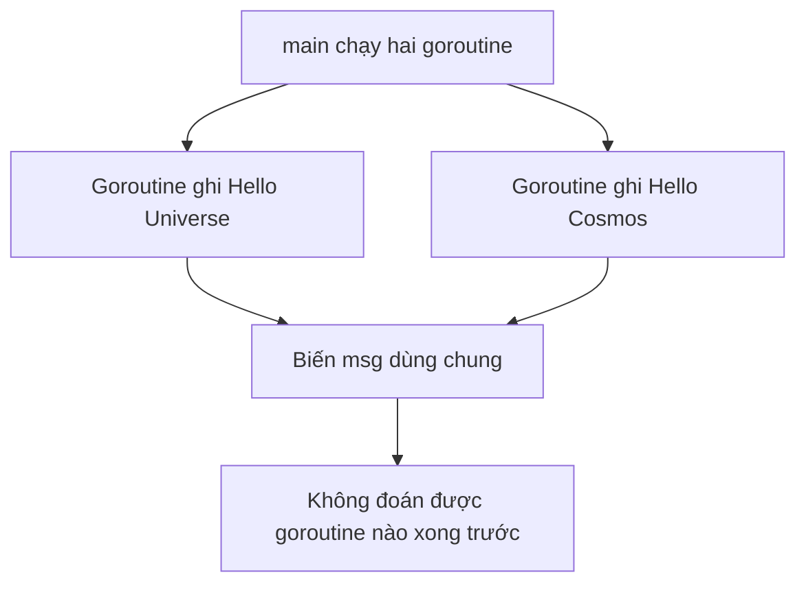

# 🐹 Race condition đầu tiên: hai goroutine tranh nhau một biến string

> Nguồn: `015-Race-Conditions-an-example.txt` · [Udemy](https://ua.udemy.com/course/working-with-concurrency-in-go-golang/learn/lecture/32041148)

Ở bài trước mình đã nói qua về race condition; giờ hãy cùng viết một ví dụ thật đơn giản để các bạn tận mắt thấy vấn đề. Mình tạo một project mới, thêm `main.go`, và làm một biến thể của ví dụ các bạn từng gặp: hai goroutine cùng cập nhật một biến `msg` rồi in kết quả ra màn hình. *Gõ theo mình nhé, sai cũng không sao — quan trọng là các bạn thấy được chuyện gì đang diễn ra.*

### 🧩 Dựng project và viết code

Trước tiên mình khởi tạo module (mình đặt tên là `example2`, tên gì cũng được miễn đúng chính tả 😄), rồi tạo file `main.go` với package `main`. Trong đó có hai biến ở cấp package:

* `msg` kiểu `string` — tài nguyên dùng chung mà cả hai goroutine sẽ ghi vào.
* `wg` kiểu `sync.WaitGroup` — để chờ hai goroutine chạy xong.

Hàm `updateMessage` nhận một tham số `s` kiểu `string`, gọi `defer wg.Done()` để giảm bộ đếm khi kết thúc, và chỉ làm đúng một việc: gán `msg = s`.

```go
var msg string
var wg sync.WaitGroup

func updateMessage(s string) {
	defer wg.Done()
	msg = s
}
```

Trong `main`, mình gán `msg = "Hello, world!"`, gọi `wg.Add(2)` vì sắp có hai goroutine, rồi lần lượt bắn hai goroutine ra nền với hai giá trị khác nhau, chờ chúng xong và in kết quả:

```go
func main() {
	msg = "Hello, world!"
	wg.Add(2)
	go updateMessage("Hello, Universe!")
	go updateMessage("Hello, Cosmos!")
	wg.Wait()
	fmt.Println(msg)
}
```

Nhìn qua thì mọi thứ rất hợp lý: mình chờ đủ hai goroutine rồi mới in, vậy thì chắc chắn có kết quả đúng chứ nhỉ? Hãy chạy thử xem.

---

### 🔮 Chạy thử — "Hello, Universe!" và điều bất ngờ

Mở terminal và chạy `go run .` — lần này chương trình in ra **"Hello, Universe!"**. Hơi lạ một chút, vì các bạn có thể kỳ vọng giá trị sau cùng là "Hello, Cosmos!" khi nó được gọi sau. Nhưng thực tế chưa chắc như vậy.

Điểm mấu chốt nằm ở chỗ: hai goroutine **được gọi theo một thứ tự, nhưng mình không hề biết đứa nào sẽ kết thúc trước**. Lần chạy trên cho thấy lời gọi `updateMessage("Hello, Cosmos!")` đã xong trước, dù nó được gọi sau. Chạy lại vài lần nữa, kết quả có thể vẫn là "Hello, Universe!" ba lần liên tiếp — và rồi đến lần thứ tư, tự nhiên thành "Hello, Cosmos!".



*Các bạn cứ chạy lại chương trình vài lần để tự mình cảm nhận sự "ngẫu nhiên" này — nó sẽ giúp các bạn nhớ lâu hơn nhiều so với việc chỉ đọc code.*

---

### 🚨 Bật flag `-race` để thấy vấn đề

Nếu chỉ chạy `go run .`, chương trình "có vẻ" chạy tốt và chúng ta có thể vô tư đi tiếp. May mắn là Go cho phép lôi vấn đề ra ánh sáng:

```bash
go run -race .
```

Lần này chương trình in ra cảnh báo **data race**. Data race xảy ra khi có các goroutine chạy đồng thời cùng truy cập một mẩu dữ liệu, và vì không ai đảm bảo thứ tự hoàn thành, kết quả sẽ rơi vào vùng không xác định.

Điểm đáng sợ nhất của ví dụ này là: **nếu không có flag `-race`, mình gần như không thể biết chương trình đang có lỗi tiềm ẩn** — một lỗi rất có thể sẽ "nổ" vào một ngày đẹp trời nào đó trong tương lai, khi code đã chạy trên môi trường thật.

---

### 🧠 Vậy làm sao để sửa?

Câu trả lời nằm ở một cơ chế có tên **mutex (mutual exclusivity)** — thứ mà chúng ta sẽ mổ xẻ trong bài tiếp theo. Ý tưởng rất gọn: trước khi một goroutine ghi vào tài nguyên dùng chung, nó phải giành được "chìa khóa"; xong việc thì trả lại để goroutine khác lần lượt đi qua.

Mình chọn ví dụ này vì nó nhỏ và dễ hiểu, nhưng đừng xem thường nó: đây chính là dạng lỗi mà các bạn sẽ gặp đi gặp lại trong sự nghiệp lập trình. Sau ví dụ đơn giản này, chúng ta sẽ làm một ví dụ phức tạp hơn một chút, rồi tiến tới các bài toán lớn hơn nữa.

### 🎯 Tự kiểm tra nhanh

**Câu 1:** Vì sao dù đã `wg.Wait()` đủ cả hai goroutine, giá trị in ra vẫn có thể không như mong đợi?

<details>
<summary><b>Xem đáp án</b></summary>

**Đáp án:** Vì `wg.Wait()` chỉ đảm bảo các goroutine đã xong, chứ không quy định goroutine nào ghi sau cùng vào `msg`.

Giải thích: Hai lời gọi được khởi chạy theo thứ tự, nhưng thứ tự hoàn thành là ngẫu nhiên.

Tham chiếu: Mục Chạy thử.

</details>

**Câu 2:** Lệnh nào giúp phát hiện data race khi chạy chương trình?

<details>
<summary><b>Xem đáp án</b></summary>

**Đáp án:** `go run -race .`

Giải thích: Chỉ cần thêm flag `-race` vào lệnh `go run` là Go sẽ báo cảnh báo data race.

Tham chiếu: Mục Bật flag -race.

</details>

**Câu 3:** Data race xảy ra khi nào?

<details>
<summary><b>Xem đáp án</b></summary>

**Đáp án:** Khi các goroutine chạy đồng thời truy cập cùng một mẩu dữ liệu và thứ tự thực thi không xác định.

Giải thích: Không ai đảm bảo được goroutine nào hoàn thành trước, nên kết quả trở nên bất định.

Tham chiếu: Mục Bật flag -race.

</details>

**Câu 4:** Vì sao ví dụ này nguy hiểm nếu không bật `-race`?

<details>
<summary><b>Xem đáp án</b></summary>

**Đáp án:** Vì chương trình vẫn chạy ra kết quả "có vẻ đúng", nên rất khó nhận ra lỗi tiềm ẩn.

Giải thích: Lỗi có thể chỉ lộ ra vào một thời điểm bất kỳ sau này.

Tham chiếu: Mục Bật flag -race.

</details>

**Câu 5:** Hướng giải quyết cho race condition trong ví dụ là gì?

<details>
<summary><b>Xem đáp án</b></summary>

**Đáp án:** Dùng mutex để khóa tài nguyên, đảm bảo mỗi thời điểm chỉ một goroutine được truy cập.

Giải thích: Mutex cho quyền truy cập độc quyền, dùng xong thì mở khóa cho goroutine khác.

Tham chiếu: Mục Vậy làm sao để sửa.

</details>

Vậy là chúng ta đã "bắt tận tay" một race condition nho nhỏ. Bài sau, mình sẽ mang `sync.Mutex` vào để dập nó — và các bạn sẽ thấy chỉ với vài dòng `Lock`/`Unlock`, mọi chuyện trở nên an toàn hơn hẳn. Hẹn gặp lại! 🚀

## Nguồn tham khảo

- [Go — Data Race Detector](https://go.dev/doc/articles/race_detector)
