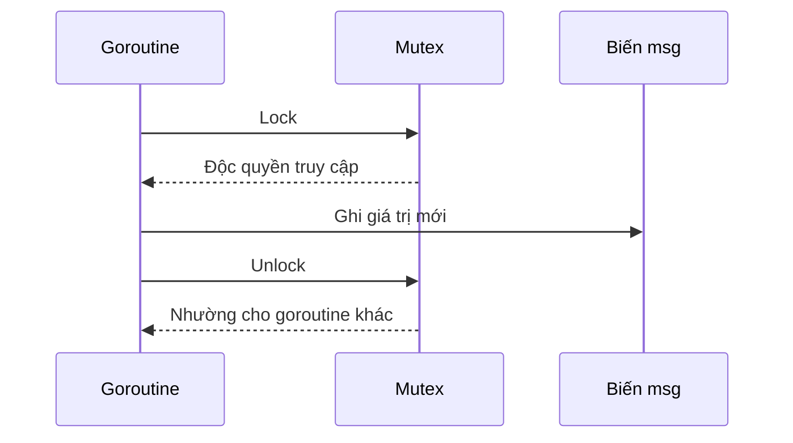

# 🔒 Gắn sync.Mutex vào code: khóa trước khi ghi, mở khóa khi xong

> Nguồn: `016-Adding-syncMutex-to-our-code.txt` · [Udemy](https://ua.udemy.com/course/working-with-concurrency-in-go-golang/learn/lecture/32079652)

Chương trình ở bài trước vẫn đang có vấn đề: hai lời gọi `updateMessage` chạy cùng lúc, cả hai đều ghi vào biến `msg` ở cấp package, và mình thì chẳng biết đứa nào kết thúc trước để biết giá trị cuối cùng của `msg` sẽ là gì. Cũng may, Go khiến việc sửa lỗi này trở nên **dễ đến bất ngờ**. Lần này chúng ta vẫn lấy đồ từ package `sync` — nhưng thay vì `WaitGroup`, mình sẽ dùng `Mutex`.

### 🧠 Vì sao không nên "để chung" mutex?

Các bạn đã quen với việc khai báo `WaitGroup` ở cấp package. Nhưng với mutex, mình **cố tình không làm vậy**, và lý do rất quan trọng:

> **Một khi mutex đã được tạo ra, tuyệt đối không được sao chép (copy) nó.**

Nếu các bạn copy một mutex, nó sẽ không hoạt động đúng nữa. Đây là chi tiết rất nhiều người mới mắc phải, nên ngay tại đây mình muốn khắc sâu vào đầu các bạn.

Thay vào đó, mình khai báo mutex **ngay trong hàm `main`**, kế sau dòng gán `msg = "Hello, world!"`:

```go
mutex := sync.Mutex{}
```

Và khi truyền nó đi, nhớ truyền **con trỏ** (`&mutex`), vì đó cũng là một cách để tránh copy.

---

### 🔑 Nhận mutex bằng con trỏ trong updateMessage

Hàm `updateMessage` giờ nhận thêm tham số `m` — viết tắt của mutex — và nhận dưới dạng **pointer tới `sync.Mutex`**, nhớ nhé, đây là chi tiết "ăn tiền":

```go
func updateMessage(s string, m *sync.Mutex) {
	defer wg.Done()
	m.Lock()
	msg = s
	m.Unlock()
}
```

Trong `main`, cả hai lời gọi goroutine đều được truyền `&mutex`:

```go
go updateMessage("Hello, Universe!", &mutex)
go updateMessage("Hello, Cosmos!", &mutex)
```

Cách mutex hoạt động chỉ đơn giản thế này:

1. **Trước khi ghi** vào biến `msg`, gọi `m.Lock()` — kể từ giây phút này mình có **quyền truy cập độc quyền** vào `msg`.
2. Khi xong việc, gọi `m.Unlock()` để trả lại quyền cho người khác.



"Chỉ có thế thôi à?" — đúng vậy, `Mutex` chỉ có ngần ấy việc. *Tất nhiên vẫn còn vài thứ thú vị khác mà chúng ta sẽ gặp sau, nhưng các bạn thấy đấy, dùng mutex không hề khó chút nào.*

---

### ✅ Chạy lại với `-race`: "Hello, Cosmos!" hay "Hello, Universe!" đều ổn

Mình chạy lại chương trình và **giữ nguyên flag `-race`**. Kết quả lần này:

* Có thể là "Hello, Cosmos!", lần sau cũng có thể là "Hello, Cosmos!", lần thứ ba lại là "Hello, Universe!" — thứ tự vẫn ngẫu nhiên như cũ.
* Nhưng khác biệt then chốt: **không còn cảnh báo data race nào nữa**.

Lý do vẫn ngẫu nhiên là mình chưa hề ép goroutine nào phải xong trước goroutine nào; điều mình làm là đảm bảo dữ liệu được truy cập **an toàn**. Trong thuật ngữ lập trình, đây gọi là **thread safe (an toàn luồng)** — chương trình có goroutine chạy nền, nhưng không có race condition.

---

### 📊 Mutex và WaitGroup khác nhau ở đâu?

Hai "công cụ" này đều nằm trong package `sync`, nhưng phục vụ hai mục đích khác hẳn nhau:

| Tiêu chí | `sync.WaitGroup` | `sync.Mutex` |
|---|---|---|
| Mục đích | Chờ các goroutine hoàn thành | Bảo vệ tài nguyên dùng chung |
| API chính | `Add`, `Done`, `Wait` | `Lock`, `Unlock` |
| Giải quyết | Đồng bộ thời điểm | Loại trừ truy cập đồng thời |
| Sao chép | Thoải mái hơn | Tuyệt đối không copy sau khi tạo |

Đây mới chỉ là ví dụ đơn giản nhất. Mình nói thật lòng: khi làm việc với dữ liệu được truy cập từ goroutine chạy nền, các bạn **phải tập thành thói quen kiểm tra race condition** — mỗi lần chạy code, mỗi lần viết test. Thói quen này sẽ cứu các bạn rất nhiều lần về sau.

### 🎯 Tự kiểm tra nhanh

**Câu 1:** Vì sao không nên khai báo mutex ở cấp package rồi truyền bằng giá trị?

<details>
<summary><b>Xem đáp án</b></summary>

**Đáp án:** Vì không được phép copy mutex sau khi đã tạo.

Giải thích: Copy mutex sẽ khiến nó hoạt động sai; vì vậy truyền bằng con trỏ.

Tham chiếu: Mục Vì sao không nên để chung mutex.

</details>

**Câu 2:** Thao tác nào phải làm trước khi ghi vào biến dùng chung?

<details>
<summary><b>Xem đáp án</b></summary>

**Đáp án:** Gọi `Lock()` trên mutex.

Giải thích: Lock mang lại quyền truy cập độc quyền; ghi xong thì gọi `Unlock()`.

Tham chiếu: Mục Nhận mutex bằng con trỏ.

</details>

**Câu 3:** Sau khi thêm mutex, thứ tự "Hello, Cosmos!" và "Hello, Universe!" có cố định không?

<details>
<summary><b>Xem đáp án</b></summary>

**Đáp án:** Không, thứ tự vẫn ngẫu nhiên.

Giải thích: Mutex chỉ đảm bảo truy cập an toàn, không quy định goroutine nào xong trước.

Tham chiếu: Mục Chạy lại với -race.

</details>

**Câu 4:** "Thread safe" nghĩa là gì trong ngữ cảnh này?

<details>
<summary><b>Xem đáp án</b></summary>

**Đáp án:** Dữ liệu được truy cập an toàn, chương trình không còn race condition.

Giải thích: Có goroutine chạy nền nhưng dữ liệu luôn được bảo vệ đúng cách.

Tham chiếu: Mục Chạy lại với -race.

</details>

**Câu 5:** Hai API chính của `sync.Mutex` là gì?

<details>
<summary><b>Xem đáp án</b></summary>

**Đáp án:** `Lock` và `Unlock`.

Giải thích: Chúng tạo và giải phóng quyền truy cập độc quyền cho goroutine.

Tham chiếu: Bảng so sánh cuối bài.

</details>

Ví dụ nhỏ này đã cho các bạn thấy mutex hoạt động ra sao. Nhưng trước khi sang bài toán phức tạp hơn, mình muốn cùng các bạn **viết test** cho chính đoạn code này — và dùng `go test -race` để bắt race condition một cách bài bản. Hẹn gặp lại ở bài sau! 🚀

## Nguồn tham khảo

- [pkg.go.dev — sync.Mutex](https://pkg.go.dev/sync#Mutex)
