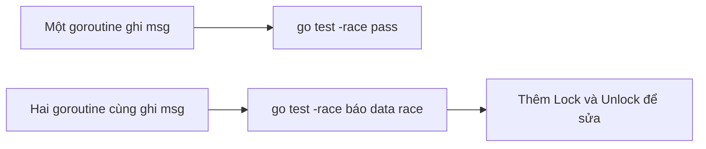

# 🧪 Kiểm tra race condition bằng test: go test -race lộ diện chân tướng

> Nguồn: `017-Testing-for-race-conditions.txt` · [Udemy](https://ua.udemy.com/course/working-with-concurrency-in-go-golang/learn/lecture/32041158)

Không chỉ có `go run -race` mới phát hiện được race condition — các bạn hoàn toàn có thể **viết test và bật flag `-race`**, đó là cách làm chuyên nghiệp hơn mà mình rất muốn các bạn làm quen. Trước khi sang ví dụ phức tạp hơn, chúng ta hãy cùng viết test cho đoạn code hiện tại.

### ↩️ Tạm "tháo" mutex để tái hiện lỗi

Muốn test cho ra vấn đề, trước tiên mình **khôi phục code về trạng thái trước khi thêm mutex**:

1. Copy đoạn code có mutex xuống dưới và comment lại, để lát nữa khôi phục.
2. Bỏ tham số mutex khỏi `updateMessage`.
3. Xóa hai lời gọi `Lock` và `Unlock` trong hàm.
4. Bỏ biến `mutex` trong `main` và các tham chiếu `&mutex`.

Giờ thì chương trình đã quay về đúng phiên bản "có race condition" như các bạn từng thấy. *Các bạn cứ yên tâm làm theo, chúng ta cố tình tạo ra lỗi để học cách bắt nó mà.*

---

### 🧪 Viết test cho updateMessage

Mình tạo file `main_test.go`, vẫn thuộc package `main`, rồi viết một hàm test tên `TestUpdateMessage` nhận tham số `t` kiểu `*testing.T`. Nội dung test gần như "nhân bản" logic của `main`:

* Gán `msg = "Hello, world!"` — đây là biến cấp package nên dùng được toán tử gán trực tiếp.
* Dùng `wg` sẵn có: gọi `wg.Add(1)` rồi bắn một goroutine `go updateMessage("Goodbye, cruel world!")`.
* Chờ bằng `wg.Wait()`.
* Sau đó kiểm tra: nếu `msg` không bằng `"Goodbye, cruel world!"` thì báo lỗi `t.Error("incorrect value in msg")`.

```go
func TestUpdateMessage(t *testing.T) {
	msg = "Hello, world!"
	wg.Add(1)
	go updateMessage("Goodbye, cruel world!")
	wg.Wait()
	if msg != "Goodbye, cruel world!" {
		t.Error("incorrect value in msg")
	}
}
```

Chạy `go test .` — test **pass**. Kể cả chạy `go test -race .` thì cũng **pass**. Nghe có vẻ yên bình quá phải không? Vì lúc này chỉ có **một** goroutine ghi vào `msg`, nên chưa có ai tranh chấp cả.

---

### 🚨 Nhân đôi goroutine: race condition xuất đầu lộ diện

Bây giờ mình nhân bản dòng gọi `go updateMessage(...)` thêm một lần nữa, với một giá trị chuỗi khác. Thế là có **hai goroutine** cùng chạy nền và cùng đụng vào biến `msg`.

* Chạy `go test .` — vẫn có vẻ ổn.
* Chạy `go test -race .` — **cảnh báo data race** xuất hiện ngay.

Đây là minh chứng rõ ràng nhất cho sự nguy hiểm của race condition: bản thân phép test không hề biết mình đang test một chương trình có lỗi, cho đến khi ta bật công cụ kiểm tra.

---

### 🧠 Bài học: đừng chỉ chạy chương trình, hãy test có `-race`

Các bạn không nhất thiết phải `go run` chương trình để kiểm tra race condition. Hoàn toàn có thể:

1. Viết test như bình thường.
2. Thêm flag `-race` vào lệnh `go test`.
3. Yên tâm rằng dữ liệu đang được truy cập đúng cách... hoặc phát hiện ngay vấn đề.

*Từ giờ, mong các bạn biến `-race` thành "bạn đồng hành" mặc định mỗi khi test code liên quan tới goroutine. Một chút thời gian chạy chậm hơn sẽ đổi lấy sự an toàn rất đáng giá.*



### 🎯 Tự kiểm tra nhanh

**Câu 1:** Vì sao phải tạm bỏ mutex trước khi viết test này?

<details>
<summary><b>Xem đáp án</b></summary>

**Đáp án:** Để tái hiện race condition phục vụ mục đích minh họa.

Giải thích: Có mutex rồi thì hai goroutine ghi an toàn, không còn lỗi để quan sát.

Tham chiếu: Mục Tạm tháo mutex.

</details>

**Câu 2:** Vì sao test với một goroutine lại pass?

<details>
<summary><b>Xem đáp án</b></summary>

**Đáp án:** Vì chỉ có một goroutine ghi vào `msg`, không xảy ra tranh chấp.

Giải thích: Race condition cần ít nhất hai goroutine cùng truy cập.

Tham chiếu: Mục Viết test cho updateMessage.

</details>

**Câu 3:** Sau khi nhân đôi dòng gọi goroutine, phép test nào bắt được lỗi?

<details>
<summary><b>Xem đáp án</b></summary>

**Đáp án:** `go test -race .`

Giải thích: Test thường vẫn pass, chỉ khi bật `-race` mới thấy cảnh báo data race.

Tham chiếu: Mục Nhân đôi goroutine.

</details>

**Câu 4:** Biến `msg` dùng trong test được lấy từ đâu?

<details>
<summary><b>Xem đáp án</b></summary>

**Đáp án:** Từ biến cấp package, nên test có thể gán trực tiếp mà không cần truyền tham số.

Giải thích: `msg` được khai báo ở cấp package trong `main.go`.

Tham chiếu: Mục Viết test cho updateMessage.

</details>

**Câu 5:** Hàm test dùng gì để chờ goroutine hoàn thành?

<details>
<summary><b>Xem đáp án</b></summary>

**Đáp án:** `sync.WaitGroup` — gọi `wg.Add(1)` rồi `wg.Wait()`.

Giải thích: `wg` là biến cấp package đã có sẵn từ bài trước.

Tham chiếu: Mục Viết test cho updateMessage.

</details>

Vậy là các bạn đã biết cách dùng test kèm `-race` để kiểm tra dữ liệu an toàn. Giờ thì đến lúc "lên đời" cho ví dụ: một chương trình phức tạp hơn, nơi có hẳn bốn nguồn thu nhập cùng cập nhật số dư ngân hàng. Hẹn gặp lại ở bài sau! 🚀

## Nguồn tham khảo

- [Go — Data Race Detector](https://go.dev/doc/articles/race_detector)
