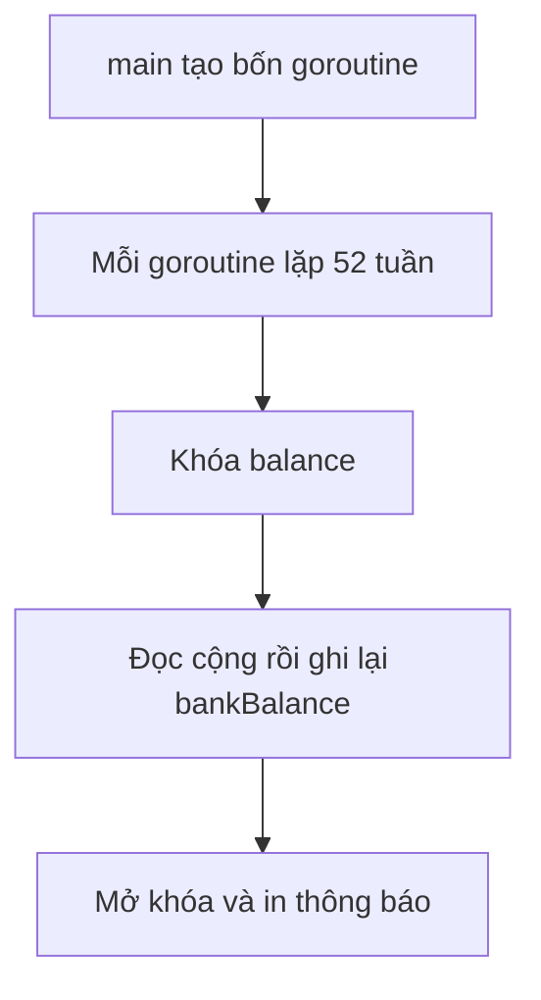

# 💰 Ví dụ phức tạp hơn: dự phóng thu nhập 52 tuần và bài học khóa đúng chỗ

> Nguồn: `018-A-more-complex-example.txt` · [Udemy](https://ua.udemy.com/course/working-with-concurrency-in-go-golang/learn/lecture/32078600)

Ví dụ trước đã cho các bạn thấy mutex hoạt động thế nào ở mức cơ bản. Giờ chúng ta thử thách hơn một chút với một bài toán dùng **cả `sync.WaitGroup` lẫn `sync.Mutex`** — lựa chọn hoàn toàn tùy ý của mình đấy nhé. Bài toán cụ thể như sau: viết chương trình **dự phóng số tiền một người kiếm được trong 52 tuần** từ nhiều nguồn thu nhập khác nhau. *Nghe có vẻ "công ty tài chính" đấy, nhưng thật ra bài toán chỉ để minh họa concept thôi — các bạn đừng lo.*

### 🧱 Income struct và "sân khấu" cho bài toán

Đầu tiên mình dọn sạch `main.go` và xóa luôn file test cũ, vì bài toán mới đã khác. Ở cấp package, mình khai báo một `sync.WaitGroup` tên `wg`. Trong Go, những dữ liệu liên quan với nhau thường được gom vào một `struct`, nên mình định nghĩa kiểu `Income` gồm hai trường:

* `Source` — nguồn tiền đến từ đâu, kiểu `string`, chỉ mang tính mô tả.
* `Amount` — số tiền kiếm được mỗi tuần, kiểu `int` cho dễ tính toán.

```go
type Income struct {
	Source string
	Amount int
}
```

Trong `main`, mình có biến `bankBalance` kiểu `int` — khai báo mà không gán gì thì mặc định bằng **0**, đúng thứ mình cần. Mình in ra màn hình dòng "Initial account balance: $0.00" bằng `fmt.Printf` với placeholder `%d`.

Tiếp đó là danh sách thu nhập, bốn nguồn cho một người "chăm chỉ":

1. **Main job (công việc chính)** — 500 đô một tuần.
2. **Gifts (quà tặng)** — bà cho 10 đô mỗi tuần.
3. **Part time job (việc làm thêm)** — người này dắt chó đi dạo, kiếm được 50 đô một tuần.
4. **Investments (đầu tư)** — khoản đầu tư "siêu tốt", 100 đô một tuần.

Mỗi nguồn thu sẽ được xử lý trong một goroutine riêng, và bên trong mỗi goroutine là vòng lặp 52 tuần cộng dồn vào số dư ngân hàng.

---

### 🔁 Mỗi nguồn thu một goroutine, mỗi goroutine 52 tuần

Mình duyệt qua `incomes` bằng `for i, income := range incomes`, rồi dùng một hàm ẩn danh chạy bằng từ khóa `go`. Hàm này nhận hai tham số `i` và `income` được truyền vào, gọi `defer wg.Done()` khi kết thúc:

```go
for i, income := range incomes {
	go func(i int, income Income) {
		defer wg.Done()
		for week := 1; week <= 52; week++ {
			temp := bankBalance
			temp += income.Amount
			bankBalance = temp
			fmt.Printf("On week %d you earned $%d.00 from %s\n", week, income.Amount, income.Source)
		}
	}(i, income)
}
```

Nhìn kỹ bên trong vòng lặp 52 tuần: mình lấy số dư hiện tại ra biến `temp`, cộng thêm tiền của tuần này, rồi gán ngược lại vào `bankBalance`. Đây chính là kiểu thao tác **đọc — sửa — ghi** kinh điển, và cũng là mầm mống của race condition khi có nhiều goroutine cùng làm.

Ở bên ngoài, mình gọi `wg.Add(len(incomes))` — đúng bằng **độ dài của slice** — rồi `wg.Wait()`, và cuối cùng in ra số dư sau 52 tuần:

```go
wg.Add(len(incomes))
// ... vòng lặp bắn bốn goroutine ở giữa ...
wg.Wait()
fmt.Printf("Final bank balance: $%d.00\n", bankBalance)
```

Các bạn đoán xem số dư cuối cùng là bao nhiêu? Với 4 nguồn, mỗi nguồn 52 tuần: `52 × (500 + 10 + 50 + 100) = 34.320` đô. Chạy `go run .` — đúng **$34,320**. Nhìn có vẻ mọi thứ hoàn hảo.

---

### 🚨 go run -race: kết quả đúng nhưng vẫn có lỗi

Đây là phần thú vị nhất. Mình xóa màn hình và chạy:

```bash
go run -race .
```

Kết quả vẫn ra $34,320 như cũ, nhưng ở đầu output xuất hiện cảnh báo **data race**. Lý do: biến `bankBalance` đang bị **nhiều goroutine truy cập cùng lúc** — chắc chắn có sự chồng lấn giữa các lần đọc và ghi.

Đây là minh chứng hoàn hảo cho điều mình nhấn mạnh từ đầu section: chương trình có thể cho **kết quả đúng** mà vẫn đang có lỗi tiềm ẩn. Nếu không bật `-race`, mình đã vô tư đi tiếp và có thể trả giá ở một thời điểm nào đó trong tương lai.

---

### 🔒 balance.Lock(): khóa ở đâu mới đúng?

Cách sửa vẫn quen thuộc: dùng mutex. Ngay sau dòng khai báo `bankBalance`, mình tạo:

```go
balance := sync.Mutex{}
```

Mình đặt tên là `balance` vì đây chính là thứ mình đang khóa và mở khóa. Và giờ đến câu hỏi mà mình muốn các bạn **tự suy nghĩ trước khi xem đáp án**: nên đặt `Lock` và `Unlock` ở đâu?

*Không vội nhé, các bạn cứ tạm dừng lại vài giây, tự đưa ra câu trả lời — cách này hiệu quả hơn nhiều so với việc mình nói thẳng ra.*

Đáp án là: đặt **bên trong vòng lặp 52 tuần**, tức vòng lặp bên trong của hàm, chứ không phải vòng lặp lớn bên ngoài. Việc đầu tiên trong vòng lặp là gọi `balance.Lock()`, làm xong việc với `bankBalance` thì gọi `balance.Unlock()`:

```go
balance.Lock()
temp := bankBalance
temp += income.Amount
bankBalance = temp
balance.Unlock()
```

Chạy lại `go run -race .` — **không còn cảnh báo nào nữa**. Vấn đề đã được giải quyết.



Một điều nữa rất đáng để ý: output của các nguồn thu **không theo thứ tự**. Việc làm thêm in ra khá tuần tự, nhưng công việc chính lại xen kẽ với đầu tư, rồi quay lại công việc chính... Đó là vì các goroutine thật sự chạy song song, và các bạn **không thể phụ thuộc vào thứ tự kết quả**. Nhớ kỹ điều này, nó sẽ xuất hiện lại nhiều lần trong khóa học.

Vậy là chúng ta đã có một chương trình dùng cả `WaitGroup` và `sync.Mutex` mà không còn race condition. Trước khi sang phần channel, mình muốn viết test cho chương trình này — vì dù sao thì "đo lường" vẫn hơn là "tin vào cảm giác".

### 🎯 Tự kiểm tra nhanh

**Câu 1:** Vì sao chương trình vẫn báo data race dù kết quả cuối cùng đúng?

<details>
<summary><b>Xem đáp án</b></summary>

**Đáp án:** Vì `bankBalance` bị nhiều goroutine đọc/ghi cùng lúc, có sự chồng lấn truy cập.

Giải thích: Kết quả đúng chỉ là may mắn của thời điểm; lỗi vẫn tiềm ẩn.

Tham chiếu: Mục go run -race.

</details>

**Câu 2:** Vì sao phải khóa `balance` bên trong vòng lặp 52 tuần?

<details>
<summary><b>Xem đáp án</b></summary>

**Đáp án:** Vì đó là nơi thực hiện thao tác đọc — cộng — ghi lên biến dùng chung.

Giải thích: Khóa bọc đúng đoạn truy cập tài nguyên, không bọc cả vòng lặp ngoài.

Tham chiếu: Mục balance.Lock.

</details>

**Câu 3:** Vì sao output của bốn nguồn thu bị xen kẽ nhau?

<details>
<summary><b>Xem đáp án</b></summary>

**Đáp án:** Vì các goroutine chạy song song, không có thứ tự hoàn thành cố định.

Giải thích: Không thể phụ thuộc vào thứ tự kết quả khi chạy đồng thời.

Tham chiếu: Mục balance.Lock.

</details>

**Câu 4:** Số dư cuối cùng sau 52 tuần là bao nhiêu và vì sao?

<details>
<summary><b>Xem đáp án</b></summary>

**Đáp án:** $34,320 — bằng 52 tuần nhân với tổng thu nhập 660 đô mỗi tuần từ bốn nguồn.

Giải thích: `52 × (500 + 10 + 50 + 100) = 34,320`.

Tham chiếu: Mục Mỗi nguồn thu một goroutine.

</details>

**Câu 5:** Biến `bankBalance` khai báo không gán giá trị thì có giá trị bao nhiêu?

<details>
<summary><b>Xem đáp án</b></summary>

**Đáp án:** 0 — giá trị mặc định của kiểu `int`.

Giải thích: Trong Go, biến không gán sẽ nhận zero value của kiểu tương ứng.

Tham chiếu: Mục Income struct và sân khấu.

</details>

Bài sau chúng ta sẽ viết test cho chương trình này, và các bạn sẽ thấy một kỹ thuật khá thú vị: "bắt" toàn bộ output của `main` để kiểm tra con số $34,320. Hẹn gặp lại! 🚀
